**Описание проекта**
- Задание: помочь маркетологам снизить расходы — отказаться от невыгодных источников трафика и перераспределить бюджет.
- Есть данные Афиши с июня 2017 по конец мая 2018 года:
лог сервера с данными о посещениях сайта Яндекс.Афиши,
выгрузка всех заказов за этот период,
статистика рекламных расходов.
- Вам предстоит изучить:
как клиенты пользуются сервисом,
когда делают первые покупки на сайте,
сколько денег приносит компании каждый клиент,
когда расходы на привлечение клиента окупаются.
Выручка измеряется в условных единицах — у.е.

## Загрузка данные и подготовка их к анализу

### Положим данные о визитах, заказах и рекламных расходах в переменные;

Импортируем библиотеки и сохраняем данные


```python
import pandas as pd
import numpy as np
from scipy import stats as st
import math
from matplotlib import pyplot as plt

import warnings
warnings.filterwarnings(action='ignore')
```


```python
visits  = pd.read_csv('/datasets/visits_log.csv')
```


```python
orders  = pd.read_csv('/datasets/orders_log.csv')
```


```python
costs  = pd.read_csv('/datasets/costs.csv')
```

### Подготовим данные. Убедимся, что тип данных во всех колонках соответствует сохранённым в них значениям.

Проверим данные visits


```python
visits.head()
```


<div>
<style scoped>
    .dataframe tbody tr th:only-of-type {
        vertical-align: middle;
    }

    .dataframe tbody tr th {
        vertical-align: top;
    }

    .dataframe thead th {
        text-align: right;
    }
</style>
<table border="1" class="dataframe">
  <thead>
    <tr style="text-align: right;">
      <th></th>
      <th>Device</th>
      <th>End Ts</th>
      <th>Source Id</th>
      <th>Start Ts</th>
      <th>Uid</th>
    </tr>
  </thead>
  <tbody>
    <tr>
      <td>0</td>
      <td>touch</td>
      <td>2017-12-20 17:38:00</td>
      <td>4</td>
      <td>2017-12-20 17:20:00</td>
      <td>16879256277535980062</td>
    </tr>
    <tr>
      <td>1</td>
      <td>desktop</td>
      <td>2018-02-19 17:21:00</td>
      <td>2</td>
      <td>2018-02-19 16:53:00</td>
      <td>104060357244891740</td>
    </tr>
    <tr>
      <td>2</td>
      <td>touch</td>
      <td>2017-07-01 01:54:00</td>
      <td>5</td>
      <td>2017-07-01 01:54:00</td>
      <td>7459035603376831527</td>
    </tr>
    <tr>
      <td>3</td>
      <td>desktop</td>
      <td>2018-05-20 11:23:00</td>
      <td>9</td>
      <td>2018-05-20 10:59:00</td>
      <td>16174680259334210214</td>
    </tr>
    <tr>
      <td>4</td>
      <td>desktop</td>
      <td>2017-12-27 14:06:00</td>
      <td>3</td>
      <td>2017-12-27 14:06:00</td>
      <td>9969694820036681168</td>
    </tr>
  </tbody>
</table>
</div>


```python
visits.info()
```

    <class 'pandas.core.frame.DataFrame'>
    RangeIndex: 359400 entries, 0 to 359399
    Data columns (total 5 columns):
    Device       359400 non-null object
    End Ts       359400 non-null object
    Source Id    359400 non-null int64
    Start Ts     359400 non-null object
    Uid          359400 non-null uint64
    dtypes: int64(1), object(3), uint64(1)
    memory usage: 13.7+ MB


Пропущенных значений нет, названия столбцов надо привести к нижнему регистру, убрать пробелы. Типы данных столбцов 'End Ts' и 'Start Ts' необходимо привести к типу datetime


```python
def good_columns(data):
    data.columns = [x.lower() for x in data.columns]
    data.columns = data.columns.str.replace(' ','_')
```


```python
good_columns(visits)
```


```python
visits['end_ts'] = pd.to_datetime(visits['end_ts'])
visits['start_ts'] = pd.to_datetime(visits['start_ts'])
```


```python
visits.info()
```

    <class 'pandas.core.frame.DataFrame'>
    RangeIndex: 359400 entries, 0 to 359399
    Data columns (total 5 columns):
    device       359400 non-null object
    end_ts       359400 non-null datetime64[ns]
    source_id    359400 non-null int64
    start_ts     359400 non-null datetime64[ns]
    uid          359400 non-null uint64
    dtypes: datetime64[ns](2), int64(1), object(1), uint64(1)
    memory usage: 13.7+ MB


```python
visits.head()
```


<div>
<style scoped>
    .dataframe tbody tr th:only-of-type {
        vertical-align: middle;
    }

    .dataframe tbody tr th {
        vertical-align: top;
    }

    .dataframe thead th {
        text-align: right;
    }
</style>
<table border="1" class="dataframe">
  <thead>
    <tr style="text-align: right;">
      <th></th>
      <th>device</th>
      <th>end_ts</th>
      <th>source_id</th>
      <th>start_ts</th>
      <th>uid</th>
    </tr>
  </thead>
  <tbody>
    <tr>
      <td>0</td>
      <td>touch</td>
      <td>2017-12-20 17:38:00</td>
      <td>4</td>
      <td>2017-12-20 17:20:00</td>
      <td>16879256277535980062</td>
    </tr>
    <tr>
      <td>1</td>
      <td>desktop</td>
      <td>2018-02-19 17:21:00</td>
      <td>2</td>
      <td>2018-02-19 16:53:00</td>
      <td>104060357244891740</td>
    </tr>
    <tr>
      <td>2</td>
      <td>touch</td>
      <td>2017-07-01 01:54:00</td>
      <td>5</td>
      <td>2017-07-01 01:54:00</td>
      <td>7459035603376831527</td>
    </tr>
    <tr>
      <td>3</td>
      <td>desktop</td>
      <td>2018-05-20 11:23:00</td>
      <td>9</td>
      <td>2018-05-20 10:59:00</td>
      <td>16174680259334210214</td>
    </tr>
    <tr>
      <td>4</td>
      <td>desktop</td>
      <td>2017-12-27 14:06:00</td>
      <td>3</td>
      <td>2017-12-27 14:06:00</td>
      <td>9969694820036681168</td>
    </tr>
  </tbody>
</table>
</div>


Проверим данные orders


```python
orders.head()
```


<div>
<style scoped>
    .dataframe tbody tr th:only-of-type {
        vertical-align: middle;
    }

    .dataframe tbody tr th {
        vertical-align: top;
    }

    .dataframe thead th {
        text-align: right;
    }
</style>
<table border="1" class="dataframe">
  <thead>
    <tr style="text-align: right;">
      <th></th>
      <th>Buy Ts</th>
      <th>Revenue</th>
      <th>Uid</th>
    </tr>
  </thead>
  <tbody>
    <tr>
      <td>0</td>
      <td>2017-06-01 00:10:00</td>
      <td>17.00</td>
      <td>10329302124590727494</td>
    </tr>
    <tr>
      <td>1</td>
      <td>2017-06-01 00:25:00</td>
      <td>0.55</td>
      <td>11627257723692907447</td>
    </tr>
    <tr>
      <td>2</td>
      <td>2017-06-01 00:27:00</td>
      <td>0.37</td>
      <td>17903680561304213844</td>
    </tr>
    <tr>
      <td>3</td>
      <td>2017-06-01 00:29:00</td>
      <td>0.55</td>
      <td>16109239769442553005</td>
    </tr>
    <tr>
      <td>4</td>
      <td>2017-06-01 07:58:00</td>
      <td>0.37</td>
      <td>14200605875248379450</td>
    </tr>
  </tbody>
</table>
</div>


```python
orders.info()
```

    <class 'pandas.core.frame.DataFrame'>
    RangeIndex: 50415 entries, 0 to 50414
    Data columns (total 3 columns):
    Buy Ts     50415 non-null object
    Revenue    50415 non-null float64
    Uid        50415 non-null uint64
    dtypes: float64(1), object(1), uint64(1)
    memory usage: 1.2+ MB


Пропущенных значений нет, названия столбцов надо привести к нижнему регистру, убрать пробелы. Тип данных столбца 'Buy Ts' необходимо привести к типу datetime


```python
good_columns(orders)
```


```python
orders['buy_ts'] = pd.to_datetime(orders['buy_ts'])
```


```python
orders.info()
```

    <class 'pandas.core.frame.DataFrame'>
    RangeIndex: 50415 entries, 0 to 50414
    Data columns (total 3 columns):
    buy_ts     50415 non-null datetime64[ns]
    revenue    50415 non-null float64
    uid        50415 non-null uint64
    dtypes: datetime64[ns](1), float64(1), uint64(1)
    memory usage: 1.2 MB


```python
orders.head()
```


<div>
<style scoped>
    .dataframe tbody tr th:only-of-type {
        vertical-align: middle;
    }

    .dataframe tbody tr th {
        vertical-align: top;
    }

    .dataframe thead th {
        text-align: right;
    }
</style>
<table border="1" class="dataframe">
  <thead>
    <tr style="text-align: right;">
      <th></th>
      <th>buy_ts</th>
      <th>revenue</th>
      <th>uid</th>
    </tr>
  </thead>
  <tbody>
    <tr>
      <td>0</td>
      <td>2017-06-01 00:10:00</td>
      <td>17.00</td>
      <td>10329302124590727494</td>
    </tr>
    <tr>
      <td>1</td>
      <td>2017-06-01 00:25:00</td>
      <td>0.55</td>
      <td>11627257723692907447</td>
    </tr>
    <tr>
      <td>2</td>
      <td>2017-06-01 00:27:00</td>
      <td>0.37</td>
      <td>17903680561304213844</td>
    </tr>
    <tr>
      <td>3</td>
      <td>2017-06-01 00:29:00</td>
      <td>0.55</td>
      <td>16109239769442553005</td>
    </tr>
    <tr>
      <td>4</td>
      <td>2017-06-01 07:58:00</td>
      <td>0.37</td>
      <td>14200605875248379450</td>
    </tr>
  </tbody>
</table>
</div>


Проверим данные costs


```python
costs.info()
```

    <class 'pandas.core.frame.DataFrame'>
    RangeIndex: 2542 entries, 0 to 2541
    Data columns (total 3 columns):
    source_id    2542 non-null int64
    dt           2542 non-null object
    costs        2542 non-null float64
    dtypes: float64(1), int64(1), object(1)
    memory usage: 59.7+ KB


Пропущенных значений нет. Тип данных столбца 'dt' необходимо привести к типу datetime


```python
good_columns(costs)
```


```python
costs['dt'] = pd.to_datetime(costs['dt'])
```


```python
costs.info()
```

    <class 'pandas.core.frame.DataFrame'>
    RangeIndex: 2542 entries, 0 to 2541
    Data columns (total 3 columns):
    source_id    2542 non-null int64
    dt           2542 non-null datetime64[ns]
    costs        2542 non-null float64
    dtypes: datetime64[ns](1), float64(1), int64(1)
    memory usage: 59.7 KB


```python
costs.head()
```


<div>
<style scoped>
    .dataframe tbody tr th:only-of-type {
        vertical-align: middle;
    }

    .dataframe tbody tr th {
        vertical-align: top;
    }

    .dataframe thead th {
        text-align: right;
    }
</style>
<table border="1" class="dataframe">
  <thead>
    <tr style="text-align: right;">
      <th></th>
      <th>source_id</th>
      <th>dt</th>
      <th>costs</th>
    </tr>
  </thead>
  <tbody>
    <tr>
      <td>0</td>
      <td>1</td>
      <td>2017-06-01</td>
      <td>75.20</td>
    </tr>
    <tr>
      <td>1</td>
      <td>1</td>
      <td>2017-06-02</td>
      <td>62.25</td>
    </tr>
    <tr>
      <td>2</td>
      <td>1</td>
      <td>2017-06-03</td>
      <td>36.53</td>
    </tr>
    <tr>
      <td>3</td>
      <td>1</td>
      <td>2017-06-04</td>
      <td>55.00</td>
    </tr>
    <tr>
      <td>4</td>
      <td>1</td>
      <td>2017-06-05</td>
      <td>57.08</td>
    </tr>
  </tbody>
</table>
</div>


## Рассчитаем метрики и построим графики

###  Продуктовые метрики

#### Рассчитаем DAU, WAU и MAU. Вычислим средние значения этих метрик за весь период. Отобразим изменения метрик во времени на графиках;


```python
visits['session_year']  = visits['start_ts'].dt.year
visits['session_month'] = visits['start_ts'].dt.month
visits['session_week']  = visits['start_ts'].dt.week
visits['session_date'] = visits['start_ts'].dt.date
```


```python
visits.head()
```


<div>
<style scoped>
    .dataframe tbody tr th:only-of-type {
        vertical-align: middle;
    }

    .dataframe tbody tr th {
        vertical-align: top;
    }

    .dataframe thead th {
        text-align: right;
    }
</style>
<table border="1" class="dataframe">
  <thead>
    <tr style="text-align: right;">
      <th></th>
      <th>device</th>
      <th>end_ts</th>
      <th>source_id</th>
      <th>start_ts</th>
      <th>uid</th>
      <th>session_year</th>
      <th>session_month</th>
      <th>session_week</th>
      <th>session_date</th>
    </tr>
  </thead>
  <tbody>
    <tr>
      <td>0</td>
      <td>touch</td>
      <td>2017-12-20 17:38:00</td>
      <td>4</td>
      <td>2017-12-20 17:20:00</td>
      <td>16879256277535980062</td>
      <td>2017</td>
      <td>12</td>
      <td>51</td>
      <td>2017-12-20</td>
    </tr>
    <tr>
      <td>1</td>
      <td>desktop</td>
      <td>2018-02-19 17:21:00</td>
      <td>2</td>
      <td>2018-02-19 16:53:00</td>
      <td>104060357244891740</td>
      <td>2018</td>
      <td>2</td>
      <td>8</td>
      <td>2018-02-19</td>
    </tr>
    <tr>
      <td>2</td>
      <td>touch</td>
      <td>2017-07-01 01:54:00</td>
      <td>5</td>
      <td>2017-07-01 01:54:00</td>
      <td>7459035603376831527</td>
      <td>2017</td>
      <td>7</td>
      <td>26</td>
      <td>2017-07-01</td>
    </tr>
    <tr>
      <td>3</td>
      <td>desktop</td>
      <td>2018-05-20 11:23:00</td>
      <td>9</td>
      <td>2018-05-20 10:59:00</td>
      <td>16174680259334210214</td>
      <td>2018</td>
      <td>5</td>
      <td>20</td>
      <td>2018-05-20</td>
    </tr>
    <tr>
      <td>4</td>
      <td>desktop</td>
      <td>2017-12-27 14:06:00</td>
      <td>3</td>
      <td>2017-12-27 14:06:00</td>
      <td>9969694820036681168</td>
      <td>2017</td>
      <td>12</td>
      <td>52</td>
      <td>2017-12-27</td>
    </tr>
  </tbody>
</table>
</div>


Найдем среднее кол-во уникальных пользователей в день


```python
dau_total = int(visits.groupby('session_date').agg({'uid': 'nunique'}).mean())
```


```python
dau_total
```


    907


Найдем среднее кол-во уникальных пользователей в неделю:


```python
wau_total = int(
    visits.groupby(['session_year', 'session_week'])
    .agg({'uid': 'nunique'})
    .mean()
)
```


```python
wau_total
```


    5716


Найдем среднее кол-во уникальных пользователей в месяц:


```python
mau_total = int(
    visits.groupby(['session_year', 'session_month'])
    .agg({'uid': 'nunique'})
    .mean()
)
```


```python
mau_total
```


    23228


Построим графики изменения кол-ва уникальных пользователей за день/месяц/год


```python
!pip install -U seaborn
```

    Defaulting to user installation because normal site-packages is not writeable
    Collecting seaborn
      Downloading seaborn-0.11.1-py3-none-any.whl (285 kB)
         |████████████████████████████████| 285 kB 1.1 MB/s eta 0:00:01
    [?25hRequirement already satisfied, skipping upgrade: pandas>=0.23 in /opt/conda/lib/python3.7/site-packages (from seaborn) (0.25.1)
    Requirement already satisfied, skipping upgrade: scipy>=1.0 in /opt/conda/lib/python3.7/site-packages (from seaborn) (1.4.1)
    Requirement already satisfied, skipping upgrade: matplotlib>=2.2 in /opt/conda/lib/python3.7/site-packages (from seaborn) (3.1.0)
    Requirement already satisfied, skipping upgrade: numpy>=1.15 in /opt/conda/lib/python3.7/site-packages (from seaborn) (1.19.5)
    Requirement already satisfied, skipping upgrade: pytz>=2017.2 in /opt/conda/lib/python3.7/site-packages (from pandas>=0.23->seaborn) (2021.1)
    Requirement already satisfied, skipping upgrade: python-dateutil>=2.6.1 in /opt/conda/lib/python3.7/site-packages (from pandas>=0.23->seaborn) (2.8.1)
    Requirement already satisfied, skipping upgrade: kiwisolver>=1.0.1 in /opt/conda/lib/python3.7/site-packages (from matplotlib>=2.2->seaborn) (1.3.1)
    Requirement already satisfied, skipping upgrade: pyparsing!=2.0.4,!=2.1.2,!=2.1.6,>=2.0.1 in /opt/conda/lib/python3.7/site-packages (from matplotlib>=2.2->seaborn) (2.4.7)
    Requirement already satisfied, skipping upgrade: cycler>=0.10 in /opt/conda/lib/python3.7/site-packages (from matplotlib>=2.2->seaborn) (0.10.0)
    Requirement already satisfied, skipping upgrade: six>=1.5 in /opt/conda/lib/python3.7/site-packages (from python-dateutil>=2.6.1->pandas>=0.23->seaborn) (1.15.0)
    Installing collected packages: seaborn
    Successfully installed seaborn-0.11.1


```python
import seaborn as sns
```


```python
visits_per_day = visits.groupby(['session_year', 'session_month', 'session_date']).agg({'uid': ['count', 'nunique']}).reset_index()
```


```python
visits_per_day.columns = ['session_year', 'session_month', 'session_date', 'count', 'nunique']
```


```python
visits_per_day.head()
```


<div>
<style scoped>
    .dataframe tbody tr th:only-of-type {
        vertical-align: middle;
    }

    .dataframe tbody tr th {
        vertical-align: top;
    }

    .dataframe thead th {
        text-align: right;
    }
</style>
<table border="1" class="dataframe">
  <thead>
    <tr style="text-align: right;">
      <th></th>
      <th>session_year</th>
      <th>session_month</th>
      <th>session_date</th>
      <th>count</th>
      <th>nunique</th>
    </tr>
  </thead>
  <tbody>
    <tr>
      <td>0</td>
      <td>2017</td>
      <td>6</td>
      <td>2017-06-01</td>
      <td>664</td>
      <td>605</td>
    </tr>
    <tr>
      <td>1</td>
      <td>2017</td>
      <td>6</td>
      <td>2017-06-02</td>
      <td>658</td>
      <td>608</td>
    </tr>
    <tr>
      <td>2</td>
      <td>2017</td>
      <td>6</td>
      <td>2017-06-03</td>
      <td>477</td>
      <td>445</td>
    </tr>
    <tr>
      <td>3</td>
      <td>2017</td>
      <td>6</td>
      <td>2017-06-04</td>
      <td>510</td>
      <td>476</td>
    </tr>
    <tr>
      <td>4</td>
      <td>2017</td>
      <td>6</td>
      <td>2017-06-05</td>
      <td>893</td>
      <td>820</td>
    </tr>
  </tbody>
</table>
</div>


```python
import matplotlib.dates as mdates

months = mdates.MonthLocator()
days = mdates.DayLocator()
timeFmt = mdates.DateFormatter('%Y-%m')

fig = plt.figure(figsize=(25,10))
plt.subplot()
ax = sns.lineplot(data=visits_per_day, x="session_date", y="nunique", color='red')
plt.title('Среднее кол-во уникальных пользователей в день', fontsize=22)
plt.xlabel('Месяц', fontsize=18)
plt.ylabel('Среднее кол-во пользователей в день', fontsize=18)
#plt.setp(ax.get_xticklabels(), rotation=90)
ax.xaxis.set_major_locator(months)
ax.xaxis.set_major_formatter(timeFmt)
ax.xaxis.set_minor_locator(days)
```


    
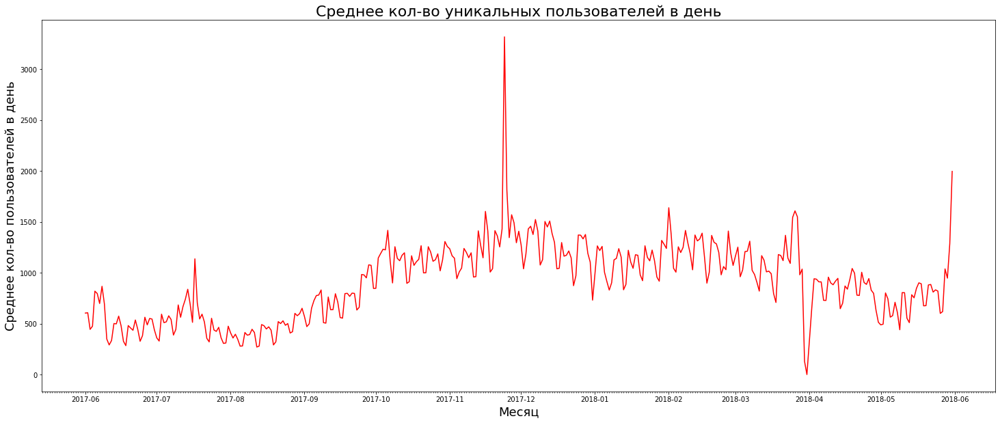
    


```python
visits_per_day.sort_values('nunique', ascending = False).head()
```


<div>
<style scoped>
    .dataframe tbody tr th:only-of-type {
        vertical-align: middle;
    }

    .dataframe tbody tr th {
        vertical-align: top;
    }

    .dataframe thead th {
        text-align: right;
    }
</style>
<table border="1" class="dataframe">
  <thead>
    <tr style="text-align: right;">
      <th></th>
      <th>session_year</th>
      <th>session_month</th>
      <th>session_date</th>
      <th>count</th>
      <th>nunique</th>
    </tr>
  </thead>
  <tbody>
    <tr>
      <td>176</td>
      <td>2017</td>
      <td>11</td>
      <td>2017-11-24</td>
      <td>4042</td>
      <td>3319</td>
    </tr>
    <tr>
      <td>363</td>
      <td>2018</td>
      <td>5</td>
      <td>2018-05-31</td>
      <td>2256</td>
      <td>1997</td>
    </tr>
    <tr>
      <td>177</td>
      <td>2017</td>
      <td>11</td>
      <td>2017-11-25</td>
      <td>2089</td>
      <td>1817</td>
    </tr>
    <tr>
      <td>245</td>
      <td>2018</td>
      <td>2</td>
      <td>2018-02-01</td>
      <td>1878</td>
      <td>1640</td>
    </tr>
    <tr>
      <td>298</td>
      <td>2018</td>
      <td>3</td>
      <td>2018-03-26</td>
      <td>1796</td>
      <td>1609</td>
    </tr>
  </tbody>
</table>
</div>


Видим аномальный всплеск пользовательско активности 2017-11-24 до 3319 уникальных пользователей 


```python
visits_per_day.sort_values('nunique').head()
```


<div>
<style scoped>
    .dataframe tbody tr th:only-of-type {
        vertical-align: middle;
    }

    .dataframe tbody tr th {
        vertical-align: top;
    }

    .dataframe thead th {
        text-align: right;
    }
</style>
<table border="1" class="dataframe">
  <thead>
    <tr style="text-align: right;">
      <th></th>
      <th>session_year</th>
      <th>session_month</th>
      <th>session_date</th>
      <th>count</th>
      <th>nunique</th>
    </tr>
  </thead>
  <tbody>
    <tr>
      <td>303</td>
      <td>2018</td>
      <td>3</td>
      <td>2018-03-31</td>
      <td>1</td>
      <td>1</td>
    </tr>
    <tr>
      <td>302</td>
      <td>2018</td>
      <td>3</td>
      <td>2018-03-30</td>
      <td>134</td>
      <td>131</td>
    </tr>
    <tr>
      <td>72</td>
      <td>2017</td>
      <td>8</td>
      <td>2017-08-12</td>
      <td>296</td>
      <td>271</td>
    </tr>
    <tr>
      <td>65</td>
      <td>2017</td>
      <td>8</td>
      <td>2017-08-05</td>
      <td>304</td>
      <td>280</td>
    </tr>
    <tr>
      <td>73</td>
      <td>2017</td>
      <td>8</td>
      <td>2017-08-13</td>
      <td>293</td>
      <td>281</td>
    </tr>
  </tbody>
</table>
</div>


Так же отмечаем резки провал ползовательской активности в период 30 и 31 марта 2018 года до значений 132 и 1 ползователь соответственно


```python
visits['session_date'] = visits['session_date'].astype('datetime64[D]')
```


```python
visits['activity_week'] = pd.to_datetime(
    visits['session_date'], unit='d'
) - pd.to_timedelta(visits['session_date'].dt.dayofweek, unit='d')
```


```python
visits_per_week = visits.groupby(['session_year', 'activity_week']).agg({'uid': 'nunique'}).reset_index()
```


```python
import matplotlib.dates as mdates

months = mdates.MonthLocator()
days = mdates.DayLocator()
timeFmt = mdates.DateFormatter('%Y-%m')

fig = plt.figure(figsize=(25,8))
plt.subplot()
ax = sns.lineplot(data=visits_per_week, x="activity_week", y="uid", color='red')
plt.title('Среднее кол-во уникальных пользователей в неделю', fontsize=22)
plt.xlabel('Месяц', fontsize=18)
plt.ylabel('Среднее кол-во пользователей в неделю', fontsize=18)
#plt.setp(ax.get_xticklabels(), rotation=90)
ax.xaxis.set_major_locator(months)
ax.xaxis.set_major_formatter(timeFmt)
ax.xaxis.set_minor_locator(days)
```


    
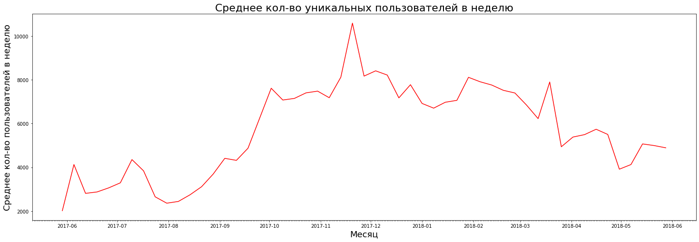
    


```python
visits.head()
```


<div>
<style scoped>
    .dataframe tbody tr th:only-of-type {
        vertical-align: middle;
    }

    .dataframe tbody tr th {
        vertical-align: top;
    }

    .dataframe thead th {
        text-align: right;
    }
</style>
<table border="1" class="dataframe">
  <thead>
    <tr style="text-align: right;">
      <th></th>
      <th>device</th>
      <th>end_ts</th>
      <th>source_id</th>
      <th>start_ts</th>
      <th>uid</th>
      <th>session_year</th>
      <th>session_month</th>
      <th>session_week</th>
      <th>session_date</th>
      <th>activity_week</th>
    </tr>
  </thead>
  <tbody>
    <tr>
      <td>0</td>
      <td>touch</td>
      <td>2017-12-20 17:38:00</td>
      <td>4</td>
      <td>2017-12-20 17:20:00</td>
      <td>16879256277535980062</td>
      <td>2017</td>
      <td>12</td>
      <td>51</td>
      <td>2017-12-20</td>
      <td>2017-12-18</td>
    </tr>
    <tr>
      <td>1</td>
      <td>desktop</td>
      <td>2018-02-19 17:21:00</td>
      <td>2</td>
      <td>2018-02-19 16:53:00</td>
      <td>104060357244891740</td>
      <td>2018</td>
      <td>2</td>
      <td>8</td>
      <td>2018-02-19</td>
      <td>2018-02-19</td>
    </tr>
    <tr>
      <td>2</td>
      <td>touch</td>
      <td>2017-07-01 01:54:00</td>
      <td>5</td>
      <td>2017-07-01 01:54:00</td>
      <td>7459035603376831527</td>
      <td>2017</td>
      <td>7</td>
      <td>26</td>
      <td>2017-07-01</td>
      <td>2017-06-26</td>
    </tr>
    <tr>
      <td>3</td>
      <td>desktop</td>
      <td>2018-05-20 11:23:00</td>
      <td>9</td>
      <td>2018-05-20 10:59:00</td>
      <td>16174680259334210214</td>
      <td>2018</td>
      <td>5</td>
      <td>20</td>
      <td>2018-05-20</td>
      <td>2018-05-14</td>
    </tr>
    <tr>
      <td>4</td>
      <td>desktop</td>
      <td>2017-12-27 14:06:00</td>
      <td>3</td>
      <td>2017-12-27 14:06:00</td>
      <td>9969694820036681168</td>
      <td>2017</td>
      <td>12</td>
      <td>52</td>
      <td>2017-12-27</td>
      <td>2017-12-25</td>
    </tr>
  </tbody>
</table>
</div>


```python
visits['activity_month'] = visits['start_ts'].astype('datetime64[M]')
```


```python
visits_per_month = visits.groupby(['activity_month']).agg({'uid': 'nunique'}).reset_index()
```


```python
import matplotlib.dates as mdates

months = mdates.MonthLocator()
days = mdates.DayLocator()
timeFmt = mdates.DateFormatter('%Y-%m')

fig = plt.figure(figsize=(30,8))
plt.subplot()
ax = sns.lineplot(data=visits_per_month, x="activity_month", y="uid", color='red')
plt.title('Среднее кол-во уникальных пользователей в месяц', fontsize=22)
plt.xlabel('Месяц', fontsize=18)
plt.ylabel('Среднее кол-во пользователей в месяц', fontsize=18)
#plt.setp(ax.get_xticklabels(), rotation=90)
ax.xaxis.set_major_locator(months)
ax.xaxis.set_major_formatter(timeFmt)
ax.xaxis.set_minor_locator(days)
```


    
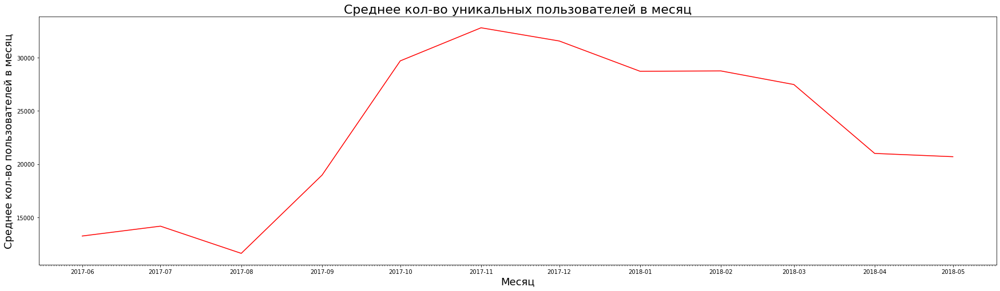
    


По полученным графикам видим что количество новых пользователей начинает расти с осени доходя до пика в декабре, и дальше следует плавный спад до начала лета. Делаем вывод что пользовательская активность имеет сезонный характер, а именно летом имеем худшие показатели

Видим аномальный всплеск пользовательско активности 2017-11-24 до 3319 уникальных пользователей 

Так же отмечаем резки провал ползовательской активности в период 30 и 31 марта 2018 года до значений 132 и 1 ползователь соответственно

Средее значение DAU за весь период:


```python
visits_per_day['nunique'].mean().round(1)
```


    908.0


Средее значение WAU за весь период:


```python
visits_per_week['uid'].mean().round(1)
```


    5716.2


Средее значение MAU за весь период:


```python
visits_per_month['uid'].mean().round(1)
```


    23228.4


#### Определим, сколько раз за день пользователи в среднем заходят на сайт. Построим график, отражающий изменения метрики во времени;


```python
visits_per_day
```


<div>
<style scoped>
    .dataframe tbody tr th:only-of-type {
        vertical-align: middle;
    }

    .dataframe tbody tr th {
        vertical-align: top;
    }

    .dataframe thead th {
        text-align: right;
    }
</style>
<table border="1" class="dataframe">
  <thead>
    <tr style="text-align: right;">
      <th></th>
      <th>session_year</th>
      <th>session_month</th>
      <th>session_date</th>
      <th>count</th>
      <th>nunique</th>
    </tr>
  </thead>
  <tbody>
    <tr>
      <td>0</td>
      <td>2017</td>
      <td>6</td>
      <td>2017-06-01</td>
      <td>664</td>
      <td>605</td>
    </tr>
    <tr>
      <td>1</td>
      <td>2017</td>
      <td>6</td>
      <td>2017-06-02</td>
      <td>658</td>
      <td>608</td>
    </tr>
    <tr>
      <td>2</td>
      <td>2017</td>
      <td>6</td>
      <td>2017-06-03</td>
      <td>477</td>
      <td>445</td>
    </tr>
    <tr>
      <td>3</td>
      <td>2017</td>
      <td>6</td>
      <td>2017-06-04</td>
      <td>510</td>
      <td>476</td>
    </tr>
    <tr>
      <td>4</td>
      <td>2017</td>
      <td>6</td>
      <td>2017-06-05</td>
      <td>893</td>
      <td>820</td>
    </tr>
    <tr>
      <td>...</td>
      <td>...</td>
      <td>...</td>
      <td>...</td>
      <td>...</td>
      <td>...</td>
    </tr>
    <tr>
      <td>359</td>
      <td>2018</td>
      <td>5</td>
      <td>2018-05-27</td>
      <td>672</td>
      <td>620</td>
    </tr>
    <tr>
      <td>360</td>
      <td>2018</td>
      <td>5</td>
      <td>2018-05-28</td>
      <td>1156</td>
      <td>1039</td>
    </tr>
    <tr>
      <td>361</td>
      <td>2018</td>
      <td>5</td>
      <td>2018-05-29</td>
      <td>1035</td>
      <td>948</td>
    </tr>
    <tr>
      <td>362</td>
      <td>2018</td>
      <td>5</td>
      <td>2018-05-30</td>
      <td>1410</td>
      <td>1289</td>
    </tr>
    <tr>
      <td>363</td>
      <td>2018</td>
      <td>5</td>
      <td>2018-05-31</td>
      <td>2256</td>
      <td>1997</td>
    </tr>
  </tbody>
</table>
<p>364 rows × 5 columns</p>
</div>


```python
visits_per_day['sessions_per_user'] = (visits_per_day['count'] / visits_per_day['nunique'])
```


```python
visits_per_day.groupby(['session_year', 'session_month']).agg({'sessions_per_user': 'mean'}).plot(
    kind = 'line',
    figsize =(30,10),
    color='red'
)
plt.title('Среднее кол-во входов на сайт пользователем в день', fontsize=25)
plt.xlabel('Месяц', fontsize=20)
plt.ylabel('Среднее кол-во входов на сайт ', fontsize=20)
```


    Text(0, 0.5, 'Среднее кол-во входов на сайт ')


    
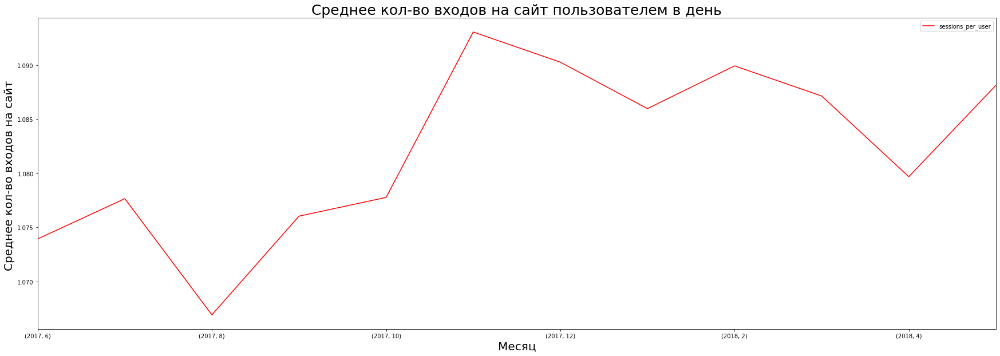
    


Видим что в среднем пользователь заходит 1 раз вне зависимости от времени года


```python
visits_per_day['sessions_per_user'].mean()
```


    1.082169644003972


#### Исследуем, сколько времени пользователи проводят на сайте. Узнаем продолжительность типичной пользовательской сессии за весь период. Чтобы выбрать подходящую среднюю меру, построим график распределения. 


```python
visits['session_duration_sec'] = (
    visits['end_ts'] - visits['start_ts']
).dt.seconds
```

Средняя продолжительность сессии:


```python
visits['session_duration_sec'].mean()
```


    643.506488592098


Посмотрим на распределение:


```python
visits['session_duration_sec'].hist(bins=100, range = (0,4000)) 
```


    <matplotlib.axes._subplots.AxesSubplot at 0x7f02d158bf50>


    
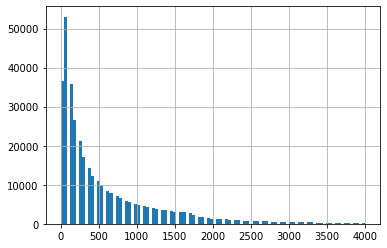
    

#visits['session_duration_sec'].mode()

```python
visits['session_duration_sec'].median()
```


    300.0


Получаем медианное время пользовательской сессии 300 сек (5 мин)

####  Рассчитаем Retention Rate, применяя когортный анализ. Покажем изменения метрики во времени на графике. Найдем средний Retention Rate на второй месяц «жизни» когорт.


```python
first_activity_date = visits.groupby(['uid'])['start_ts'].min()
first_activity_date.name = 'first_activity_date'
visits = visits.join(first_activity_date,on='uid') 
```


```python
visits.head()
```


<div>
<style scoped>
    .dataframe tbody tr th:only-of-type {
        vertical-align: middle;
    }

    .dataframe tbody tr th {
        vertical-align: top;
    }

    .dataframe thead th {
        text-align: right;
    }
</style>
<table border="1" class="dataframe">
  <thead>
    <tr style="text-align: right;">
      <th></th>
      <th>device</th>
      <th>end_ts</th>
      <th>source_id</th>
      <th>start_ts</th>
      <th>uid</th>
      <th>session_year</th>
      <th>session_month</th>
      <th>session_week</th>
      <th>session_date</th>
      <th>activity_week</th>
      <th>activity_month</th>
      <th>session_duration_sec</th>
      <th>first_activity_date</th>
    </tr>
  </thead>
  <tbody>
    <tr>
      <td>0</td>
      <td>touch</td>
      <td>2017-12-20 17:38:00</td>
      <td>4</td>
      <td>2017-12-20 17:20:00</td>
      <td>16879256277535980062</td>
      <td>2017</td>
      <td>12</td>
      <td>51</td>
      <td>2017-12-20</td>
      <td>2017-12-18</td>
      <td>2017-12-01</td>
      <td>1080</td>
      <td>2017-12-20 17:20:00</td>
    </tr>
    <tr>
      <td>1</td>
      <td>desktop</td>
      <td>2018-02-19 17:21:00</td>
      <td>2</td>
      <td>2018-02-19 16:53:00</td>
      <td>104060357244891740</td>
      <td>2018</td>
      <td>2</td>
      <td>8</td>
      <td>2018-02-19</td>
      <td>2018-02-19</td>
      <td>2018-02-01</td>
      <td>1680</td>
      <td>2018-02-19 16:53:00</td>
    </tr>
    <tr>
      <td>2</td>
      <td>touch</td>
      <td>2017-07-01 01:54:00</td>
      <td>5</td>
      <td>2017-07-01 01:54:00</td>
      <td>7459035603376831527</td>
      <td>2017</td>
      <td>7</td>
      <td>26</td>
      <td>2017-07-01</td>
      <td>2017-06-26</td>
      <td>2017-07-01</td>
      <td>0</td>
      <td>2017-07-01 01:54:00</td>
    </tr>
    <tr>
      <td>3</td>
      <td>desktop</td>
      <td>2018-05-20 11:23:00</td>
      <td>9</td>
      <td>2018-05-20 10:59:00</td>
      <td>16174680259334210214</td>
      <td>2018</td>
      <td>5</td>
      <td>20</td>
      <td>2018-05-20</td>
      <td>2018-05-14</td>
      <td>2018-05-01</td>
      <td>1440</td>
      <td>2018-03-09 20:05:00</td>
    </tr>
    <tr>
      <td>4</td>
      <td>desktop</td>
      <td>2017-12-27 14:06:00</td>
      <td>3</td>
      <td>2017-12-27 14:06:00</td>
      <td>9969694820036681168</td>
      <td>2017</td>
      <td>12</td>
      <td>52</td>
      <td>2017-12-27</td>
      <td>2017-12-25</td>
      <td>2017-12-01</td>
      <td>0</td>
      <td>2017-12-27 14:06:00</td>
    </tr>
  </tbody>
</table>
</div>


```python
visits['first_activity_month'] = visits['first_activity_date'].astype(
    'datetime64[M]'
)
```


```python
visits.head()
```


<div>
<style scoped>
    .dataframe tbody tr th:only-of-type {
        vertical-align: middle;
    }

    .dataframe tbody tr th {
        vertical-align: top;
    }

    .dataframe thead th {
        text-align: right;
    }
</style>
<table border="1" class="dataframe">
  <thead>
    <tr style="text-align: right;">
      <th></th>
      <th>device</th>
      <th>end_ts</th>
      <th>source_id</th>
      <th>start_ts</th>
      <th>uid</th>
      <th>session_year</th>
      <th>session_month</th>
      <th>session_week</th>
      <th>session_date</th>
      <th>activity_week</th>
      <th>activity_month</th>
      <th>session_duration_sec</th>
      <th>first_activity_date</th>
      <th>first_activity_month</th>
    </tr>
  </thead>
  <tbody>
    <tr>
      <td>0</td>
      <td>touch</td>
      <td>2017-12-20 17:38:00</td>
      <td>4</td>
      <td>2017-12-20 17:20:00</td>
      <td>16879256277535980062</td>
      <td>2017</td>
      <td>12</td>
      <td>51</td>
      <td>2017-12-20</td>
      <td>2017-12-18</td>
      <td>2017-12-01</td>
      <td>1080</td>
      <td>2017-12-20 17:20:00</td>
      <td>2017-12-01</td>
    </tr>
    <tr>
      <td>1</td>
      <td>desktop</td>
      <td>2018-02-19 17:21:00</td>
      <td>2</td>
      <td>2018-02-19 16:53:00</td>
      <td>104060357244891740</td>
      <td>2018</td>
      <td>2</td>
      <td>8</td>
      <td>2018-02-19</td>
      <td>2018-02-19</td>
      <td>2018-02-01</td>
      <td>1680</td>
      <td>2018-02-19 16:53:00</td>
      <td>2018-02-01</td>
    </tr>
    <tr>
      <td>2</td>
      <td>touch</td>
      <td>2017-07-01 01:54:00</td>
      <td>5</td>
      <td>2017-07-01 01:54:00</td>
      <td>7459035603376831527</td>
      <td>2017</td>
      <td>7</td>
      <td>26</td>
      <td>2017-07-01</td>
      <td>2017-06-26</td>
      <td>2017-07-01</td>
      <td>0</td>
      <td>2017-07-01 01:54:00</td>
      <td>2017-07-01</td>
    </tr>
    <tr>
      <td>3</td>
      <td>desktop</td>
      <td>2018-05-20 11:23:00</td>
      <td>9</td>
      <td>2018-05-20 10:59:00</td>
      <td>16174680259334210214</td>
      <td>2018</td>
      <td>5</td>
      <td>20</td>
      <td>2018-05-20</td>
      <td>2018-05-14</td>
      <td>2018-05-01</td>
      <td>1440</td>
      <td>2018-03-09 20:05:00</td>
      <td>2018-03-01</td>
    </tr>
    <tr>
      <td>4</td>
      <td>desktop</td>
      <td>2017-12-27 14:06:00</td>
      <td>3</td>
      <td>2017-12-27 14:06:00</td>
      <td>9969694820036681168</td>
      <td>2017</td>
      <td>12</td>
      <td>52</td>
      <td>2017-12-27</td>
      <td>2017-12-25</td>
      <td>2017-12-01</td>
      <td>0</td>
      <td>2017-12-27 14:06:00</td>
      <td>2017-12-01</td>
    </tr>
  </tbody>
</table>
</div>


```python
visits['cohort_lifetime'] = (
    visits['activity_month'] - visits['first_activity_month']
)
```


```python
visits['cohort_lifetime'] = visits[
    'cohort_lifetime'
] / np.timedelta64(1, 'M')

visits['cohort_lifetime'] = (
    visits['cohort_lifetime'].round().astype('int')
)
```


```python
cohorts = visits.groupby(['first_activity_month','cohort_lifetime']).agg({'uid':'nunique'}).reset_index()
```


```python
initial_users_count = cohorts[cohorts['cohort_lifetime'] == 0][
    ['first_activity_month', 'uid']
]
```


```python
initial_users_count = initial_users_count.rename(columns={'uid':'cohort_users'})
```


```python
cohorts = cohorts.merge(initial_users_count,on='first_activity_month') 
```


```python
cohorts['retention'] = cohorts['uid']/cohorts['cohort_users'] 
```


```python
cohorts['first_activity_month'] = cohorts['first_activity_month'].dt.strftime('%Y-%m') 
```


```python
retention_pivot = cohorts.pivot_table(
    index='first_activity_month',
    columns='cohort_lifetime',
    values='retention',
    aggfunc='sum',
) 
```


```python
retention_pivot.fillna('')
```


<div>
<style scoped>
    .dataframe tbody tr th:only-of-type {
        vertical-align: middle;
    }

    .dataframe tbody tr th {
        vertical-align: top;
    }

    .dataframe thead th {
        text-align: right;
    }
</style>
<table border="1" class="dataframe">
  <thead>
    <tr style="text-align: right;">
      <th>cohort_lifetime</th>
      <th>0</th>
      <th>1</th>
      <th>2</th>
      <th>3</th>
      <th>4</th>
      <th>5</th>
      <th>6</th>
      <th>7</th>
      <th>8</th>
      <th>9</th>
      <th>10</th>
      <th>11</th>
    </tr>
    <tr>
      <th>first_activity_month</th>
      <th></th>
      <th></th>
      <th></th>
      <th></th>
      <th></th>
      <th></th>
      <th></th>
      <th></th>
      <th></th>
      <th></th>
      <th></th>
      <th></th>
    </tr>
  </thead>
  <tbody>
    <tr>
      <td>2017-06</td>
      <td>1.0</td>
      <td>0.0786635</td>
      <td>0.0537748</td>
      <td>0.0613923</td>
      <td>0.0685572</td>
      <td>0.0714232</td>
      <td>0.0610152</td>
      <td>0.0577721</td>
      <td>0.0523418</td>
      <td>0.0508334</td>
      <td>0.0406516</td>
      <td>0.0449506</td>
    </tr>
    <tr>
      <td>2017-07</td>
      <td>1.0</td>
      <td>0.0560883</td>
      <td>0.0512938</td>
      <td>0.0561644</td>
      <td>0.0582192</td>
      <td>0.0481735</td>
      <td>0.0453577</td>
      <td>0.0457382</td>
      <td>0.0388128</td>
      <td>0.0286149</td>
      <td>0.0274734</td>
      <td></td>
    </tr>
    <tr>
      <td>2017-08</td>
      <td>1.0</td>
      <td>0.076908</td>
      <td>0.0628622</td>
      <td>0.062764</td>
      <td>0.0500933</td>
      <td>0.0440035</td>
      <td>0.0363422</td>
      <td>0.0394853</td>
      <td>0.0278951</td>
      <td>0.0260289</td>
      <td></td>
      <td></td>
    </tr>
    <tr>
      <td>2017-09</td>
      <td>1.0</td>
      <td>0.0854885</td>
      <td>0.069205</td>
      <td>0.0507064</td>
      <td>0.0393918</td>
      <td>0.0378352</td>
      <td>0.0358597</td>
      <td>0.0241858</td>
      <td>0.0228089</td>
      <td></td>
      <td></td>
      <td></td>
    </tr>
    <tr>
      <td>2017-10</td>
      <td>1.0</td>
      <td>0.078608</td>
      <td>0.0522385</td>
      <td>0.0389575</td>
      <td>0.0342611</td>
      <td>0.0322208</td>
      <td>0.0213651</td>
      <td>0.0203642</td>
      <td></td>
      <td></td>
      <td></td>
      <td></td>
    </tr>
    <tr>
      <td>2017-11</td>
      <td>1.0</td>
      <td>0.078281</td>
      <td>0.0441133</td>
      <td>0.0386817</td>
      <td>0.0337272</td>
      <td>0.0234146</td>
      <td>0.0217998</td>
      <td></td>
      <td></td>
      <td></td>
      <td></td>
      <td></td>
    </tr>
    <tr>
      <td>2017-12</td>
      <td>1.0</td>
      <td>0.0558018</td>
      <td>0.0379927</td>
      <td>0.0311065</td>
      <td>0.0202628</td>
      <td>0.0190359</td>
      <td></td>
      <td></td>
      <td></td>
      <td></td>
      <td></td>
      <td></td>
    </tr>
    <tr>
      <td>2018-01</td>
      <td>1.0</td>
      <td>0.0597153</td>
      <td>0.0393388</td>
      <td>0.0249735</td>
      <td>0.020244</td>
      <td></td>
      <td></td>
      <td></td>
      <td></td>
      <td></td>
      <td></td>
      <td></td>
    </tr>
    <tr>
      <td>2018-02</td>
      <td>1.0</td>
      <td>0.0570798</td>
      <td>0.0254539</td>
      <td>0.0200928</td>
      <td></td>
      <td></td>
      <td></td>
      <td></td>
      <td></td>
      <td></td>
      <td></td>
      <td></td>
    </tr>
    <tr>
      <td>2018-03</td>
      <td>1.0</td>
      <td>0.0418184</td>
      <td>0.0270533</td>
      <td></td>
      <td></td>
      <td></td>
      <td></td>
      <td></td>
      <td></td>
      <td></td>
      <td></td>
      <td></td>
    </tr>
    <tr>
      <td>2018-04</td>
      <td>1.0</td>
      <td>0.0483799</td>
      <td></td>
      <td></td>
      <td></td>
      <td></td>
      <td></td>
      <td></td>
      <td></td>
      <td></td>
      <td></td>
      <td></td>
    </tr>
    <tr>
      <td>2018-05</td>
      <td>1.0</td>
      <td></td>
      <td></td>
      <td></td>
      <td></td>
      <td></td>
      <td></td>
      <td></td>
      <td></td>
      <td></td>
      <td></td>
      <td></td>
    </tr>
  </tbody>
</table>
</div>


```python
import seaborn as sns
from matplotlib import pyplot as plt
sns.set(style='white')
plt.figure(figsize=(13, 9))
plt.title('Cohorts: User Retention')
sns.heatmap(retention_pivot, annot=True, fmt='.1%', linewidths=1, linecolor='gray',vmin=0.01, vmax=0.07); 
```


    
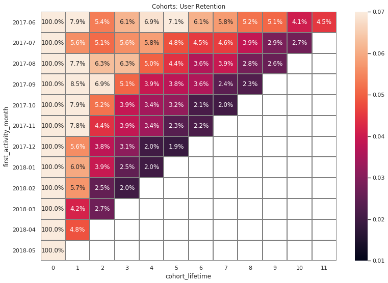
    


Найдем средний Retention Rate на второй месяц «жизни» когорт:


```python
(retention_pivot[1].mean()*100).round(2)
```


    6.52


Для всех когорт отмечаем резкое падение пользовательской активности(примерно 94% за первый месяц)

Cредний RR на второй месяц жизни когорт составляет 6.52%

### Метрики электронной коммерции

#### Исследуем, сколько времени в среднем проходит с момента первого посещения сайта до совершения покупки. 


```python
visits.info()
```

    <class 'pandas.core.frame.DataFrame'>
    RangeIndex: 359400 entries, 0 to 359399
    Data columns (total 15 columns):
    device                  359400 non-null object
    end_ts                  359400 non-null datetime64[ns]
    source_id               359400 non-null int64
    start_ts                359400 non-null datetime64[ns]
    uid                     359400 non-null uint64
    session_year            359400 non-null int64
    session_month           359400 non-null int64
    session_week            359400 non-null int64
    session_date            359400 non-null datetime64[ns]
    activity_week           359400 non-null datetime64[ns]
    activity_month          359400 non-null datetime64[ns]
    session_duration_sec    359400 non-null int64
    first_activity_date     359400 non-null datetime64[ns]
    first_activity_month    359400 non-null datetime64[ns]
    cohort_lifetime         359400 non-null int64
    dtypes: datetime64[ns](7), int64(6), object(1), uint64(1)
    memory usage: 41.1+ MB


```python
orders.info()
```

    <class 'pandas.core.frame.DataFrame'>
    RangeIndex: 50415 entries, 0 to 50414
    Data columns (total 3 columns):
    buy_ts     50415 non-null datetime64[ns]
    revenue    50415 non-null float64
    uid        50415 non-null uint64
    dtypes: datetime64[ns](1), float64(1), uint64(1)
    memory usage: 1.2 MB


```python
#найдем время первого входа пользователя на сайт 
first_visits = visits.groupby(['uid'])['first_activity_date'].min().reset_index()
```


```python
first_visits.head()
```


<div>
<style scoped>
    .dataframe tbody tr th:only-of-type {
        vertical-align: middle;
    }

    .dataframe tbody tr th {
        vertical-align: top;
    }

    .dataframe thead th {
        text-align: right;
    }
</style>
<table border="1" class="dataframe">
  <thead>
    <tr style="text-align: right;">
      <th></th>
      <th>uid</th>
      <th>first_activity_date</th>
    </tr>
  </thead>
  <tbody>
    <tr>
      <td>0</td>
      <td>11863502262781</td>
      <td>2018-03-01 17:27:00</td>
    </tr>
    <tr>
      <td>1</td>
      <td>49537067089222</td>
      <td>2018-02-06 15:55:00</td>
    </tr>
    <tr>
      <td>2</td>
      <td>297729379853735</td>
      <td>2017-06-07 18:47:00</td>
    </tr>
    <tr>
      <td>3</td>
      <td>313578113262317</td>
      <td>2017-09-18 22:49:00</td>
    </tr>
    <tr>
      <td>4</td>
      <td>325320750514679</td>
      <td>2017-09-30 14:29:00</td>
    </tr>
  </tbody>
</table>
</div>


```python
#найдем время первой покупки совершенной пользователем
first_orders = orders.groupby(['uid'])['buy_ts'].min()
first_orders.name = 'first_order_date'
first_orders = first_orders.reset_index()
```


```python
#составим таблицу с временем первого посещения и первой покупки пользователя
first_visits_orders = pd.merge(first_visits, first_orders,on='uid') 
```


```python
first_visits_orders
```


<div>
<style scoped>
    .dataframe tbody tr th:only-of-type {
        vertical-align: middle;
    }

    .dataframe tbody tr th {
        vertical-align: top;
    }

    .dataframe thead th {
        text-align: right;
    }
</style>
<table border="1" class="dataframe">
  <thead>
    <tr style="text-align: right;">
      <th></th>
      <th>uid</th>
      <th>first_activity_date</th>
      <th>first_order_date</th>
    </tr>
  </thead>
  <tbody>
    <tr>
      <td>0</td>
      <td>313578113262317</td>
      <td>2017-09-18 22:49:00</td>
      <td>2018-01-03 21:51:00</td>
    </tr>
    <tr>
      <td>1</td>
      <td>1575281904278712</td>
      <td>2017-06-03 10:13:00</td>
      <td>2017-06-03 10:13:00</td>
    </tr>
    <tr>
      <td>2</td>
      <td>2429014661409475</td>
      <td>2017-10-11 17:14:00</td>
      <td>2017-10-11 18:33:00</td>
    </tr>
    <tr>
      <td>3</td>
      <td>2464366381792757</td>
      <td>2018-01-27 20:10:00</td>
      <td>2018-01-28 15:54:00</td>
    </tr>
    <tr>
      <td>4</td>
      <td>2551852515556206</td>
      <td>2017-11-24 10:14:00</td>
      <td>2017-11-24 10:14:00</td>
    </tr>
    <tr>
      <td>...</td>
      <td>...</td>
      <td>...</td>
      <td>...</td>
    </tr>
    <tr>
      <td>36518</td>
      <td>18445147675727495770</td>
      <td>2017-08-20 13:30:00</td>
      <td>2017-11-24 09:03:00</td>
    </tr>
    <tr>
      <td>36519</td>
      <td>18445407535914413204</td>
      <td>2017-09-22 23:48:00</td>
      <td>2017-09-22 23:55:00</td>
    </tr>
    <tr>
      <td>36520</td>
      <td>18445601152732270159</td>
      <td>2017-08-07 11:51:00</td>
      <td>2018-03-26 22:54:00</td>
    </tr>
    <tr>
      <td>36521</td>
      <td>18446156210226471712</td>
      <td>2017-11-07 10:01:00</td>
      <td>2018-02-18 19:34:00</td>
    </tr>
    <tr>
      <td>36522</td>
      <td>18446167067214817906</td>
      <td>2017-10-17 10:05:00</td>
      <td>2017-10-17 10:16:00</td>
    </tr>
  </tbody>
</table>
<p>36523 rows × 3 columns</p>
</div>


```python
#найдем время от первого посещения до первой покупки 
first_visits_orders['waiting'] = first_visits_orders['first_order_date'] - first_visits_orders['first_activity_date']
```


```python
#переведем найденое время в минуты 
first_visits_orders['waiting'] = first_visits_orders['waiting'] / np.timedelta64(1, 'm')
```


```python
first_visits_orders['waiting'].hist(bins = 50, range = (0, 100))
```


    <matplotlib.axes._subplots.AxesSubplot at 0x7f026b825690>


    
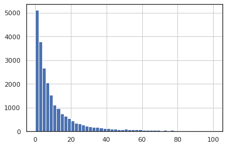
    


```python
#first_visits_orders['waiting'].mode()
```


```python
first_visits_orders['waiting'].median()
```


    16.0


Получаем медипанное значения времени между первым посещением и первой покупкой 16 мин.

#### Применяя когортный анализ, рассчитаем среднее количество покупок на одного покупателя за определённый период. 


```python
orders['order_month'] = orders['buy_ts'].astype('datetime64[M]')
```


```python
#найдем месяц первой покупки для определения когорт пользователей
first_orders = orders.groupby('uid').agg({'order_month': 'min'}).reset_index()
first_orders.columns = ['uid', 'first_order_month']
```


```python
#добавляем столбец с датой первого заказа к датафрейму со всеми заказами 
orders = orders.merge(first_orders, on='uid')
```


```python
orders.head()
```


<div>
<style scoped>
    .dataframe tbody tr th:only-of-type {
        vertical-align: middle;
    }

    .dataframe tbody tr th {
        vertical-align: top;
    }

    .dataframe thead th {
        text-align: right;
    }
</style>
<table border="1" class="dataframe">
  <thead>
    <tr style="text-align: right;">
      <th></th>
      <th>buy_ts</th>
      <th>revenue</th>
      <th>uid</th>
      <th>order_month</th>
      <th>first_order_month</th>
    </tr>
  </thead>
  <tbody>
    <tr>
      <td>0</td>
      <td>2017-06-01 00:10:00</td>
      <td>17.00</td>
      <td>10329302124590727494</td>
      <td>2017-06-01</td>
      <td>2017-06-01</td>
    </tr>
    <tr>
      <td>1</td>
      <td>2017-06-01 00:25:00</td>
      <td>0.55</td>
      <td>11627257723692907447</td>
      <td>2017-06-01</td>
      <td>2017-06-01</td>
    </tr>
    <tr>
      <td>2</td>
      <td>2017-06-01 00:27:00</td>
      <td>0.37</td>
      <td>17903680561304213844</td>
      <td>2017-06-01</td>
      <td>2017-06-01</td>
    </tr>
    <tr>
      <td>3</td>
      <td>2017-06-01 00:29:00</td>
      <td>0.55</td>
      <td>16109239769442553005</td>
      <td>2017-06-01</td>
      <td>2017-06-01</td>
    </tr>
    <tr>
      <td>4</td>
      <td>2017-06-01 07:58:00</td>
      <td>0.37</td>
      <td>14200605875248379450</td>
      <td>2017-06-01</td>
      <td>2017-06-01</td>
    </tr>
  </tbody>
</table>
</div>


```python
#Определим размеры когорт по месяцу первого заказа
cohort_sizes = (
    orders.groupby('first_order_month')
    .agg({'uid': 'nunique'})
    .reset_index()
)
cohort_sizes.columns = ['first_order_month', 'n_buyers']
```


```python
cohort_sizes
```


<div>
<style scoped>
    .dataframe tbody tr th:only-of-type {
        vertical-align: middle;
    }

    .dataframe tbody tr th {
        vertical-align: top;
    }

    .dataframe thead th {
        text-align: right;
    }
</style>
<table border="1" class="dataframe">
  <thead>
    <tr style="text-align: right;">
      <th></th>
      <th>first_order_month</th>
      <th>n_buyers</th>
    </tr>
  </thead>
  <tbody>
    <tr>
      <td>0</td>
      <td>2017-06-01</td>
      <td>2023</td>
    </tr>
    <tr>
      <td>1</td>
      <td>2017-07-01</td>
      <td>1923</td>
    </tr>
    <tr>
      <td>2</td>
      <td>2017-08-01</td>
      <td>1370</td>
    </tr>
    <tr>
      <td>3</td>
      <td>2017-09-01</td>
      <td>2581</td>
    </tr>
    <tr>
      <td>4</td>
      <td>2017-10-01</td>
      <td>4340</td>
    </tr>
    <tr>
      <td>5</td>
      <td>2017-11-01</td>
      <td>4081</td>
    </tr>
    <tr>
      <td>6</td>
      <td>2017-12-01</td>
      <td>4383</td>
    </tr>
    <tr>
      <td>7</td>
      <td>2018-01-01</td>
      <td>3373</td>
    </tr>
    <tr>
      <td>8</td>
      <td>2018-02-01</td>
      <td>3651</td>
    </tr>
    <tr>
      <td>9</td>
      <td>2018-03-01</td>
      <td>3533</td>
    </tr>
    <tr>
      <td>10</td>
      <td>2018-04-01</td>
      <td>2276</td>
    </tr>
    <tr>
      <td>11</td>
      <td>2018-05-01</td>
      <td>2988</td>
    </tr>
    <tr>
      <td>12</td>
      <td>2018-06-01</td>
      <td>1</td>
    </tr>
  </tbody>
</table>
</div>


```python
cohorts = (
    orders.groupby(['first_order_month', 'order_month'])
    .agg({'revenue': 'sum', 'buy_ts' : 'count'})
    .reset_index()
)
```


```python
cohorts = cohorts.rename(columns={'buy_ts':'n_orders'})
```


```python
cohorts
```


<div>
<style scoped>
    .dataframe tbody tr th:only-of-type {
        vertical-align: middle;
    }

    .dataframe tbody tr th {
        vertical-align: top;
    }

    .dataframe thead th {
        text-align: right;
    }
</style>
<table border="1" class="dataframe">
  <thead>
    <tr style="text-align: right;">
      <th></th>
      <th>first_order_month</th>
      <th>order_month</th>
      <th>revenue</th>
      <th>n_orders</th>
    </tr>
  </thead>
  <tbody>
    <tr>
      <td>0</td>
      <td>2017-06-01</td>
      <td>2017-06-01</td>
      <td>9557.49</td>
      <td>2354</td>
    </tr>
    <tr>
      <td>1</td>
      <td>2017-06-01</td>
      <td>2017-07-01</td>
      <td>981.82</td>
      <td>177</td>
    </tr>
    <tr>
      <td>2</td>
      <td>2017-06-01</td>
      <td>2017-08-01</td>
      <td>885.34</td>
      <td>174</td>
    </tr>
    <tr>
      <td>3</td>
      <td>2017-06-01</td>
      <td>2017-09-01</td>
      <td>1931.30</td>
      <td>226</td>
    </tr>
    <tr>
      <td>4</td>
      <td>2017-06-01</td>
      <td>2017-10-01</td>
      <td>2068.58</td>
      <td>292</td>
    </tr>
    <tr>
      <td>...</td>
      <td>...</td>
      <td>...</td>
      <td>...</td>
      <td>...</td>
    </tr>
    <tr>
      <td>74</td>
      <td>2018-03-01</td>
      <td>2018-05-01</td>
      <td>1114.87</td>
      <td>176</td>
    </tr>
    <tr>
      <td>75</td>
      <td>2018-04-01</td>
      <td>2018-04-01</td>
      <td>10600.69</td>
      <td>2495</td>
    </tr>
    <tr>
      <td>76</td>
      <td>2018-04-01</td>
      <td>2018-05-01</td>
      <td>1209.92</td>
      <td>195</td>
    </tr>
    <tr>
      <td>77</td>
      <td>2018-05-01</td>
      <td>2018-05-01</td>
      <td>13925.76</td>
      <td>3249</td>
    </tr>
    <tr>
      <td>78</td>
      <td>2018-06-01</td>
      <td>2018-06-01</td>
      <td>3.42</td>
      <td>1</td>
    </tr>
  </tbody>
</table>
<p>79 rows × 4 columns</p>
</div>


```python
#Добавим к сгруппированой таблице с когортами размеры когорт
report = pd.merge(cohort_sizes, cohorts, on='first_order_month')
```


```python
#Добавим столбец с информацие о возрасте когорты 
report['age'] = (
    report['order_month'] - report['first_order_month']
) / np.timedelta64(1, 'M')
report['age'] = report['age'].round().astype('int')
```


```python
report['first_order_month'] = report['first_order_month'].dt.strftime('%Y-%m')
```


```python
report
```


<div>
<style scoped>
    .dataframe tbody tr th:only-of-type {
        vertical-align: middle;
    }

    .dataframe tbody tr th {
        vertical-align: top;
    }

    .dataframe thead th {
        text-align: right;
    }
</style>
<table border="1" class="dataframe">
  <thead>
    <tr style="text-align: right;">
      <th></th>
      <th>first_order_month</th>
      <th>n_buyers</th>
      <th>order_month</th>
      <th>revenue</th>
      <th>n_orders</th>
      <th>age</th>
    </tr>
  </thead>
  <tbody>
    <tr>
      <td>0</td>
      <td>2017-06</td>
      <td>2023</td>
      <td>2017-06-01</td>
      <td>9557.49</td>
      <td>2354</td>
      <td>0</td>
    </tr>
    <tr>
      <td>1</td>
      <td>2017-06</td>
      <td>2023</td>
      <td>2017-07-01</td>
      <td>981.82</td>
      <td>177</td>
      <td>1</td>
    </tr>
    <tr>
      <td>2</td>
      <td>2017-06</td>
      <td>2023</td>
      <td>2017-08-01</td>
      <td>885.34</td>
      <td>174</td>
      <td>2</td>
    </tr>
    <tr>
      <td>3</td>
      <td>2017-06</td>
      <td>2023</td>
      <td>2017-09-01</td>
      <td>1931.30</td>
      <td>226</td>
      <td>3</td>
    </tr>
    <tr>
      <td>4</td>
      <td>2017-06</td>
      <td>2023</td>
      <td>2017-10-01</td>
      <td>2068.58</td>
      <td>292</td>
      <td>4</td>
    </tr>
    <tr>
      <td>...</td>
      <td>...</td>
      <td>...</td>
      <td>...</td>
      <td>...</td>
      <td>...</td>
      <td>...</td>
    </tr>
    <tr>
      <td>74</td>
      <td>2018-03</td>
      <td>3533</td>
      <td>2018-05-01</td>
      <td>1114.87</td>
      <td>176</td>
      <td>2</td>
    </tr>
    <tr>
      <td>75</td>
      <td>2018-04</td>
      <td>2276</td>
      <td>2018-04-01</td>
      <td>10600.69</td>
      <td>2495</td>
      <td>0</td>
    </tr>
    <tr>
      <td>76</td>
      <td>2018-04</td>
      <td>2276</td>
      <td>2018-05-01</td>
      <td>1209.92</td>
      <td>195</td>
      <td>1</td>
    </tr>
    <tr>
      <td>77</td>
      <td>2018-05</td>
      <td>2988</td>
      <td>2018-05-01</td>
      <td>13925.76</td>
      <td>3249</td>
      <td>0</td>
    </tr>
    <tr>
      <td>78</td>
      <td>2018-06</td>
      <td>1</td>
      <td>2018-06-01</td>
      <td>3.42</td>
      <td>1</td>
      <td>0</td>
    </tr>
  </tbody>
</table>
<p>79 rows × 6 columns</p>
</div>


```python
report['orders_per_user'] = report['n_orders'] / report['n_buyers']

output = report.pivot_table(
    index='first_order_month', columns='age', values='orders_per_user', aggfunc='mean'
).cumsum(axis=1).round(2) 
```


```python
output.fillna('')
```


<div>
<style scoped>
    .dataframe tbody tr th:only-of-type {
        vertical-align: middle;
    }

    .dataframe tbody tr th {
        vertical-align: top;
    }

    .dataframe thead th {
        text-align: right;
    }
</style>
<table border="1" class="dataframe">
  <thead>
    <tr style="text-align: right;">
      <th>age</th>
      <th>0</th>
      <th>1</th>
      <th>2</th>
      <th>3</th>
      <th>4</th>
      <th>5</th>
      <th>6</th>
      <th>7</th>
      <th>8</th>
      <th>9</th>
      <th>10</th>
      <th>11</th>
    </tr>
    <tr>
      <th>first_order_month</th>
      <th></th>
      <th></th>
      <th></th>
      <th></th>
      <th></th>
      <th></th>
      <th></th>
      <th></th>
      <th></th>
      <th></th>
      <th></th>
      <th></th>
    </tr>
  </thead>
  <tbody>
    <tr>
      <td>2017-06</td>
      <td>1.16</td>
      <td>1.25</td>
      <td>1.34</td>
      <td>1.45</td>
      <td>1.59</td>
      <td>1.7</td>
      <td>1.84</td>
      <td>1.92</td>
      <td>2.03</td>
      <td>2.1</td>
      <td>2.15</td>
      <td>2.19</td>
    </tr>
    <tr>
      <td>2017-07</td>
      <td>1.14</td>
      <td>1.19</td>
      <td>1.25</td>
      <td>1.31</td>
      <td>1.34</td>
      <td>1.39</td>
      <td>1.42</td>
      <td>1.44</td>
      <td>1.47</td>
      <td>1.49</td>
      <td>1.51</td>
      <td></td>
    </tr>
    <tr>
      <td>2017-08</td>
      <td>1.12</td>
      <td>1.2</td>
      <td>1.27</td>
      <td>1.33</td>
      <td>1.39</td>
      <td>1.44</td>
      <td>1.47</td>
      <td>1.53</td>
      <td>1.56</td>
      <td>1.6</td>
      <td></td>
      <td></td>
    </tr>
    <tr>
      <td>2017-09</td>
      <td>1.14</td>
      <td>1.22</td>
      <td>1.28</td>
      <td>1.35</td>
      <td>1.37</td>
      <td>1.42</td>
      <td>1.46</td>
      <td>1.48</td>
      <td>1.5</td>
      <td></td>
      <td></td>
      <td></td>
    </tr>
    <tr>
      <td>2017-10</td>
      <td>1.14</td>
      <td>1.22</td>
      <td>1.25</td>
      <td>1.28</td>
      <td>1.31</td>
      <td>1.34</td>
      <td>1.35</td>
      <td>1.38</td>
      <td></td>
      <td></td>
      <td></td>
      <td></td>
    </tr>
    <tr>
      <td>2017-11</td>
      <td>1.18</td>
      <td>1.28</td>
      <td>1.32</td>
      <td>1.37</td>
      <td>1.41</td>
      <td>1.42</td>
      <td>1.45</td>
      <td></td>
      <td></td>
      <td></td>
      <td></td>
      <td></td>
    </tr>
    <tr>
      <td>2017-12</td>
      <td>1.15</td>
      <td>1.21</td>
      <td>1.26</td>
      <td>1.3</td>
      <td>1.32</td>
      <td>1.34</td>
      <td></td>
      <td></td>
      <td></td>
      <td></td>
      <td></td>
      <td></td>
    </tr>
    <tr>
      <td>2018-01</td>
      <td>1.12</td>
      <td>1.19</td>
      <td>1.24</td>
      <td>1.25</td>
      <td>1.28</td>
      <td></td>
      <td></td>
      <td></td>
      <td></td>
      <td></td>
      <td></td>
      <td></td>
    </tr>
    <tr>
      <td>2018-02</td>
      <td>1.12</td>
      <td>1.18</td>
      <td>1.21</td>
      <td>1.22</td>
      <td></td>
      <td></td>
      <td></td>
      <td></td>
      <td></td>
      <td></td>
      <td></td>
      <td></td>
    </tr>
    <tr>
      <td>2018-03</td>
      <td>1.17</td>
      <td>1.22</td>
      <td>1.27</td>
      <td></td>
      <td></td>
      <td></td>
      <td></td>
      <td></td>
      <td></td>
      <td></td>
      <td></td>
      <td></td>
    </tr>
    <tr>
      <td>2018-04</td>
      <td>1.10</td>
      <td>1.18</td>
      <td></td>
      <td></td>
      <td></td>
      <td></td>
      <td></td>
      <td></td>
      <td></td>
      <td></td>
      <td></td>
      <td></td>
    </tr>
    <tr>
      <td>2018-05</td>
      <td>1.09</td>
      <td></td>
      <td></td>
      <td></td>
      <td></td>
      <td></td>
      <td></td>
      <td></td>
      <td></td>
      <td></td>
      <td></td>
      <td></td>
    </tr>
    <tr>
      <td>2018-06</td>
      <td>1.00</td>
      <td></td>
      <td></td>
      <td></td>
      <td></td>
      <td></td>
      <td></td>
      <td></td>
      <td></td>
      <td></td>
      <td></td>
      <td></td>
    </tr>
  </tbody>
</table>
</div>


```python
plt.figure(figsize=(13, 9))
plt.title('orders_per_user')
sns.heatmap(output, annot=True, linewidths=1, fmt='.2f' ,linecolor='gray', vmin = 0.9, vmax = 2) 
```


    <matplotlib.axes._subplots.AxesSubplot at 0x7f02d16f5d10>


    
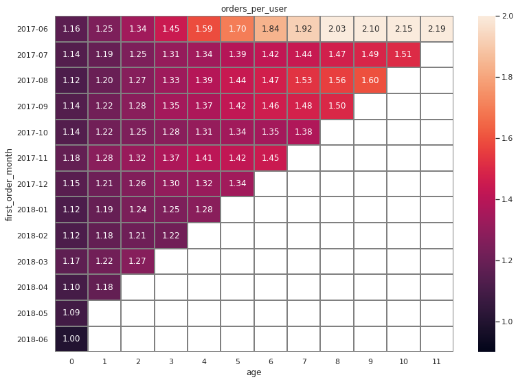
    


Видим что по этому показателю несколько выделяется первая когорта, а в оствльном показатели имеют схожую динамику

#### Рассчитаем средний чек, применяя группировку по времени совершения покупки. Когортный анализ не подходит — он может исказить расчёты. Построим график, отражающий изменения метрики во времени;


```python
orders.head()
```


<div>
<style scoped>
    .dataframe tbody tr th:only-of-type {
        vertical-align: middle;
    }

    .dataframe tbody tr th {
        vertical-align: top;
    }

    .dataframe thead th {
        text-align: right;
    }
</style>
<table border="1" class="dataframe">
  <thead>
    <tr style="text-align: right;">
      <th></th>
      <th>buy_ts</th>
      <th>revenue</th>
      <th>uid</th>
      <th>order_month</th>
      <th>first_order_month</th>
    </tr>
  </thead>
  <tbody>
    <tr>
      <td>0</td>
      <td>2017-06-01 00:10:00</td>
      <td>17.00</td>
      <td>10329302124590727494</td>
      <td>2017-06-01</td>
      <td>2017-06-01</td>
    </tr>
    <tr>
      <td>1</td>
      <td>2017-06-01 00:25:00</td>
      <td>0.55</td>
      <td>11627257723692907447</td>
      <td>2017-06-01</td>
      <td>2017-06-01</td>
    </tr>
    <tr>
      <td>2</td>
      <td>2017-06-01 00:27:00</td>
      <td>0.37</td>
      <td>17903680561304213844</td>
      <td>2017-06-01</td>
      <td>2017-06-01</td>
    </tr>
    <tr>
      <td>3</td>
      <td>2017-06-01 00:29:00</td>
      <td>0.55</td>
      <td>16109239769442553005</td>
      <td>2017-06-01</td>
      <td>2017-06-01</td>
    </tr>
    <tr>
      <td>4</td>
      <td>2017-06-01 07:58:00</td>
      <td>0.37</td>
      <td>14200605875248379450</td>
      <td>2017-06-01</td>
      <td>2017-06-01</td>
    </tr>
  </tbody>
</table>
</div>


```python
orders['order_month'] = orders['order_month'].dt.strftime('%Y-%m')
```


```python
cheek = orders.groupby('order_month').agg({'revenue': 'sum', 'uid': 'nunique'})
```


```python
cheek['revenue_per_user'] = cheek['revenue'] / cheek['uid']
```


```python
cheek['revenue_per_user'].plot(kind = 'line', figsize =(30,10), color = 'red')
```


    <matplotlib.axes._subplots.AxesSubplot at 0x7f02846e9850>


    
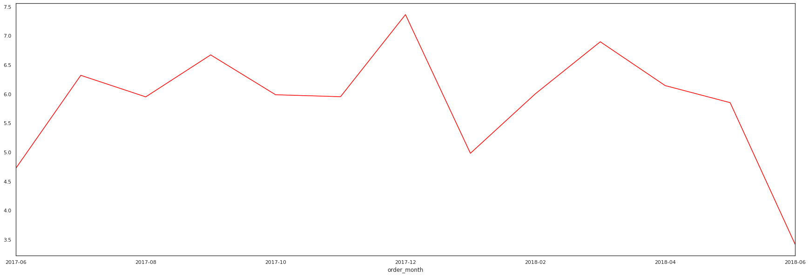
    


```python
cheek
```


<div>
<style scoped>
    .dataframe tbody tr th:only-of-type {
        vertical-align: middle;
    }

    .dataframe tbody tr th {
        vertical-align: top;
    }

    .dataframe thead th {
        text-align: right;
    }
</style>
<table border="1" class="dataframe">
  <thead>
    <tr style="text-align: right;">
      <th></th>
      <th>revenue</th>
      <th>uid</th>
      <th>revenue_per_user</th>
    </tr>
    <tr>
      <th>order_month</th>
      <th></th>
      <th></th>
      <th></th>
    </tr>
  </thead>
  <tbody>
    <tr>
      <td>2017-06</td>
      <td>9557.49</td>
      <td>2023</td>
      <td>4.724414</td>
    </tr>
    <tr>
      <td>2017-07</td>
      <td>12539.47</td>
      <td>1984</td>
      <td>6.320297</td>
    </tr>
    <tr>
      <td>2017-08</td>
      <td>8758.78</td>
      <td>1472</td>
      <td>5.950258</td>
    </tr>
    <tr>
      <td>2017-09</td>
      <td>18345.51</td>
      <td>2750</td>
      <td>6.671095</td>
    </tr>
    <tr>
      <td>2017-10</td>
      <td>27987.70</td>
      <td>4675</td>
      <td>5.986674</td>
    </tr>
    <tr>
      <td>2017-11</td>
      <td>27069.93</td>
      <td>4547</td>
      <td>5.953360</td>
    </tr>
    <tr>
      <td>2017-12</td>
      <td>36388.60</td>
      <td>4942</td>
      <td>7.363132</td>
    </tr>
    <tr>
      <td>2018-01</td>
      <td>19417.13</td>
      <td>3898</td>
      <td>4.981306</td>
    </tr>
    <tr>
      <td>2018-02</td>
      <td>25560.54</td>
      <td>4258</td>
      <td>6.002945</td>
    </tr>
    <tr>
      <td>2018-03</td>
      <td>28834.59</td>
      <td>4181</td>
      <td>6.896577</td>
    </tr>
    <tr>
      <td>2018-04</td>
      <td>16858.06</td>
      <td>2744</td>
      <td>6.143608</td>
    </tr>
    <tr>
      <td>2018-05</td>
      <td>20735.98</td>
      <td>3544</td>
      <td>5.851010</td>
    </tr>
    <tr>
      <td>2018-06</td>
      <td>3.42</td>
      <td>1</td>
      <td>3.420000</td>
    </tr>
  </tbody>
</table>
</div>


```python
cheek['revenue_per_user'].mean().round(2)
```


    5.87


```python
cheek['revenue_per_user'].describe()
```


    count    13.000000
    mean      5.866514
    std       1.014569
    min       3.420000
    25%       5.851010
    50%       5.986674
    75%       6.320297
    max       7.363132
    Name: revenue_per_user, dtype: float64


```python
cheek.sort_values('revenue_per_user', ascending = False).head()
```


<div>
<style scoped>
    .dataframe tbody tr th:only-of-type {
        vertical-align: middle;
    }

    .dataframe tbody tr th {
        vertical-align: top;
    }

    .dataframe thead th {
        text-align: right;
    }
</style>
<table border="1" class="dataframe">
  <thead>
    <tr style="text-align: right;">
      <th></th>
      <th>revenue</th>
      <th>uid</th>
      <th>revenue_per_user</th>
    </tr>
    <tr>
      <th>order_month</th>
      <th></th>
      <th></th>
      <th></th>
    </tr>
  </thead>
  <tbody>
    <tr>
      <td>2017-12</td>
      <td>36388.60</td>
      <td>4942</td>
      <td>7.363132</td>
    </tr>
    <tr>
      <td>2018-03</td>
      <td>28834.59</td>
      <td>4181</td>
      <td>6.896577</td>
    </tr>
    <tr>
      <td>2017-09</td>
      <td>18345.51</td>
      <td>2750</td>
      <td>6.671095</td>
    </tr>
    <tr>
      <td>2017-07</td>
      <td>12539.47</td>
      <td>1984</td>
      <td>6.320297</td>
    </tr>
    <tr>
      <td>2018-04</td>
      <td>16858.06</td>
      <td>2744</td>
      <td>6.143608</td>
    </tr>
  </tbody>
</table>
</div>


```python
cheek.sort_values('revenue_per_user', ascending = True).head()
```


<div>
<style scoped>
    .dataframe tbody tr th:only-of-type {
        vertical-align: middle;
    }

    .dataframe tbody tr th {
        vertical-align: top;
    }

    .dataframe thead th {
        text-align: right;
    }
</style>
<table border="1" class="dataframe">
  <thead>
    <tr style="text-align: right;">
      <th></th>
      <th>revenue</th>
      <th>uid</th>
      <th>revenue_per_user</th>
    </tr>
    <tr>
      <th>order_month</th>
      <th></th>
      <th></th>
      <th></th>
    </tr>
  </thead>
  <tbody>
    <tr>
      <td>2018-06</td>
      <td>3.42</td>
      <td>1</td>
      <td>3.420000</td>
    </tr>
    <tr>
      <td>2017-06</td>
      <td>9557.49</td>
      <td>2023</td>
      <td>4.724414</td>
    </tr>
    <tr>
      <td>2018-01</td>
      <td>19417.13</td>
      <td>3898</td>
      <td>4.981306</td>
    </tr>
    <tr>
      <td>2018-05</td>
      <td>20735.98</td>
      <td>3544</td>
      <td>5.851010</td>
    </tr>
    <tr>
      <td>2017-08</td>
      <td>8758.78</td>
      <td>1472</td>
      <td>5.950258</td>
    </tr>
  </tbody>
</table>
</div>


Средний чек на протяжении всего наблюдения достиг максимального значения в декабре 17го года, минимальное значение были зафиксировано в в июне 17го и 18го года. При этом среднее значение для каждого месяца  отклоняется от среднего значения за весь период std = 1.014569

#### Выясним, как меняется LTV на покупателя по когортам.  Рассчитаем средний LTV по когортам за 6 месяцев; в расчёт включаем когорты, «прожившие» не менее 6 месяцев. Маржинальность сервиса — 100%. Отразим изменения метрики во времени на графике;


```python
report['ltv'] = report['revenue'] / report['n_buyers']

output = report.pivot_table(
    index='first_order_month', columns='age', values='ltv', aggfunc='mean'
).cumsum(axis=1).round(2) 
```


```python
output.fillna('')
```


<div>
<style scoped>
    .dataframe tbody tr th:only-of-type {
        vertical-align: middle;
    }

    .dataframe tbody tr th {
        vertical-align: top;
    }

    .dataframe thead th {
        text-align: right;
    }
</style>
<table border="1" class="dataframe">
  <thead>
    <tr style="text-align: right;">
      <th>age</th>
      <th>0</th>
      <th>1</th>
      <th>2</th>
      <th>3</th>
      <th>4</th>
      <th>5</th>
      <th>6</th>
      <th>7</th>
      <th>8</th>
      <th>9</th>
      <th>10</th>
      <th>11</th>
    </tr>
    <tr>
      <th>first_order_month</th>
      <th></th>
      <th></th>
      <th></th>
      <th></th>
      <th></th>
      <th></th>
      <th></th>
      <th></th>
      <th></th>
      <th></th>
      <th></th>
      <th></th>
    </tr>
  </thead>
  <tbody>
    <tr>
      <td>2017-06</td>
      <td>4.72</td>
      <td>5.21</td>
      <td>5.65</td>
      <td>6.6</td>
      <td>7.62</td>
      <td>8.36</td>
      <td>9.31</td>
      <td>9.89</td>
      <td>10.45</td>
      <td>11.05</td>
      <td>11.62</td>
      <td>11.88</td>
    </tr>
    <tr>
      <td>2017-07</td>
      <td>6.01</td>
      <td>6.35</td>
      <td>6.97</td>
      <td>7.33</td>
      <td>7.5</td>
      <td>7.66</td>
      <td>7.78</td>
      <td>7.92</td>
      <td>8.08</td>
      <td>8.23</td>
      <td>8.39</td>
      <td></td>
    </tr>
    <tr>
      <td>2017-08</td>
      <td>5.28</td>
      <td>5.75</td>
      <td>6.21</td>
      <td>6.6</td>
      <td>7.09</td>
      <td>7.38</td>
      <td>7.59</td>
      <td>7.99</td>
      <td>8.28</td>
      <td>8.47</td>
      <td></td>
      <td></td>
    </tr>
    <tr>
      <td>2017-09</td>
      <td>5.64</td>
      <td>6.76</td>
      <td>7.28</td>
      <td>11.26</td>
      <td>11.66</td>
      <td>12.31</td>
      <td>13.01</td>
      <td>13.25</td>
      <td>13.44</td>
      <td></td>
      <td></td>
      <td></td>
    </tr>
    <tr>
      <td>2017-10</td>
      <td>5.00</td>
      <td>5.54</td>
      <td>5.73</td>
      <td>5.89</td>
      <td>6.04</td>
      <td>6.16</td>
      <td>6.24</td>
      <td>6.36</td>
      <td></td>
      <td></td>
      <td></td>
      <td></td>
    </tr>
    <tr>
      <td>2017-11</td>
      <td>5.15</td>
      <td>5.55</td>
      <td>5.75</td>
      <td>6.08</td>
      <td>6.23</td>
      <td>6.28</td>
      <td>6.4</td>
      <td></td>
      <td></td>
      <td></td>
      <td></td>
      <td></td>
    </tr>
    <tr>
      <td>2017-12</td>
      <td>4.74</td>
      <td>5</td>
      <td>5.92</td>
      <td>6.99</td>
      <td>7.3</td>
      <td>7.64</td>
      <td></td>
      <td></td>
      <td></td>
      <td></td>
      <td></td>
      <td></td>
    </tr>
    <tr>
      <td>2018-01</td>
      <td>4.14</td>
      <td>4.43</td>
      <td>4.73</td>
      <td>4.88</td>
      <td>4.94</td>
      <td></td>
      <td></td>
      <td></td>
      <td></td>
      <td></td>
      <td></td>
      <td></td>
    </tr>
    <tr>
      <td>2018-02</td>
      <td>4.16</td>
      <td>4.44</td>
      <td>4.51</td>
      <td>4.59</td>
      <td></td>
      <td></td>
      <td></td>
      <td></td>
      <td></td>
      <td></td>
      <td></td>
      <td></td>
    </tr>
    <tr>
      <td>2018-03</td>
      <td>4.84</td>
      <td>5.14</td>
      <td>5.46</td>
      <td></td>
      <td></td>
      <td></td>
      <td></td>
      <td></td>
      <td></td>
      <td></td>
      <td></td>
      <td></td>
    </tr>
    <tr>
      <td>2018-04</td>
      <td>4.66</td>
      <td>5.19</td>
      <td></td>
      <td></td>
      <td></td>
      <td></td>
      <td></td>
      <td></td>
      <td></td>
      <td></td>
      <td></td>
      <td></td>
    </tr>
    <tr>
      <td>2018-05</td>
      <td>4.66</td>
      <td></td>
      <td></td>
      <td></td>
      <td></td>
      <td></td>
      <td></td>
      <td></td>
      <td></td>
      <td></td>
      <td></td>
      <td></td>
    </tr>
    <tr>
      <td>2018-06</td>
      <td>3.42</td>
      <td></td>
      <td></td>
      <td></td>
      <td></td>
      <td></td>
      <td></td>
      <td></td>
      <td></td>
      <td></td>
      <td></td>
      <td></td>
    </tr>
  </tbody>
</table>
</div>


```python
plt.figure(figsize=(13, 9))
plt.title('LTV')
sns.heatmap(output, annot=True, fmt='.2f', linewidths=1, linecolor='gray', vmin = 3.4, vmax = 10 ) 
```


    <matplotlib.axes._subplots.AxesSubplot at 0x7f02846e6290>


    
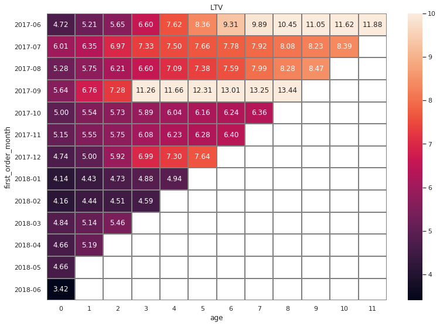
    


Рассчитаем средний LTV по когортам за 6 месяцев; в расчёт включены когорты, «прожившие» не менее 6 месяцев.


```python
output[5].mean().round(2)
```


    7.97


Отмечем что по значению LTV выделяются когорты пользователей пришедших в июне и сентябре

### Маркетинговые метрики

#### Посчитаем общую сумму расходов на маркетинг. Выясним, как траты распределены по источникам. Визуализируем изменения метрик во времени;


```python
costs.head()
```


<div>
<style scoped>
    .dataframe tbody tr th:only-of-type {
        vertical-align: middle;
    }

    .dataframe tbody tr th {
        vertical-align: top;
    }

    .dataframe thead th {
        text-align: right;
    }
</style>
<table border="1" class="dataframe">
  <thead>
    <tr style="text-align: right;">
      <th></th>
      <th>source_id</th>
      <th>dt</th>
      <th>costs</th>
    </tr>
  </thead>
  <tbody>
    <tr>
      <td>0</td>
      <td>1</td>
      <td>2017-06-01</td>
      <td>75.20</td>
    </tr>
    <tr>
      <td>1</td>
      <td>1</td>
      <td>2017-06-02</td>
      <td>62.25</td>
    </tr>
    <tr>
      <td>2</td>
      <td>1</td>
      <td>2017-06-03</td>
      <td>36.53</td>
    </tr>
    <tr>
      <td>3</td>
      <td>1</td>
      <td>2017-06-04</td>
      <td>55.00</td>
    </tr>
    <tr>
      <td>4</td>
      <td>1</td>
      <td>2017-06-05</td>
      <td>57.08</td>
    </tr>
  </tbody>
</table>
</div>


Найдем общую сумму расходов на маркетинг:


```python
costs['costs'].sum()
```


    329131.62


Найдем расходы на маркетинг по источникам:


```python
adv_cost = costs.pivot_table(index = 'source_id', values = 'costs', aggfunc = 'sum')
```


```python
adv_cost
```


<div>
<style scoped>
    .dataframe tbody tr th:only-of-type {
        vertical-align: middle;
    }

    .dataframe tbody tr th {
        vertical-align: top;
    }

    .dataframe thead th {
        text-align: right;
    }
</style>
<table border="1" class="dataframe">
  <thead>
    <tr style="text-align: right;">
      <th></th>
      <th>costs</th>
    </tr>
    <tr>
      <th>source_id</th>
      <th></th>
    </tr>
  </thead>
  <tbody>
    <tr>
      <td>1</td>
      <td>20833.27</td>
    </tr>
    <tr>
      <td>2</td>
      <td>42806.04</td>
    </tr>
    <tr>
      <td>3</td>
      <td>141321.63</td>
    </tr>
    <tr>
      <td>4</td>
      <td>61073.60</td>
    </tr>
    <tr>
      <td>5</td>
      <td>51757.10</td>
    </tr>
    <tr>
      <td>9</td>
      <td>5517.49</td>
    </tr>
    <tr>
      <td>10</td>
      <td>5822.49</td>
    </tr>
  </tbody>
</table>
</div>


Отобразим это на графике:


```python
adv_cost = adv_cost.reset_index()
```


```python
plt.figure(figsize=(30,10))
ax = sns.barplot(x="source_id", y="costs", data=adv_cost)
plt.title('Распределение затрат на маркетинг по источникам', fontsize=18)
plt.xlabel('Номер источника', fontsize=14)
plt.ylabel('Стоимость', fontsize=14)
```


    Text(0, 0.5, 'Стоимость')


    
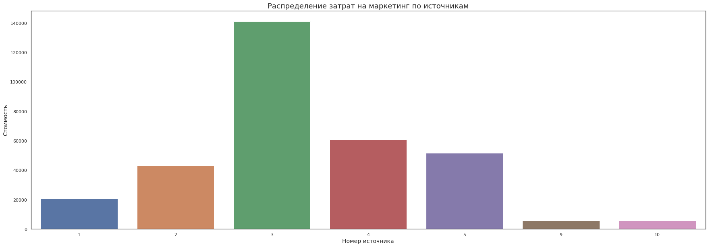
    


Видим что по кол-ву средств потраченных на маркетинг выделяется источник под номером 3


```python
costs['costs_month'] = costs['dt'].astype('datetime64[M]')
```


```python
data = costs.groupby(['costs_month', 'source_id']).agg({'costs': 'sum'})
```


```python
data = data.reset_index()
```


```python
data['costs_month'] = data['costs_month'].dt.strftime('%Y-%m')
```


```python
data
```


<div>
<style scoped>
    .dataframe tbody tr th:only-of-type {
        vertical-align: middle;
    }

    .dataframe tbody tr th {
        vertical-align: top;
    }

    .dataframe thead th {
        text-align: right;
    }
</style>
<table border="1" class="dataframe">
  <thead>
    <tr style="text-align: right;">
      <th></th>
      <th>costs_month</th>
      <th>source_id</th>
      <th>costs</th>
    </tr>
  </thead>
  <tbody>
    <tr>
      <td>0</td>
      <td>2017-06</td>
      <td>1</td>
      <td>1125.61</td>
    </tr>
    <tr>
      <td>1</td>
      <td>2017-06</td>
      <td>2</td>
      <td>2427.38</td>
    </tr>
    <tr>
      <td>2</td>
      <td>2017-06</td>
      <td>3</td>
      <td>7731.65</td>
    </tr>
    <tr>
      <td>3</td>
      <td>2017-06</td>
      <td>4</td>
      <td>3514.80</td>
    </tr>
    <tr>
      <td>4</td>
      <td>2017-06</td>
      <td>5</td>
      <td>2616.12</td>
    </tr>
    <tr>
      <td>...</td>
      <td>...</td>
      <td>...</td>
      <td>...</td>
    </tr>
    <tr>
      <td>79</td>
      <td>2018-05</td>
      <td>3</td>
      <td>9411.42</td>
    </tr>
    <tr>
      <td>80</td>
      <td>2018-05</td>
      <td>4</td>
      <td>4214.21</td>
    </tr>
    <tr>
      <td>81</td>
      <td>2018-05</td>
      <td>5</td>
      <td>3669.56</td>
    </tr>
    <tr>
      <td>82</td>
      <td>2018-05</td>
      <td>9</td>
      <td>362.17</td>
    </tr>
    <tr>
      <td>83</td>
      <td>2018-05</td>
      <td>10</td>
      <td>409.86</td>
    </tr>
  </tbody>
</table>
<p>84 rows × 3 columns</p>
</div>


```python
area_data =[data[data['source_id'] == 1]['costs'],
data[data['source_id'] == 2]['costs'],
data[data['source_id'] == 3]['costs'],
data[data['source_id'] == 4]['costs'],
data[data['source_id'] == 5]['costs'],
data[data['source_id'] == 9]['costs'],
data[data['source_id'] == 10]['costs']]
date = data['costs_month'].unique()
labels = data['source_id'].unique()
```


```python
palette = sns.color_palette("Spectral", 9).as_hex()
colors = ','.join(palette)

fig = plt.figure(figsize=(18,5))
plt.stackplot(date, area_data , colors=colors, labels=labels)
plt.legend(loc='upper center', bbox_to_anchor=(1.1, 0.8), shadow=True, ncol=1)
plt.title('Распределение затрат на маркетинг по источникам в месяц')
plt.ylabel('Сумма')
#plt.xticks(np.arange(1750,2020,step=10), rotation=40)
```


    Text(0, 0.5, 'Сумма')


    
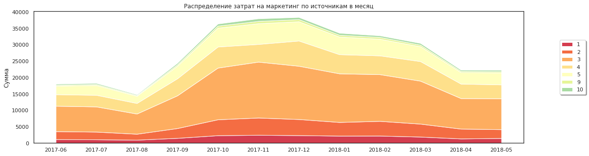
    


Отмечаем схожую пропорцию распределения маркетинговых расходов на протяжении всего времени наблюдения. Так же видим нарасщивание бюджета с августа 17 года и постепенное снижение с декабря 17го года. Наибольшую долю бюджета неизменно занимает 3ий источник привлечения покупателей.

#### Рассчитаем средний CAC на одного покупателя для всего проекта и для каждого источника трафика. Отразим изменения метрик на графиках;


```python
#Загружаем таблицы
visits_new  = pd.read_csv('/datasets/visits_log.csv')
orders_new  = pd.read_csv('/datasets/orders_log.csv')
costs_new  = pd.read_csv('/datasets/costs.csv')

#Исправояем имена столбцов
good_columns(visits_new)
good_columns(orders_new)
good_columns(costs_new)

#Приводим значения столбцов к формату datetime
visits_new['end_ts'] = pd.to_datetime(visits['end_ts'])
visits_new['start_ts'] = pd.to_datetime(visits['start_ts'])
orders_new['buy_ts'] = pd.to_datetime(orders_new['buy_ts'])

#Приводим столбец dt к дневному формату
costs_new['dt'] = pd.to_datetime(costs_new['dt']).dt.date

#orders_new['buy_ts'] = orders_new['buy_ts'].astype('datetime64[M]')
#costs_new['dt'] = costs_new['dt'].astype('datetime64[M]')

#Копируем измененные таблицы
df_order_cac = orders_new.copy()
df_visit_cac = visits_new.copy()
df_cost_cac = costs_new.copy()

#Меняем формат datetime на дневной 
df_order_cac['buy_ts'] = df_order_cac['buy_ts'].astype('datetime64[D]')

#Находим время первого заказа
first_order = df_order_cac.groupby(['uid']).agg({'buy_ts':'min'}).reset_index()
first_order.columns = ['uid', 'first_order_date']

#Приводим столбец first_order_date к дневному формату
first_order['first_order_date'] = first_order['first_order_date'].dt.date

#Создадим таблицу первых визитов:
df_visit_cac['start_ts_date'] = df_visit_cac['start_ts'].astype('datetime64[D]') #!!!
df_visit_cac = df_visit_cac.sort_values('start_ts').groupby('uid').first().reset_index()

#Объединим таблицы first_order и df_visit_cac:
source_first_visit = pd.merge(first_order, df_visit_cac, on='uid')

#display(source_first_visit)

#Сгруппируем таблицу визитов по источнику и дате первого заказа и посчитаем количество пользователей:
group_source_first_visit = source_first_visit.groupby(['source_id','first_order_date']).agg({'uid':'nunique'}).reset_index()
group_source_first_visit = group_source_first_visit.rename(columns={'uid':'n_buyers'})

#display(group_source_first_visit)

#Объединим таблицы group_source_first_visit и group_df_cost_cac:
cost_by_source = pd.merge(group_source_first_visit, df_cost_cac,
                          left_on=['source_id','first_order_date'], right_on=['source_id','dt'], how='inner')

cost_by_source['first_order_month'] = cost_by_source['first_order_date'].astype('datetime64[M]')
#display(cost_by_source)


cost_by_source['cac'] = cost_by_source['costs'] / cost_by_source['n_buyers']

display('Средний САС на одного покупателя для всего проекта: {}'.format(cost_by_source['cac'].mean().round(2)))
display(cost_by_source.groupby('source_id')['cac'].mean())
```


    'Средний САС на одного покупателя для всего проекта: 10.19'


    source_id
    1      9.489732
    2     16.287024
    3     15.580474
    4      7.271743
    5      8.336731
    9      6.842532
    10     6.555415
    Name: cac, dtype: float64


```python
cac = cost_by_source.groupby('first_order_month').agg({'cac':'mean'})
```


```python
fig = plt.figure(figsize=(30,8))
plt.subplot()

months = mdates.MonthLocator()
days = mdates.DayLocator()
timeFmt = mdates.DateFormatter('%Y-%m')

ax = sns.lineplot(data=cac, x="first_order_month", y="cac", color='red')
plt.title('Средний CAC на одного покупателя', fontsize=22)
plt.xlabel('Месяц', fontsize=18)
plt.ylabel('CAC', fontsize=18)
ax.xaxis.set_major_locator(months)
ax.xaxis.set_major_formatter(timeFmt)
ax.xaxis.set_minor_locator(days)
```


    
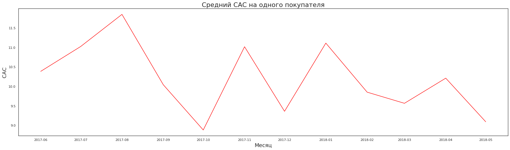
    


```python
cac_source = cost_by_source.groupby(['first_order_month', 'source_id']).agg({'cac':'mean'}).reset_index()
```


```python
fig = plt.figure(figsize=(30,8))
plt.subplot()

months = mdates.MonthLocator()
days = mdates.DayLocator()
timeFmt = mdates.DateFormatter('%Y-%m')

ax = sns.lineplot(data=cac_source, x="first_order_month", y="cac", hue = 'source_id',
                 palette = 'bright')
plt.title('Средний CAC на одного покупателя по источникам', fontsize=22)
plt.xlabel('Месяц', fontsize=18)
plt.ylabel('CAC', fontsize=18)
ax.xaxis.set_major_locator(months)
ax.xaxis.set_major_formatter(timeFmt)
ax.xaxis.set_minor_locator(days)

```


    
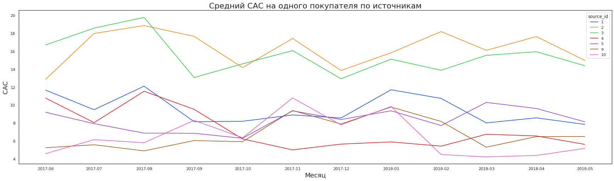
    


Средний САС для всех источников составляет 10.19, при этом если смотреть в разрезе источников для 2 и 3 стоимость привлечения покупателя гораздо выше.

#### Рассчитаем ROMI по когортам в разрезе источников. Сравним окупаемость за одинаковые периоды жизни когорт.  Построим графики, отражающие изменения метрик во времени.


```python
#Пересчитаем LTV с учетом источников

df_order_ltv = orders_new.copy()
df_visit_ltv = visits_new.copy()
df_cost_ltv = costs_new.copy()

#display(df_order_ltv.head())
#display(df_visit_ltv.head())

#Добавим к таблице с заказами дату первого заказа
first_order = df_order_cac.groupby(['uid']).agg({'buy_ts':'min'}).reset_index()
first_order.columns = ['uid', 'first_order_date']
df_order_ltv = pd.merge(df_order_ltv, first_order, on = 'uid')

#display(df_order_ltv)


#Добавим к таблице с заказами время первого визита 
first_visits = df_visit_cac.sort_values('start_ts').groupby('uid').first().reset_index()
df_order_visits_ltv = pd.merge(df_order_ltv, first_visits, on = 'uid')
#display(df_order_visits_ltv)

#Приведем значения столбцов first_order_month и order_month к формату месяца
df_order_visits_ltv['first_order_month'] = df_order_visits_ltv['first_order_date'].astype('datetime64[M]')
df_order_visits_ltv['order_month'] = df_order_visits_ltv['buy_ts'].astype('datetime64[M]')
#display(df_order_visits_ltv.head())

#Найдем размер каждой когорты с учетом источника
cohort_sizes = (
    df_order_visits_ltv.groupby(['first_order_month', 'source_id'])
    .agg({'uid': 'nunique'})
    .reset_index()
)
cohort_sizes.columns = ['first_order_month', 'source_id','n_buyers']

display(cohort_sizes)

#Найдем выручку для каждой когорты с учетом источника
cohorts = (
    df_order_visits_ltv.groupby(['first_order_month', 'order_month', 'source_id'])
    .agg({'revenue': 'sum'})
    .reset_index()
)

display(cohorts)
```


<div>
<style scoped>
    .dataframe tbody tr th:only-of-type {
        vertical-align: middle;
    }

    .dataframe tbody tr th {
        vertical-align: top;
    }

    .dataframe thead th {
        text-align: right;
    }
</style>
<table border="1" class="dataframe">
  <thead>
    <tr style="text-align: right;">
      <th></th>
      <th>first_order_month</th>
      <th>source_id</th>
      <th>n_buyers</th>
    </tr>
  </thead>
  <tbody>
    <tr>
      <td>0</td>
      <td>2017-06-01</td>
      <td>1</td>
      <td>190</td>
    </tr>
    <tr>
      <td>1</td>
      <td>2017-06-01</td>
      <td>2</td>
      <td>235</td>
    </tr>
    <tr>
      <td>2</td>
      <td>2017-06-01</td>
      <td>3</td>
      <td>638</td>
    </tr>
    <tr>
      <td>3</td>
      <td>2017-06-01</td>
      <td>4</td>
      <td>413</td>
    </tr>
    <tr>
      <td>4</td>
      <td>2017-06-01</td>
      <td>5</td>
      <td>384</td>
    </tr>
    <tr>
      <td>...</td>
      <td>...</td>
      <td>...</td>
      <td>...</td>
    </tr>
    <tr>
      <td>81</td>
      <td>2018-05-01</td>
      <td>4</td>
      <td>804</td>
    </tr>
    <tr>
      <td>82</td>
      <td>2018-05-01</td>
      <td>5</td>
      <td>497</td>
    </tr>
    <tr>
      <td>83</td>
      <td>2018-05-01</td>
      <td>9</td>
      <td>60</td>
    </tr>
    <tr>
      <td>84</td>
      <td>2018-05-01</td>
      <td>10</td>
      <td>130</td>
    </tr>
    <tr>
      <td>85</td>
      <td>2018-06-01</td>
      <td>4</td>
      <td>1</td>
    </tr>
  </tbody>
</table>
<p>86 rows × 3 columns</p>
</div>


<div>
<style scoped>
    .dataframe tbody tr th:only-of-type {
        vertical-align: middle;
    }

    .dataframe tbody tr th {
        vertical-align: top;
    }

    .dataframe thead th {
        text-align: right;
    }
</style>
<table border="1" class="dataframe">
  <thead>
    <tr style="text-align: right;">
      <th></th>
      <th>first_order_month</th>
      <th>order_month</th>
      <th>source_id</th>
      <th>revenue</th>
    </tr>
  </thead>
  <tbody>
    <tr>
      <td>0</td>
      <td>2017-06-01</td>
      <td>2017-06-01</td>
      <td>1</td>
      <td>1378.70</td>
    </tr>
    <tr>
      <td>1</td>
      <td>2017-06-01</td>
      <td>2017-06-01</td>
      <td>2</td>
      <td>1043.68</td>
    </tr>
    <tr>
      <td>2</td>
      <td>2017-06-01</td>
      <td>2017-06-01</td>
      <td>3</td>
      <td>2804.34</td>
    </tr>
    <tr>
      <td>3</td>
      <td>2017-06-01</td>
      <td>2017-06-01</td>
      <td>4</td>
      <td>1959.84</td>
    </tr>
    <tr>
      <td>4</td>
      <td>2017-06-01</td>
      <td>2017-06-01</td>
      <td>5</td>
      <td>1898.89</td>
    </tr>
    <tr>
      <td>...</td>
      <td>...</td>
      <td>...</td>
      <td>...</td>
      <td>...</td>
    </tr>
    <tr>
      <td>511</td>
      <td>2018-05-01</td>
      <td>2018-05-01</td>
      <td>4</td>
      <td>3802.91</td>
    </tr>
    <tr>
      <td>512</td>
      <td>2018-05-01</td>
      <td>2018-05-01</td>
      <td>5</td>
      <td>2094.04</td>
    </tr>
    <tr>
      <td>513</td>
      <td>2018-05-01</td>
      <td>2018-05-01</td>
      <td>9</td>
      <td>223.05</td>
    </tr>
    <tr>
      <td>514</td>
      <td>2018-05-01</td>
      <td>2018-05-01</td>
      <td>10</td>
      <td>470.89</td>
    </tr>
    <tr>
      <td>515</td>
      <td>2018-06-01</td>
      <td>2018-06-01</td>
      <td>4</td>
      <td>3.42</td>
    </tr>
  </tbody>
</table>
<p>516 rows × 4 columns</p>
</div>


```python
#Сформируем таблицу с когортами и их размером с учетом источников:
report = pd.merge(cohort_sizes, cohorts, on=['source_id','first_order_month'])

#Добавим время жизни когорт и посчитаем ltv с учетом источников 
report['age'] = (
    report['order_month'] - report['first_order_month']
) / np.timedelta64(1, 'M')
report['age'] = report['age'].round().astype('int')
report['ltv'] = report['revenue'] / report['n_buyers']
display(report)
```


<div>
<style scoped>
    .dataframe tbody tr th:only-of-type {
        vertical-align: middle;
    }

    .dataframe tbody tr th {
        vertical-align: top;
    }

    .dataframe thead th {
        text-align: right;
    }
</style>
<table border="1" class="dataframe">
  <thead>
    <tr style="text-align: right;">
      <th></th>
      <th>first_order_month</th>
      <th>source_id</th>
      <th>n_buyers</th>
      <th>order_month</th>
      <th>revenue</th>
      <th>age</th>
      <th>ltv</th>
    </tr>
  </thead>
  <tbody>
    <tr>
      <td>0</td>
      <td>2017-06-01</td>
      <td>1</td>
      <td>190</td>
      <td>2017-06-01</td>
      <td>1378.70</td>
      <td>0</td>
      <td>7.256316</td>
    </tr>
    <tr>
      <td>1</td>
      <td>2017-06-01</td>
      <td>1</td>
      <td>190</td>
      <td>2017-07-01</td>
      <td>414.98</td>
      <td>1</td>
      <td>2.184105</td>
    </tr>
    <tr>
      <td>2</td>
      <td>2017-06-01</td>
      <td>1</td>
      <td>190</td>
      <td>2017-08-01</td>
      <td>419.43</td>
      <td>2</td>
      <td>2.207526</td>
    </tr>
    <tr>
      <td>3</td>
      <td>2017-06-01</td>
      <td>1</td>
      <td>190</td>
      <td>2017-09-01</td>
      <td>714.24</td>
      <td>3</td>
      <td>3.759158</td>
    </tr>
    <tr>
      <td>4</td>
      <td>2017-06-01</td>
      <td>1</td>
      <td>190</td>
      <td>2017-10-01</td>
      <td>811.20</td>
      <td>4</td>
      <td>4.269474</td>
    </tr>
    <tr>
      <td>...</td>
      <td>...</td>
      <td>...</td>
      <td>...</td>
      <td>...</td>
      <td>...</td>
      <td>...</td>
      <td>...</td>
    </tr>
    <tr>
      <td>511</td>
      <td>2018-05-01</td>
      <td>4</td>
      <td>804</td>
      <td>2018-05-01</td>
      <td>3802.91</td>
      <td>0</td>
      <td>4.729988</td>
    </tr>
    <tr>
      <td>512</td>
      <td>2018-05-01</td>
      <td>5</td>
      <td>497</td>
      <td>2018-05-01</td>
      <td>2094.04</td>
      <td>0</td>
      <td>4.213360</td>
    </tr>
    <tr>
      <td>513</td>
      <td>2018-05-01</td>
      <td>9</td>
      <td>60</td>
      <td>2018-05-01</td>
      <td>223.05</td>
      <td>0</td>
      <td>3.717500</td>
    </tr>
    <tr>
      <td>514</td>
      <td>2018-05-01</td>
      <td>10</td>
      <td>130</td>
      <td>2018-05-01</td>
      <td>470.89</td>
      <td>0</td>
      <td>3.622231</td>
    </tr>
    <tr>
      <td>515</td>
      <td>2018-06-01</td>
      <td>4</td>
      <td>1</td>
      <td>2018-06-01</td>
      <td>3.42</td>
      <td>0</td>
      <td>3.420000</td>
    </tr>
  </tbody>
</table>
<p>516 rows × 7 columns</p>
</div>


```python
df_order_visits_ltv['first_order_date'] = df_order_visits_ltv['first_order_date'].astype('datetime64[D]')
```


```python
data = df_order_visits_ltv.groupby(['source_id', 'first_order_date']).agg({'uid': 'nunique'}).reset_index()
```


```python
data
```


<div>
<style scoped>
    .dataframe tbody tr th:only-of-type {
        vertical-align: middle;
    }

    .dataframe tbody tr th {
        vertical-align: top;
    }

    .dataframe thead th {
        text-align: right;
    }
</style>
<table border="1" class="dataframe">
  <thead>
    <tr style="text-align: right;">
      <th></th>
      <th>source_id</th>
      <th>first_order_date</th>
      <th>uid</th>
    </tr>
  </thead>
  <tbody>
    <tr>
      <td>0</td>
      <td>1</td>
      <td>2017-06-01</td>
      <td>14</td>
    </tr>
    <tr>
      <td>1</td>
      <td>1</td>
      <td>2017-06-02</td>
      <td>7</td>
    </tr>
    <tr>
      <td>2</td>
      <td>1</td>
      <td>2017-06-03</td>
      <td>7</td>
    </tr>
    <tr>
      <td>3</td>
      <td>1</td>
      <td>2017-06-04</td>
      <td>3</td>
    </tr>
    <tr>
      <td>4</td>
      <td>1</td>
      <td>2017-06-05</td>
      <td>18</td>
    </tr>
    <tr>
      <td>...</td>
      <td>...</td>
      <td>...</td>
      <td>...</td>
    </tr>
    <tr>
      <td>2430</td>
      <td>10</td>
      <td>2018-05-27</td>
      <td>2</td>
    </tr>
    <tr>
      <td>2431</td>
      <td>10</td>
      <td>2018-05-28</td>
      <td>10</td>
    </tr>
    <tr>
      <td>2432</td>
      <td>10</td>
      <td>2018-05-29</td>
      <td>7</td>
    </tr>
    <tr>
      <td>2433</td>
      <td>10</td>
      <td>2018-05-30</td>
      <td>5</td>
    </tr>
    <tr>
      <td>2434</td>
      <td>10</td>
      <td>2018-05-31</td>
      <td>35</td>
    </tr>
  </tbody>
</table>
<p>2435 rows × 3 columns</p>
</div>


```python
df_cost_ltv['dt'] = df_cost_ltv['dt'].astype('datetime64[D]')
```


```python
last_data = pd.merge(data, df_cost_ltv, 
                left_on=['source_id','first_order_date'], right_on=['source_id','dt'], how='inner')
```


```python
last_data
```


<div>
<style scoped>
    .dataframe tbody tr th:only-of-type {
        vertical-align: middle;
    }

    .dataframe tbody tr th {
        vertical-align: top;
    }

    .dataframe thead th {
        text-align: right;
    }
</style>
<table border="1" class="dataframe">
  <thead>
    <tr style="text-align: right;">
      <th></th>
      <th>source_id</th>
      <th>first_order_date</th>
      <th>uid</th>
      <th>dt</th>
      <th>costs</th>
    </tr>
  </thead>
  <tbody>
    <tr>
      <td>0</td>
      <td>1</td>
      <td>2017-06-01</td>
      <td>14</td>
      <td>2017-06-01</td>
      <td>75.20</td>
    </tr>
    <tr>
      <td>1</td>
      <td>1</td>
      <td>2017-06-02</td>
      <td>7</td>
      <td>2017-06-02</td>
      <td>62.25</td>
    </tr>
    <tr>
      <td>2</td>
      <td>1</td>
      <td>2017-06-03</td>
      <td>7</td>
      <td>2017-06-03</td>
      <td>36.53</td>
    </tr>
    <tr>
      <td>3</td>
      <td>1</td>
      <td>2017-06-04</td>
      <td>3</td>
      <td>2017-06-04</td>
      <td>55.00</td>
    </tr>
    <tr>
      <td>4</td>
      <td>1</td>
      <td>2017-06-05</td>
      <td>18</td>
      <td>2017-06-05</td>
      <td>57.08</td>
    </tr>
    <tr>
      <td>...</td>
      <td>...</td>
      <td>...</td>
      <td>...</td>
      <td>...</td>
      <td>...</td>
    </tr>
    <tr>
      <td>2428</td>
      <td>10</td>
      <td>2018-05-27</td>
      <td>2</td>
      <td>2018-05-27</td>
      <td>9.92</td>
    </tr>
    <tr>
      <td>2429</td>
      <td>10</td>
      <td>2018-05-28</td>
      <td>10</td>
      <td>2018-05-28</td>
      <td>21.26</td>
    </tr>
    <tr>
      <td>2430</td>
      <td>10</td>
      <td>2018-05-29</td>
      <td>7</td>
      <td>2018-05-29</td>
      <td>11.32</td>
    </tr>
    <tr>
      <td>2431</td>
      <td>10</td>
      <td>2018-05-30</td>
      <td>5</td>
      <td>2018-05-30</td>
      <td>33.15</td>
    </tr>
    <tr>
      <td>2432</td>
      <td>10</td>
      <td>2018-05-31</td>
      <td>35</td>
      <td>2018-05-31</td>
      <td>17.60</td>
    </tr>
  </tbody>
</table>
<p>2433 rows × 5 columns</p>
</div>


```python
last_data['first_order_month'] = last_data['first_order_date'].astype('datetime64[M]')
```


```python
last_data
```


<div>
<style scoped>
    .dataframe tbody tr th:only-of-type {
        vertical-align: middle;
    }

    .dataframe tbody tr th {
        vertical-align: top;
    }

    .dataframe thead th {
        text-align: right;
    }
</style>
<table border="1" class="dataframe">
  <thead>
    <tr style="text-align: right;">
      <th></th>
      <th>source_id</th>
      <th>first_order_date</th>
      <th>uid</th>
      <th>dt</th>
      <th>costs</th>
      <th>first_order_month</th>
    </tr>
  </thead>
  <tbody>
    <tr>
      <td>0</td>
      <td>1</td>
      <td>2017-06-01</td>
      <td>14</td>
      <td>2017-06-01</td>
      <td>75.20</td>
      <td>2017-06-01</td>
    </tr>
    <tr>
      <td>1</td>
      <td>1</td>
      <td>2017-06-02</td>
      <td>7</td>
      <td>2017-06-02</td>
      <td>62.25</td>
      <td>2017-06-01</td>
    </tr>
    <tr>
      <td>2</td>
      <td>1</td>
      <td>2017-06-03</td>
      <td>7</td>
      <td>2017-06-03</td>
      <td>36.53</td>
      <td>2017-06-01</td>
    </tr>
    <tr>
      <td>3</td>
      <td>1</td>
      <td>2017-06-04</td>
      <td>3</td>
      <td>2017-06-04</td>
      <td>55.00</td>
      <td>2017-06-01</td>
    </tr>
    <tr>
      <td>4</td>
      <td>1</td>
      <td>2017-06-05</td>
      <td>18</td>
      <td>2017-06-05</td>
      <td>57.08</td>
      <td>2017-06-01</td>
    </tr>
    <tr>
      <td>...</td>
      <td>...</td>
      <td>...</td>
      <td>...</td>
      <td>...</td>
      <td>...</td>
      <td>...</td>
    </tr>
    <tr>
      <td>2428</td>
      <td>10</td>
      <td>2018-05-27</td>
      <td>2</td>
      <td>2018-05-27</td>
      <td>9.92</td>
      <td>2018-05-01</td>
    </tr>
    <tr>
      <td>2429</td>
      <td>10</td>
      <td>2018-05-28</td>
      <td>10</td>
      <td>2018-05-28</td>
      <td>21.26</td>
      <td>2018-05-01</td>
    </tr>
    <tr>
      <td>2430</td>
      <td>10</td>
      <td>2018-05-29</td>
      <td>7</td>
      <td>2018-05-29</td>
      <td>11.32</td>
      <td>2018-05-01</td>
    </tr>
    <tr>
      <td>2431</td>
      <td>10</td>
      <td>2018-05-30</td>
      <td>5</td>
      <td>2018-05-30</td>
      <td>33.15</td>
      <td>2018-05-01</td>
    </tr>
    <tr>
      <td>2432</td>
      <td>10</td>
      <td>2018-05-31</td>
      <td>35</td>
      <td>2018-05-31</td>
      <td>17.60</td>
      <td>2018-05-01</td>
    </tr>
  </tbody>
</table>
<p>2433 rows × 6 columns</p>
</div>


```python
uuu = last_data.groupby(['first_order_month', 'source_id']).agg({'costs' : 'sum'}).reset_index()
uuu
```


<div>
<style scoped>
    .dataframe tbody tr th:only-of-type {
        vertical-align: middle;
    }

    .dataframe tbody tr th {
        vertical-align: top;
    }

    .dataframe thead th {
        text-align: right;
    }
</style>
<table border="1" class="dataframe">
  <thead>
    <tr style="text-align: right;">
      <th></th>
      <th>first_order_month</th>
      <th>source_id</th>
      <th>costs</th>
    </tr>
  </thead>
  <tbody>
    <tr>
      <td>0</td>
      <td>2017-06-01</td>
      <td>1</td>
      <td>1103.93</td>
    </tr>
    <tr>
      <td>1</td>
      <td>2017-06-01</td>
      <td>2</td>
      <td>2427.38</td>
    </tr>
    <tr>
      <td>2</td>
      <td>2017-06-01</td>
      <td>3</td>
      <td>7731.65</td>
    </tr>
    <tr>
      <td>3</td>
      <td>2017-06-01</td>
      <td>4</td>
      <td>3514.80</td>
    </tr>
    <tr>
      <td>4</td>
      <td>2017-06-01</td>
      <td>5</td>
      <td>2616.12</td>
    </tr>
    <tr>
      <td>...</td>
      <td>...</td>
      <td>...</td>
      <td>...</td>
    </tr>
    <tr>
      <td>79</td>
      <td>2018-05-01</td>
      <td>3</td>
      <td>9411.42</td>
    </tr>
    <tr>
      <td>80</td>
      <td>2018-05-01</td>
      <td>4</td>
      <td>4214.21</td>
    </tr>
    <tr>
      <td>81</td>
      <td>2018-05-01</td>
      <td>5</td>
      <td>3669.56</td>
    </tr>
    <tr>
      <td>82</td>
      <td>2018-05-01</td>
      <td>9</td>
      <td>299.78</td>
    </tr>
    <tr>
      <td>83</td>
      <td>2018-05-01</td>
      <td>10</td>
      <td>380.34</td>
    </tr>
  </tbody>
</table>
<p>84 rows × 3 columns</p>
</div>


```python
uuu.info()
```

    <class 'pandas.core.frame.DataFrame'>
    RangeIndex: 84 entries, 0 to 83
    Data columns (total 3 columns):
    first_order_month    84 non-null datetime64[ns]
    source_id            84 non-null int64
    costs                84 non-null float64
    dtypes: datetime64[ns](1), float64(1), int64(1)
    memory usage: 2.1 KB


```python
final = pd.merge(report, uuu, on = ['first_order_month', 'source_id'], how = 'left')
```


```python
final
```


<div>
<style scoped>
    .dataframe tbody tr th:only-of-type {
        vertical-align: middle;
    }

    .dataframe tbody tr th {
        vertical-align: top;
    }

    .dataframe thead th {
        text-align: right;
    }
</style>
<table border="1" class="dataframe">
  <thead>
    <tr style="text-align: right;">
      <th></th>
      <th>first_order_month</th>
      <th>source_id</th>
      <th>n_buyers</th>
      <th>order_month</th>
      <th>revenue</th>
      <th>age</th>
      <th>ltv</th>
      <th>costs</th>
    </tr>
  </thead>
  <tbody>
    <tr>
      <td>0</td>
      <td>2017-06-01</td>
      <td>1</td>
      <td>190</td>
      <td>2017-06-01</td>
      <td>1378.70</td>
      <td>0</td>
      <td>7.256316</td>
      <td>1103.93</td>
    </tr>
    <tr>
      <td>1</td>
      <td>2017-06-01</td>
      <td>1</td>
      <td>190</td>
      <td>2017-07-01</td>
      <td>414.98</td>
      <td>1</td>
      <td>2.184105</td>
      <td>1103.93</td>
    </tr>
    <tr>
      <td>2</td>
      <td>2017-06-01</td>
      <td>1</td>
      <td>190</td>
      <td>2017-08-01</td>
      <td>419.43</td>
      <td>2</td>
      <td>2.207526</td>
      <td>1103.93</td>
    </tr>
    <tr>
      <td>3</td>
      <td>2017-06-01</td>
      <td>1</td>
      <td>190</td>
      <td>2017-09-01</td>
      <td>714.24</td>
      <td>3</td>
      <td>3.759158</td>
      <td>1103.93</td>
    </tr>
    <tr>
      <td>4</td>
      <td>2017-06-01</td>
      <td>1</td>
      <td>190</td>
      <td>2017-10-01</td>
      <td>811.20</td>
      <td>4</td>
      <td>4.269474</td>
      <td>1103.93</td>
    </tr>
    <tr>
      <td>...</td>
      <td>...</td>
      <td>...</td>
      <td>...</td>
      <td>...</td>
      <td>...</td>
      <td>...</td>
      <td>...</td>
      <td>...</td>
    </tr>
    <tr>
      <td>511</td>
      <td>2018-05-01</td>
      <td>4</td>
      <td>804</td>
      <td>2018-05-01</td>
      <td>3802.91</td>
      <td>0</td>
      <td>4.729988</td>
      <td>4214.21</td>
    </tr>
    <tr>
      <td>512</td>
      <td>2018-05-01</td>
      <td>5</td>
      <td>497</td>
      <td>2018-05-01</td>
      <td>2094.04</td>
      <td>0</td>
      <td>4.213360</td>
      <td>3669.56</td>
    </tr>
    <tr>
      <td>513</td>
      <td>2018-05-01</td>
      <td>9</td>
      <td>60</td>
      <td>2018-05-01</td>
      <td>223.05</td>
      <td>0</td>
      <td>3.717500</td>
      <td>299.78</td>
    </tr>
    <tr>
      <td>514</td>
      <td>2018-05-01</td>
      <td>10</td>
      <td>130</td>
      <td>2018-05-01</td>
      <td>470.89</td>
      <td>0</td>
      <td>3.622231</td>
      <td>380.34</td>
    </tr>
    <tr>
      <td>515</td>
      <td>2018-06-01</td>
      <td>4</td>
      <td>1</td>
      <td>2018-06-01</td>
      <td>3.42</td>
      <td>0</td>
      <td>3.420000</td>
      <td>NaN</td>
    </tr>
  </tbody>
</table>
<p>516 rows × 8 columns</p>
</div>


```python
final['cac'] = final['costs'] / final['n_buyers']
```


```python
final['romi'] = final['ltv'] / final['cac']
final['first_order_month'] = final['first_order_month'].dt.strftime('%Y-%m')
```


```python
final
```


<div>
<style scoped>
    .dataframe tbody tr th:only-of-type {
        vertical-align: middle;
    }

    .dataframe tbody tr th {
        vertical-align: top;
    }

    .dataframe thead th {
        text-align: right;
    }
</style>
<table border="1" class="dataframe">
  <thead>
    <tr style="text-align: right;">
      <th></th>
      <th>first_order_month</th>
      <th>source_id</th>
      <th>n_buyers</th>
      <th>order_month</th>
      <th>revenue</th>
      <th>age</th>
      <th>ltv</th>
      <th>costs</th>
      <th>cac</th>
      <th>romi</th>
    </tr>
  </thead>
  <tbody>
    <tr>
      <td>0</td>
      <td>2017-06</td>
      <td>1</td>
      <td>190</td>
      <td>2017-06-01</td>
      <td>1378.70</td>
      <td>0</td>
      <td>7.256316</td>
      <td>1103.93</td>
      <td>5.810158</td>
      <td>1.248902</td>
    </tr>
    <tr>
      <td>1</td>
      <td>2017-06</td>
      <td>1</td>
      <td>190</td>
      <td>2017-07-01</td>
      <td>414.98</td>
      <td>1</td>
      <td>2.184105</td>
      <td>1103.93</td>
      <td>5.810158</td>
      <td>0.375912</td>
    </tr>
    <tr>
      <td>2</td>
      <td>2017-06</td>
      <td>1</td>
      <td>190</td>
      <td>2017-08-01</td>
      <td>419.43</td>
      <td>2</td>
      <td>2.207526</td>
      <td>1103.93</td>
      <td>5.810158</td>
      <td>0.379943</td>
    </tr>
    <tr>
      <td>3</td>
      <td>2017-06</td>
      <td>1</td>
      <td>190</td>
      <td>2017-09-01</td>
      <td>714.24</td>
      <td>3</td>
      <td>3.759158</td>
      <td>1103.93</td>
      <td>5.810158</td>
      <td>0.646998</td>
    </tr>
    <tr>
      <td>4</td>
      <td>2017-06</td>
      <td>1</td>
      <td>190</td>
      <td>2017-10-01</td>
      <td>811.20</td>
      <td>4</td>
      <td>4.269474</td>
      <td>1103.93</td>
      <td>5.810158</td>
      <td>0.734829</td>
    </tr>
    <tr>
      <td>...</td>
      <td>...</td>
      <td>...</td>
      <td>...</td>
      <td>...</td>
      <td>...</td>
      <td>...</td>
      <td>...</td>
      <td>...</td>
      <td>...</td>
      <td>...</td>
    </tr>
    <tr>
      <td>511</td>
      <td>2018-05</td>
      <td>4</td>
      <td>804</td>
      <td>2018-05-01</td>
      <td>3802.91</td>
      <td>0</td>
      <td>4.729988</td>
      <td>4214.21</td>
      <td>5.241555</td>
      <td>0.902402</td>
    </tr>
    <tr>
      <td>512</td>
      <td>2018-05</td>
      <td>5</td>
      <td>497</td>
      <td>2018-05-01</td>
      <td>2094.04</td>
      <td>0</td>
      <td>4.213360</td>
      <td>3669.56</td>
      <td>7.383421</td>
      <td>0.570652</td>
    </tr>
    <tr>
      <td>513</td>
      <td>2018-05</td>
      <td>9</td>
      <td>60</td>
      <td>2018-05-01</td>
      <td>223.05</td>
      <td>0</td>
      <td>3.717500</td>
      <td>299.78</td>
      <td>4.996333</td>
      <td>0.744046</td>
    </tr>
    <tr>
      <td>514</td>
      <td>2018-05</td>
      <td>10</td>
      <td>130</td>
      <td>2018-05-01</td>
      <td>470.89</td>
      <td>0</td>
      <td>3.622231</td>
      <td>380.34</td>
      <td>2.925692</td>
      <td>1.238076</td>
    </tr>
    <tr>
      <td>515</td>
      <td>2018-06</td>
      <td>4</td>
      <td>1</td>
      <td>2018-06-01</td>
      <td>3.42</td>
      <td>0</td>
      <td>3.420000</td>
      <td>NaN</td>
      <td>NaN</td>
      <td>NaN</td>
    </tr>
  </tbody>
</table>
<p>516 rows × 10 columns</p>
</div>


```python
for i in costs['source_id'].unique():
    final_1 = final[final['source_id'] == i]
    output = final_1.pivot_table(
        index='first_order_month', columns='age', values='romi', aggfunc='mean'
    )
    
    display('Source_id: {}'.format(i))
    #display(output.cumsum(axis=1).round(2).fillna('') )
    display(output.cumsum(axis=1).mean(axis=0))
```


    'Source_id: 1'


    age
    0     0.896870
    1     1.054240
    2     1.265794
    3     1.373079
    4     1.579057
    5     1.784799
    6     2.058848
    7     2.390708
    8     2.899744
    9     3.517754
    10    4.309252
    11    5.790575
    dtype: float64


    'Source_id: 2'


    age
    0     0.549809
    1     0.630713
    2     0.778177
    3     0.940051
    4     1.086790
    5     1.230695
    6     1.031419
    7     1.142108
    8     1.217649
    9     0.997106
    10    1.290747
    11    1.612957
    dtype: float64


    'Source_id: 3'


    age
    0     0.336151
    1     0.357750
    2     0.367152
    3     0.379767
    4     0.394988
    5     0.413851
    6     0.423732
    7     0.442706
    8     0.454574
    9     0.429613
    10    0.479128
    11    0.470834
    dtype: float64


    'Source_id: 4'


    age
    0     0.757591
    1     0.777118
    2     0.791857
    3     0.814921
    4     0.843845
    5     0.900297
    6     0.980375
    7     0.900496
    8     0.904477
    9     0.952753
    10    1.165144
    11    1.420471
    dtype: float64


    'Source_id: 5'


    age
    0     0.664930
    1     0.718187
    2     0.779618
    3     1.111582
    4     1.231647
    5     1.387731
    6     1.549131
    7     1.783598
    8     2.016601
    9     1.415622
    10    1.306381
    11    1.673333
    dtype: float64


    'Source_id: 9'


    age
    0     0.922197
    1     1.008903
    2     1.092498
    3     1.210882
    4     1.265664
    5     1.423288
    6     1.571047
    7     1.737837
    8     1.913976
    9     1.793551
    10    1.898806
    dtype: float64


    'Source_id: 10'


    age
    0    0.807268
    1    0.788778
    2    0.830895
    3    0.763323
    4    0.773311
    5    0.808618
    6    0.915105
    7    0.916066
    8    0.715775
    9    1.226031
    dtype: float64

fig, ax = plt.subplots(len(costs['source_id'].unique()),1)
fig.set_size_inches(35, 70)
n = 0
for i in costs['source_id'].unique():
    final_1 = final[final['source_id'] == i]
    final_1['romi'] = final_1['ltv'] / final_1['cac']
    output = final_1.pivot_table(
        index='first_order_month', columns='age', values='romi', aggfunc='mean'
    )
    romi = output.cumsum(axis=1).mean(axis=0)
    sns.lineplot(data=romi, ax = ax[n])
    ax[n].set_title('График окупаемости по источнику {}'.format(i), fontsize=20)
    ax[n].set_xlabel('Срок жизни когорты, мес.', fontsize=18)
    ax[n].set_ylabel('ROMI', fontsize=18)
    ax[n].tick_params(labelsize=14)
    n+=1

```python
for i in costs['source_id'].unique():
    final_a = final[final['source_id'] == i]
    output_1 = final_a.pivot_table(
        index='first_order_month', columns='age', values='romi', aggfunc='mean'
    ).cumsum(axis=1).round(2) 

    plt.figure(figsize=(13, 9))
    plt.title('ROMI от ' + str(i)+ ' источника')
    sns.heatmap(output_1, annot=True, linewidths=1, fmt='.2f' ,linecolor='gray', vmin = 0.2, vmax = 2) 
```


    
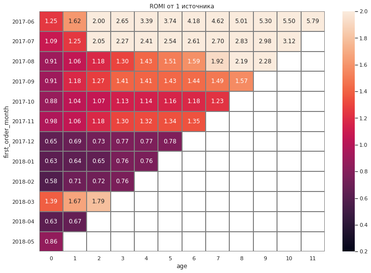
    


    
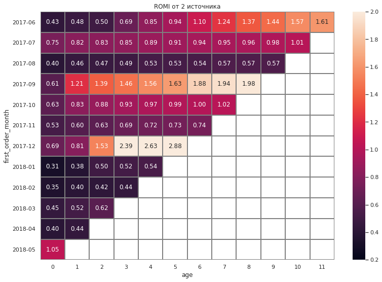
    


    
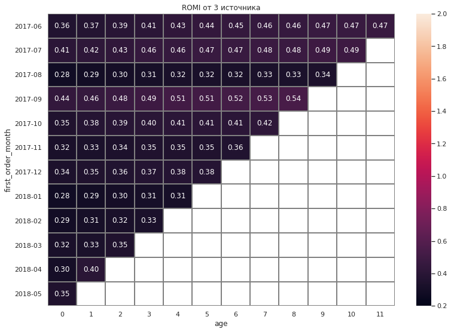
    


    
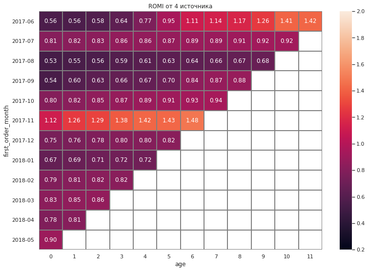
    


    
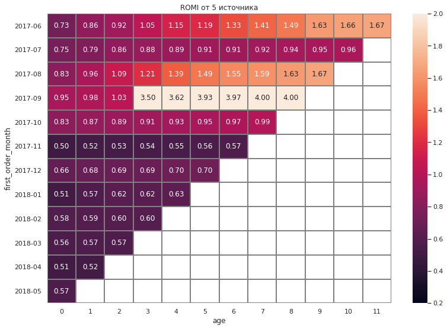
    


    
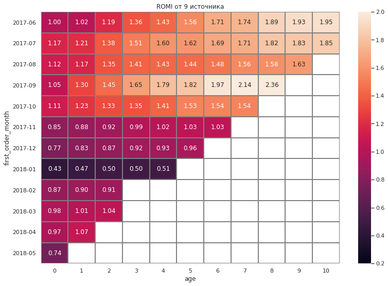
    


    
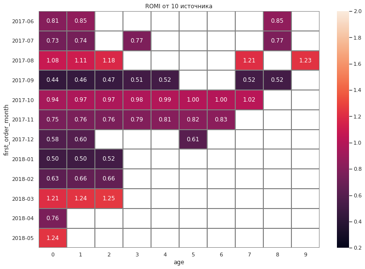
    


Все источники кроме 3его в среднем окупаются, лучший показатель у 1ого источника. Так же неплохие показатели у 5 и 9 источников. 3ий источник являясь самым дорогим в пересчете на покупателя и занимая большую часть бюджета на маркетинг вовсе не окупился за наблюдаемы период.

## Выводы и рекомендации

Согласно ROMI самый быстрый и прибыльный источник - 1, вовсе не окупается источник номер 3. При этом обратим внимание что при распределении бюджета на маркетинг 3му источнику выделяется больше всего средств. Так же отмечаем что стоимость привлечения одного клиента для 2 и 3 источника самая большая. Оценивая стоимость привлечения клиента и окупаемость инвестиций на маркетинг, можно сказат что источники 1,2,5 и 9

Продуктовые метрики:
- Кол-во новых пользователей прямопропорционально распределению рекламного бюджета
- В среднем пользователь заходит 1 раз
- Наиболее распространенное время пользовательской сессии - 1 минута
- Степень удержания пользователя очень низка, на второй месяц жизни когорт падение составляет около 94%

Метрики электронной коммерции:
- С момента первого входа до первой покупки проходит в среднем 1 минута, что соотносится со средним временем пользовательской сессии
- Колличество покупок совершенных одним пользователем с одной в первый месяц жизни когорты к 6 месяцу составляет 2
- Средний чек на одного пользователя для всех когорт составляет от 4,7 до 7.3 у.е. (всреднем 5.8)
- Отмечем что по значению LTV выделяются когорты пользователей пришедших в июне и сентябре

Маркетинговые метрики:
- Плюс минус пропорции в распределении рекламного бюджета остаются схожими на протяжении всего времени. Так же заметим что кол-во средств потраченных на маркетинг коррелирует с кол-вом новых пользователей
- Оценивая метрики в разрезе источников выделяем наиболее выгодные и определяем убыточные.
Согласно ROMI самый быстрый и прибыльный источник - 1, вовсе не окупается источник номер 3. При этом обратим внимание что при распределении бюджета на маркетинг 3му источнику выделяется больше всего средств. Так же отмечаем что стоимость привлечения одного клиента для 2 и 3 источника самая большая.

Согласно маркетинговым метриками стоит исключить из источников привлечения покупателей 3ий номер, так как за год он не окупился ни у одной из когорт пользоватлей. Это позволит использовать рекламный бюджет более эффективно, перераспрелделив его на выгодные и перспективные источники привлечения трафика, такие как номер 1, 5 и 9

### Итоги когортного анализа

Проведя исследования данных и когортный анализ делаем следующие выводы: наиболее выделяются когорты пользователей привлеченных в июне и сентябре. Именно на эти когорты следует сделать упор в при распределении бюджета на маркетинг(учитывая наиболее выгодные источники трафика для максимизации прибыли)
