**Проанализируйте клиентов регионального банка и сегментировать пользователей по количеству потребляемых продуктов.**

- Проведите исследовательский анализ данных,
- Сегментируйте пользователей на основе данных о количестве потребляемых продуктов,
- Сформулируйте и проверьте статистические гипотезы.

    *Проверьте гипотезу различия дохода между теми клиентами, которые пользуются двумя продуктами банка, и теми, которые пользуются одним.*

    *Сформулируйте и проверьте статистическую гипотезу относительно представленных данных.*

Ссылка на дашборд: https://public.tableau.com/views/Final_16295068799600/Dashboard1?:language=en-US&publish=yes&:display_count=n&:origin=viz_share_link

 **Описание данных:**

Датасет содержит данные о клиентах банка. Банк располагается в Ярославле и областных городах: Ростов Великий и Рыбинск.

Колонки:

- `userid` — идентификатор пользователя,
- `score` — баллы кредитного скоринга,
- `City` — город,
- `Gender` — пол,
- `Age` — возраст,
- `Objects` — количество объектов в собственности,
- `Balance` — баланс на счёте,
- `Products` — количество продуктов, которыми пользуется клиент,
- `CreditCard` — есть ли кредитная карта,
- `Loyalty` — активный клиент,
- `estimated_salary` — заработная плата клиента,
- `Churn` — ушёл или нет.

# Импорт библиотек, загрузка данных и первичный осмотр

Импортируем библиотеки:


```python
import pandas as pd
from matplotlib import pyplot as plt
import seaborn as sns
import scipy.stats as stats
from sklearn.preprocessing import StandardScaler
from scipy.cluster.hierarchy import dendrogram, linkage
from sklearn.cluster import KMeans
import os
```


```python
pip install -U seaborn
```

    Defaulting to user installation because normal site-packages is not writeable
    Requirement already up-to-date: seaborn in /home/jovyan/.local/lib/python3.7/site-packages (0.11.2)
    Requirement already satisfied, skipping upgrade: numpy>=1.15 in /opt/conda/lib/python3.7/site-packages (from seaborn) (1.19.5)
    Requirement already satisfied, skipping upgrade: pandas>=0.23 in /opt/conda/lib/python3.7/site-packages (from seaborn) (0.25.1)
    Requirement already satisfied, skipping upgrade: scipy>=1.0 in /opt/conda/lib/python3.7/site-packages (from seaborn) (1.4.1)
    Requirement already satisfied, skipping upgrade: matplotlib>=2.2 in /opt/conda/lib/python3.7/site-packages (from seaborn) (3.1.0)
    Requirement already satisfied, skipping upgrade: python-dateutil>=2.6.1 in /opt/conda/lib/python3.7/site-packages (from pandas>=0.23->seaborn) (2.8.1)
    Requirement already satisfied, skipping upgrade: pytz>=2017.2 in /opt/conda/lib/python3.7/site-packages (from pandas>=0.23->seaborn) (2021.1)
    Requirement already satisfied, skipping upgrade: cycler>=0.10 in /opt/conda/lib/python3.7/site-packages (from matplotlib>=2.2->seaborn) (0.10.0)
    Requirement already satisfied, skipping upgrade: pyparsing!=2.0.4,!=2.1.2,!=2.1.6,>=2.0.1 in /opt/conda/lib/python3.7/site-packages (from matplotlib>=2.2->seaborn) (2.4.7)
    Requirement already satisfied, skipping upgrade: kiwisolver>=1.0.1 in /opt/conda/lib/python3.7/site-packages (from matplotlib>=2.2->seaborn) (1.3.1)
    Requirement already satisfied, skipping upgrade: six>=1.5 in /opt/conda/lib/python3.7/site-packages (from python-dateutil>=2.6.1->pandas>=0.23->seaborn) (1.15.0)
    Note: you may need to restart the kernel to use updated packages.


Загружаем данные:


```python
if os.path.exists('bank_dataset.csv'):
    bank_df = pd.read_csv('bank_dataset.csv')
else:
    bank_df = pd.read_csv('/datasets/bank_dataset.csv')
```


```python
bank_df.head()
```


<div>
<style scoped>
    .dataframe tbody tr th:only-of-type {
        vertical-align: middle;
    }

    .dataframe tbody tr th {
        vertical-align: top;
    }

    .dataframe thead th {
        text-align: right;
    }
</style>
<table border="1" class="dataframe">
  <thead>
    <tr style="text-align: right;">
      <th></th>
      <th>userid</th>
      <th>score</th>
      <th>City</th>
      <th>Gender</th>
      <th>Age</th>
      <th>Objects</th>
      <th>Balance</th>
      <th>Products</th>
      <th>CreditCard</th>
      <th>Loyalty</th>
      <th>estimated_salary</th>
      <th>Churn</th>
    </tr>
  </thead>
  <tbody>
    <tr>
      <td>0</td>
      <td>15677338</td>
      <td>619</td>
      <td>Ярославль</td>
      <td>Ж</td>
      <td>42</td>
      <td>2</td>
      <td>NaN</td>
      <td>1</td>
      <td>1</td>
      <td>1</td>
      <td>101348.88</td>
      <td>1</td>
    </tr>
    <tr>
      <td>1</td>
      <td>15690047</td>
      <td>608</td>
      <td>Рыбинск</td>
      <td>Ж</td>
      <td>41</td>
      <td>1</td>
      <td>83807.86</td>
      <td>1</td>
      <td>0</td>
      <td>1</td>
      <td>112542.58</td>
      <td>0</td>
    </tr>
    <tr>
      <td>2</td>
      <td>15662040</td>
      <td>502</td>
      <td>Ярославль</td>
      <td>Ж</td>
      <td>42</td>
      <td>8</td>
      <td>159660.80</td>
      <td>3</td>
      <td>1</td>
      <td>0</td>
      <td>113931.57</td>
      <td>1</td>
    </tr>
    <tr>
      <td>3</td>
      <td>15744090</td>
      <td>699</td>
      <td>Ярославль</td>
      <td>Ж</td>
      <td>39</td>
      <td>1</td>
      <td>NaN</td>
      <td>2</td>
      <td>0</td>
      <td>0</td>
      <td>93826.63</td>
      <td>0</td>
    </tr>
    <tr>
      <td>4</td>
      <td>15780624</td>
      <td>850</td>
      <td>Рыбинск</td>
      <td>Ж</td>
      <td>43</td>
      <td>2</td>
      <td>125510.82</td>
      <td>1</td>
      <td>1</td>
      <td>1</td>
      <td>79084.10</td>
      <td>0</td>
    </tr>
  </tbody>
</table>
</div>


Данные успешно загружены.

# Предобработка и разведовательный анализ данных

Приведем названия столбцов к нижнему регистру.


```python
bank_df.columns = bank_df.columns.str.lower()
```

Посмотрим общую информацию по датасету:


```python
bank_df.info()
```

    <class 'pandas.core.frame.DataFrame'>
    RangeIndex: 10000 entries, 0 to 9999
    Data columns (total 12 columns):
    userid              10000 non-null int64
    score               10000 non-null int64
    city                10000 non-null object
    gender              10000 non-null object
    age                 10000 non-null int64
    objects             10000 non-null int64
    balance             6383 non-null float64
    products            10000 non-null int64
    creditcard          10000 non-null int64
    loyalty             10000 non-null int64
    estimated_salary    10000 non-null float64
    churn               10000 non-null int64
    dtypes: float64(2), int64(8), object(2)
    memory usage: 937.6+ KB


Видим что в столбце 'balance' имеются пропущенные значения. 

Проверим датасет на дубликаты:


```python
bank_df.duplicated().sum()
```


    0


Обращаем внимание, что в датасете присутствуют данные, где значения столбцов 'loyalty' и 'churn' положительны одновременно, что противоречит зравому смылсу.

Посмотрим на распределения значений по этим столбцам:


```python
bank_df.pivot_table(index = ['loyalty','churn'], values = 'userid', aggfunc = 'nunique')
```


<div>
<style scoped>
    .dataframe tbody tr th:only-of-type {
        vertical-align: middle;
    }

    .dataframe tbody tr th {
        vertical-align: top;
    }

    .dataframe thead th {
        text-align: right;
    }
</style>
<table border="1" class="dataframe">
  <thead>
    <tr style="text-align: right;">
      <th></th>
      <th></th>
      <th>churn</th>
      <th>loyalty</th>
      <th>userid</th>
    </tr>
    <tr>
      <th>loyalty</th>
      <th>churn</th>
      <th></th>
      <th></th>
      <th></th>
    </tr>
  </thead>
  <tbody>
    <tr>
      <td rowspan="2" valign="top">0</td>
      <td>0</td>
      <td>1</td>
      <td>1</td>
      <td>3547</td>
    </tr>
    <tr>
      <td>1</td>
      <td>1</td>
      <td>1</td>
      <td>1302</td>
    </tr>
    <tr>
      <td rowspan="2" valign="top">1</td>
      <td>0</td>
      <td>1</td>
      <td>1</td>
      <td>4416</td>
    </tr>
    <tr>
      <td>1</td>
      <td>1</td>
      <td>1</td>
      <td>735</td>
    </tr>
  </tbody>
</table>
</div>


```python
wrong_df = bank_df[(bank_df['loyalty']==1) & (bank_df['churn']==1)]
wrong_df.head()
```


<div>
<style scoped>
    .dataframe tbody tr th:only-of-type {
        vertical-align: middle;
    }

    .dataframe tbody tr th {
        vertical-align: top;
    }

    .dataframe thead th {
        text-align: right;
    }
</style>
<table border="1" class="dataframe">
  <thead>
    <tr style="text-align: right;">
      <th></th>
      <th>userid</th>
      <th>score</th>
      <th>city</th>
      <th>gender</th>
      <th>age</th>
      <th>objects</th>
      <th>balance</th>
      <th>products</th>
      <th>creditcard</th>
      <th>loyalty</th>
      <th>estimated_salary</th>
      <th>churn</th>
    </tr>
  </thead>
  <tbody>
    <tr>
      <td>0</td>
      <td>15677338</td>
      <td>619</td>
      <td>Ярославль</td>
      <td>Ж</td>
      <td>42</td>
      <td>2</td>
      <td>NaN</td>
      <td>1</td>
      <td>1</td>
      <td>1</td>
      <td>101348.88</td>
      <td>1</td>
    </tr>
    <tr>
      <td>46</td>
      <td>15645016</td>
      <td>829</td>
      <td>Ростов Великий</td>
      <td>Ж</td>
      <td>27</td>
      <td>9</td>
      <td>112045.67</td>
      <td>1</td>
      <td>1</td>
      <td>1</td>
      <td>119708.21</td>
      <td>1</td>
    </tr>
    <tr>
      <td>47</td>
      <td>15814309</td>
      <td>637</td>
      <td>Ростов Великий</td>
      <td>Ж</td>
      <td>39</td>
      <td>9</td>
      <td>137843.80</td>
      <td>1</td>
      <td>1</td>
      <td>1</td>
      <td>117622.80</td>
      <td>1</td>
    </tr>
    <tr>
      <td>90</td>
      <td>15800271</td>
      <td>647</td>
      <td>Рыбинск</td>
      <td>Ж</td>
      <td>44</td>
      <td>5</td>
      <td>NaN</td>
      <td>3</td>
      <td>1</td>
      <td>1</td>
      <td>174205.22</td>
      <td>1</td>
    </tr>
    <tr>
      <td>104</td>
      <td>15847655</td>
      <td>670</td>
      <td>Рыбинск</td>
      <td>Ж</td>
      <td>65</td>
      <td>1</td>
      <td>NaN</td>
      <td>1</td>
      <td>1</td>
      <td>1</td>
      <td>177655.68</td>
      <td>1</td>
    </tr>
  </tbody>
</table>
</div>


```python
len(wrong_df)/len(bank_df)*100
```


    7.35


Получаем что 7.35% данных являются испорченными. Удалим эти данные из датасета.


```python
bank_df = pd.concat([bank_df, wrong_df, wrong_df]).drop_duplicates(keep=False)
```

# Исследовательский анализ данных


```python
bank_df.head()
```


<div>
<style scoped>
    .dataframe tbody tr th:only-of-type {
        vertical-align: middle;
    }

    .dataframe tbody tr th {
        vertical-align: top;
    }

    .dataframe thead th {
        text-align: right;
    }
</style>
<table border="1" class="dataframe">
  <thead>
    <tr style="text-align: right;">
      <th></th>
      <th>userid</th>
      <th>score</th>
      <th>city</th>
      <th>gender</th>
      <th>age</th>
      <th>objects</th>
      <th>balance</th>
      <th>products</th>
      <th>creditcard</th>
      <th>loyalty</th>
      <th>estimated_salary</th>
      <th>churn</th>
    </tr>
  </thead>
  <tbody>
    <tr>
      <td>1</td>
      <td>15690047</td>
      <td>608</td>
      <td>Рыбинск</td>
      <td>Ж</td>
      <td>41</td>
      <td>1</td>
      <td>83807.86</td>
      <td>1</td>
      <td>0</td>
      <td>1</td>
      <td>112542.58</td>
      <td>0</td>
    </tr>
    <tr>
      <td>2</td>
      <td>15662040</td>
      <td>502</td>
      <td>Ярославль</td>
      <td>Ж</td>
      <td>42</td>
      <td>8</td>
      <td>159660.80</td>
      <td>3</td>
      <td>1</td>
      <td>0</td>
      <td>113931.57</td>
      <td>1</td>
    </tr>
    <tr>
      <td>3</td>
      <td>15744090</td>
      <td>699</td>
      <td>Ярославль</td>
      <td>Ж</td>
      <td>39</td>
      <td>1</td>
      <td>NaN</td>
      <td>2</td>
      <td>0</td>
      <td>0</td>
      <td>93826.63</td>
      <td>0</td>
    </tr>
    <tr>
      <td>4</td>
      <td>15780624</td>
      <td>850</td>
      <td>Рыбинск</td>
      <td>Ж</td>
      <td>43</td>
      <td>2</td>
      <td>125510.82</td>
      <td>1</td>
      <td>1</td>
      <td>1</td>
      <td>79084.10</td>
      <td>0</td>
    </tr>
    <tr>
      <td>5</td>
      <td>15616748</td>
      <td>645</td>
      <td>Рыбинск</td>
      <td>М</td>
      <td>44</td>
      <td>8</td>
      <td>113755.78</td>
      <td>2</td>
      <td>1</td>
      <td>0</td>
      <td>149756.71</td>
      <td>1</td>
    </tr>
  </tbody>
</table>
</div>


Делаем предположение, что отсутствующий баланс означает отсутствие у клиентов дебетовой карты и вводим бинарный столбец с информацией о наличии этой карты:


```python
bank_df['debit']=bank_df['balance'].apply(lambda x: 0 if pd.isnull(x) else 1)
bank_df.head()
```


<div>
<style scoped>
    .dataframe tbody tr th:only-of-type {
        vertical-align: middle;
    }

    .dataframe tbody tr th {
        vertical-align: top;
    }

    .dataframe thead th {
        text-align: right;
    }
</style>
<table border="1" class="dataframe">
  <thead>
    <tr style="text-align: right;">
      <th></th>
      <th>userid</th>
      <th>score</th>
      <th>city</th>
      <th>gender</th>
      <th>age</th>
      <th>objects</th>
      <th>balance</th>
      <th>products</th>
      <th>creditcard</th>
      <th>loyalty</th>
      <th>estimated_salary</th>
      <th>churn</th>
      <th>debit</th>
    </tr>
  </thead>
  <tbody>
    <tr>
      <td>1</td>
      <td>15690047</td>
      <td>608</td>
      <td>Рыбинск</td>
      <td>Ж</td>
      <td>41</td>
      <td>1</td>
      <td>83807.86</td>
      <td>1</td>
      <td>0</td>
      <td>1</td>
      <td>112542.58</td>
      <td>0</td>
      <td>1</td>
    </tr>
    <tr>
      <td>2</td>
      <td>15662040</td>
      <td>502</td>
      <td>Ярославль</td>
      <td>Ж</td>
      <td>42</td>
      <td>8</td>
      <td>159660.80</td>
      <td>3</td>
      <td>1</td>
      <td>0</td>
      <td>113931.57</td>
      <td>1</td>
      <td>1</td>
    </tr>
    <tr>
      <td>3</td>
      <td>15744090</td>
      <td>699</td>
      <td>Ярославль</td>
      <td>Ж</td>
      <td>39</td>
      <td>1</td>
      <td>NaN</td>
      <td>2</td>
      <td>0</td>
      <td>0</td>
      <td>93826.63</td>
      <td>0</td>
      <td>0</td>
    </tr>
    <tr>
      <td>4</td>
      <td>15780624</td>
      <td>850</td>
      <td>Рыбинск</td>
      <td>Ж</td>
      <td>43</td>
      <td>2</td>
      <td>125510.82</td>
      <td>1</td>
      <td>1</td>
      <td>1</td>
      <td>79084.10</td>
      <td>0</td>
      <td>1</td>
    </tr>
    <tr>
      <td>5</td>
      <td>15616748</td>
      <td>645</td>
      <td>Рыбинск</td>
      <td>М</td>
      <td>44</td>
      <td>8</td>
      <td>113755.78</td>
      <td>2</td>
      <td>1</td>
      <td>0</td>
      <td>149756.71</td>
      <td>1</td>
      <td>1</td>
    </tr>
  </tbody>
</table>
</div>


```python
bank_df.describe()
```


<div>
<style scoped>
    .dataframe tbody tr th:only-of-type {
        vertical-align: middle;
    }

    .dataframe tbody tr th {
        vertical-align: top;
    }

    .dataframe thead th {
        text-align: right;
    }
</style>
<table border="1" class="dataframe">
  <thead>
    <tr style="text-align: right;">
      <th></th>
      <th>userid</th>
      <th>score</th>
      <th>age</th>
      <th>objects</th>
      <th>balance</th>
      <th>products</th>
      <th>creditcard</th>
      <th>loyalty</th>
      <th>estimated_salary</th>
      <th>churn</th>
      <th>debit</th>
    </tr>
  </thead>
  <tbody>
    <tr>
      <td>count</td>
      <td>9.265000e+03</td>
      <td>9265.000000</td>
      <td>9265.000000</td>
      <td>9265.000000</td>
      <td>5828.000000</td>
      <td>9265.000000</td>
      <td>9265.000000</td>
      <td>9265.000000</td>
      <td>9265.000000</td>
      <td>9265.000000</td>
      <td>9265.000000</td>
    </tr>
    <tr>
      <td>mean</td>
      <td>1.573371e+07</td>
      <td>650.947760</td>
      <td>38.458392</td>
      <td>5.030545</td>
      <td>119721.727020</td>
      <td>1.529843</td>
      <td>0.709444</td>
      <td>0.476632</td>
      <td>100045.514557</td>
      <td>0.140529</td>
      <td>0.629034</td>
    </tr>
    <tr>
      <td>std</td>
      <td>7.178278e+04</td>
      <td>96.549121</td>
      <td>10.395463</td>
      <td>2.888066</td>
      <td>30013.873379</td>
      <td>0.555239</td>
      <td>0.454043</td>
      <td>0.499481</td>
      <td>57482.129482</td>
      <td>0.347554</td>
      <td>0.483089</td>
    </tr>
    <tr>
      <td>min</td>
      <td>1.560844e+07</td>
      <td>350.000000</td>
      <td>18.000000</td>
      <td>0.000000</td>
      <td>3768.690000</td>
      <td>1.000000</td>
      <td>0.000000</td>
      <td>0.000000</td>
      <td>90.070000</td>
      <td>0.000000</td>
      <td>0.000000</td>
    </tr>
    <tr>
      <td>25%</td>
      <td>1.567145e+07</td>
      <td>584.000000</td>
      <td>32.000000</td>
      <td>3.000000</td>
      <td>99840.992500</td>
      <td>1.000000</td>
      <td>0.000000</td>
      <td>0.000000</td>
      <td>51099.560000</td>
      <td>0.000000</td>
      <td>0.000000</td>
    </tr>
    <tr>
      <td>50%</td>
      <td>1.573363e+07</td>
      <td>652.000000</td>
      <td>37.000000</td>
      <td>5.000000</td>
      <td>119786.615000</td>
      <td>2.000000</td>
      <td>1.000000</td>
      <td>0.000000</td>
      <td>99984.860000</td>
      <td>0.000000</td>
      <td>1.000000</td>
    </tr>
    <tr>
      <td>75%</td>
      <td>1.579562e+07</td>
      <td>718.000000</td>
      <td>43.000000</td>
      <td>8.000000</td>
      <td>139666.295000</td>
      <td>2.000000</td>
      <td>1.000000</td>
      <td>1.000000</td>
      <td>149278.960000</td>
      <td>0.000000</td>
      <td>1.000000</td>
    </tr>
    <tr>
      <td>max</td>
      <td>1.585843e+07</td>
      <td>850.000000</td>
      <td>92.000000</td>
      <td>10.000000</td>
      <td>222267.630000</td>
      <td>4.000000</td>
      <td>1.000000</td>
      <td>1.000000</td>
      <td>199992.480000</td>
      <td>1.000000</td>
      <td>1.000000</td>
    </tr>
  </tbody>
</table>
</div>


Для дальнейшего анализа выделим бинарные и распрелеленные значения:


```python
bank_df.columns
```


    Index(['userid', 'score', 'city', 'gender', 'age', 'objects', 'balance',
           'products', 'creditcard', 'loyalty', 'estimated_salary', 'churn',
           'debit'],
          dtype='object')


```python
df_binary = bank_df[['gender', 'creditcard', 'loyalty', 'churn', 'products', 'debit']]
df_hist = bank_df[['score','city', 'age', 'objects','balance', 'products','estimated_salary', 'churn']]
```

Построим гистограммы по распределенным данным нашего датасета в разрезе оттока:


```python
sns.set_style('darkgrid')
fig = plt.figure(figsize=(30,10))
n = 0
for i in df_hist.drop('churn', axis = 1).columns:
    plt.subplot(2, 4, n+1)
    g = sns.histplot(data = df_hist,
                x = i,
                bins = 20, hue = 'churn', multiple="stack", kde=True)
    plt.title(i.upper())
    n+=1
```


    
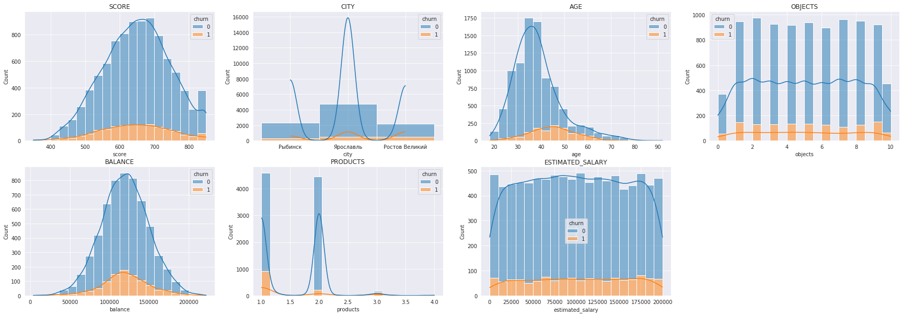
    


```python
bank_df.query('churn == 1')['age'].median()
```


    45.0


```python
bank_df.query('churn == 0')['age'].median()
```


    36.0


Из полученных результатов видим, что ушедшие клиенты чаще пользовались только одним продуктом банка. Так же медианный возраст группы оттока больше, чем у оставшихся клиентов. 


```python
sns.set_style('darkgrid')
fig = plt.figure(figsize=(25,6))
n = 0
for i in df_binary.drop(['churn', 'products'], axis = 1).columns:
    plt.subplot(1, 4, n+1)
    g = sns.countplot(data = df_binary, x = i, hue = 'churn')
    plt.title(i.upper())
    n+=1
```


    
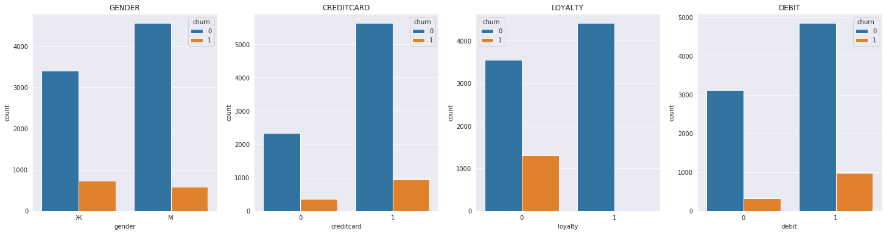
    


Так же обращаем внимание, что кол-во женщин в группе оттока больше кол-ва мужчин, при прочих схожих показателях.

## Сегментация пользователей по кол-ву продуктов 

Посмотрим на распределение пользователей по кол-ву используемых продуктов:


```python
bank_df.groupby('products').agg({'userid':'count'}).rename(columns = {'userid':'user_count'})
```


<div>
<style scoped>
    .dataframe tbody tr th:only-of-type {
        vertical-align: middle;
    }

    .dataframe tbody tr th {
        vertical-align: top;
    }

    .dataframe thead th {
        text-align: right;
    }
</style>
<table border="1" class="dataframe">
  <thead>
    <tr style="text-align: right;">
      <th></th>
      <th>user_count</th>
    </tr>
    <tr>
      <th>products</th>
      <th></th>
    </tr>
  </thead>
  <tbody>
    <tr>
      <td>1</td>
      <td>4599</td>
    </tr>
    <tr>
      <td>2</td>
      <td>4454</td>
    </tr>
    <tr>
      <td>3</td>
      <td>181</td>
    </tr>
    <tr>
      <td>4</td>
      <td>31</td>
    </tr>
  </tbody>
</table>
</div>


```python
len(bank_df[bank_df['products']>2])/len(bank_df)
```


    0.022881813275769023


Видим крайне малое значение клиентов, кто пользуется более чем 2умя продуктами банка (2.3%). Заключаем что ключевые группы для анализа - это пользователи 1ого и 2ух продуктов банка.

Построим гистограммы для всех групп пользоватетй:


```python
sns.set_style('darkgrid')
for j in range(1,5,1):
    print('COUNT OF PRODUCTS:', str(j))
    fig = plt.figure(figsize=(30,4))
    n = 0
    for i in df_hist.drop(['churn','products'], axis = 1).columns:
        plt.subplot(1, 6, n+1)
        g = sns.histplot(data = df_hist[df_hist['products']==j],
                    x = i,
                    bins = 20, hue = 'churn', multiple="stack", kde=True)
        plt.title(i.upper())
        n+=1
    plt.show()
```

    COUNT OF PRODUCTS: 1


    
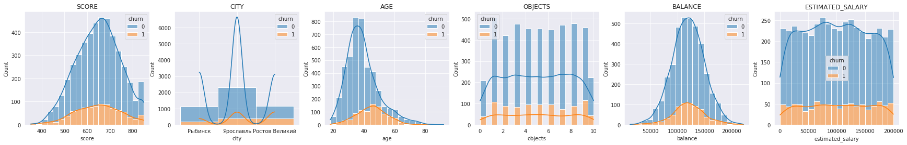
    


    COUNT OF PRODUCTS: 2


    
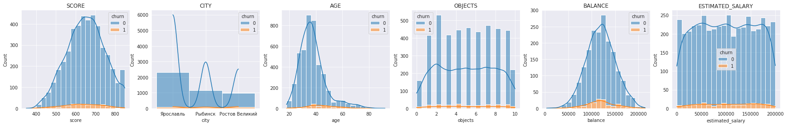
    


    COUNT OF PRODUCTS: 3


    
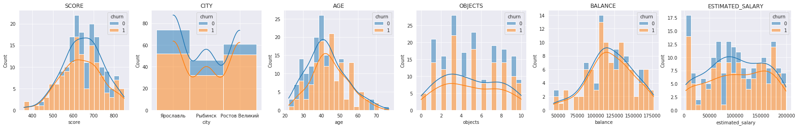
    


    COUNT OF PRODUCTS: 4


    
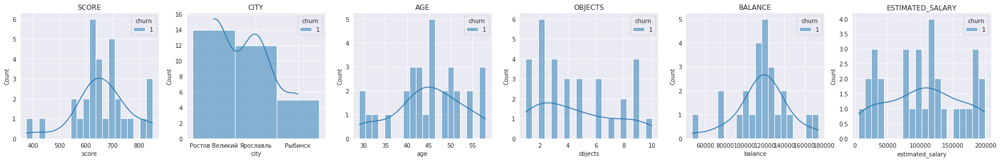
    


```python
len(bank_df.query('churn == 1 and products == 1'))/len(bank_df.query('products == 1'))
```


    0.2009132420091324


```python
len(bank_df.query('churn == 1 and products == 2'))/len(bank_df.query('products == 2'))
```


    0.047597665020206556


```python
len(bank_df.query('churn == 1 and products == 3'))/len(bank_df.query('products == 3'))
```


    0.7458563535911602


```python
len(bank_df.query('churn == 1 and products == 4'))/len(bank_df.query('products == 4'))
```


    1.0


При общей схожести распределений, отмечаем что оттока в группе с двумя продуктами значительно меньше (20% против 4.75%).

Группы пользователей с 3 и 4 продуктами, при своем небольшом размере, показали очень большой процент оттока : 74.5% и 100% соответствено.

Так же посмотрим на распределение бинарных признаков:


```python
sns.set_style('darkgrid')
for j in range(1,5,1):
    print('COUNT OF PRODUCTS:', str(j))
    fig = plt.figure(figsize=(20,3))
    n = 0
    for i in df_binary.drop(['churn','products'], axis = 1).columns:
        plt.subplot(1, 4, n+1)
        g = sns.countplot(data = df_binary[df_binary['products']==j], x = i, hue = 'churn')
        plt.title(i.upper())
        n+=1
    plt.show()
```

    COUNT OF PRODUCTS: 1


    
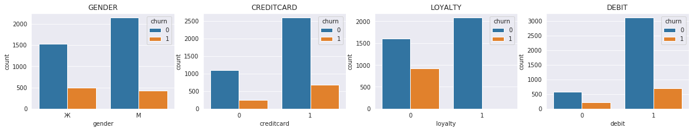
    


    COUNT OF PRODUCTS: 2


    
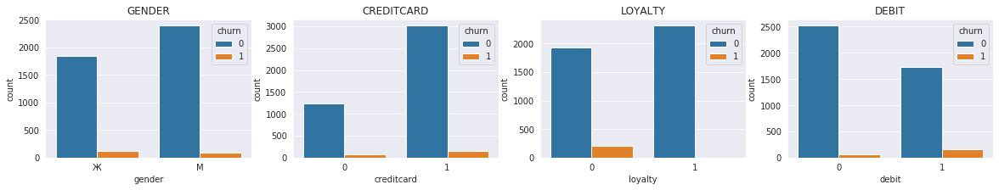
    


    COUNT OF PRODUCTS: 3


    
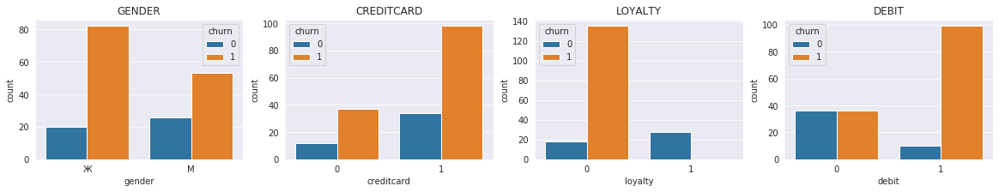
    


    COUNT OF PRODUCTS: 4


    
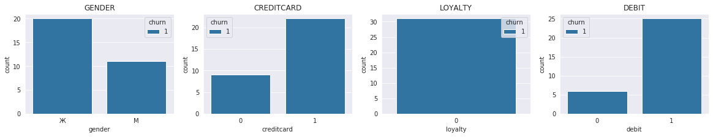
    


Видим что по бинарным признакам общие распределения схожи и подтверждают наши предыдущие выводы. Но среди пользователей 2ух продуктов значительно больше клиентов кто не имеет дебетовой карты.

# Кластеризация

Проведем кластреизацию как альтренативный способ сегментации пользователей:


```python
bank_df.head()
```


<div>
<style scoped>
    .dataframe tbody tr th:only-of-type {
        vertical-align: middle;
    }

    .dataframe tbody tr th {
        vertical-align: top;
    }

    .dataframe thead th {
        text-align: right;
    }
</style>
<table border="1" class="dataframe">
  <thead>
    <tr style="text-align: right;">
      <th></th>
      <th>userid</th>
      <th>score</th>
      <th>city</th>
      <th>gender</th>
      <th>age</th>
      <th>objects</th>
      <th>balance</th>
      <th>products</th>
      <th>creditcard</th>
      <th>loyalty</th>
      <th>estimated_salary</th>
      <th>churn</th>
      <th>debit</th>
    </tr>
  </thead>
  <tbody>
    <tr>
      <td>1</td>
      <td>15690047</td>
      <td>608</td>
      <td>Рыбинск</td>
      <td>Ж</td>
      <td>41</td>
      <td>1</td>
      <td>83807.86</td>
      <td>1</td>
      <td>0</td>
      <td>1</td>
      <td>112542.58</td>
      <td>0</td>
      <td>1</td>
    </tr>
    <tr>
      <td>2</td>
      <td>15662040</td>
      <td>502</td>
      <td>Ярославль</td>
      <td>Ж</td>
      <td>42</td>
      <td>8</td>
      <td>159660.80</td>
      <td>3</td>
      <td>1</td>
      <td>0</td>
      <td>113931.57</td>
      <td>1</td>
      <td>1</td>
    </tr>
    <tr>
      <td>3</td>
      <td>15744090</td>
      <td>699</td>
      <td>Ярославль</td>
      <td>Ж</td>
      <td>39</td>
      <td>1</td>
      <td>NaN</td>
      <td>2</td>
      <td>0</td>
      <td>0</td>
      <td>93826.63</td>
      <td>0</td>
      <td>0</td>
    </tr>
    <tr>
      <td>4</td>
      <td>15780624</td>
      <td>850</td>
      <td>Рыбинск</td>
      <td>Ж</td>
      <td>43</td>
      <td>2</td>
      <td>125510.82</td>
      <td>1</td>
      <td>1</td>
      <td>1</td>
      <td>79084.10</td>
      <td>0</td>
      <td>1</td>
    </tr>
    <tr>
      <td>5</td>
      <td>15616748</td>
      <td>645</td>
      <td>Рыбинск</td>
      <td>М</td>
      <td>44</td>
      <td>8</td>
      <td>113755.78</td>
      <td>2</td>
      <td>1</td>
      <td>0</td>
      <td>149756.71</td>
      <td>1</td>
      <td>1</td>
    </tr>
  </tbody>
</table>
</div>


Заменяем значения для обучения моделей.

Пол:
- М - 0
- Ж - 1


```python
len(bank_df.query('balance == 0'))
```


    0


Заменим пропущенные значения в столбце 'balance' на 0 (при имеющемся флаге наличия дебетовой карты)

Посмотри на корреляцию данных в датасете:


```python
bank_df['gender'] = bank_df['gender'].replace(['М','Ж'], [0,1])
bank_df = bank_df.fillna(0)
bank_df.index = bank_df['userid']
bank_df = bank_df.drop('userid', axis = 1)
```


```python
bank_cr = bank_df.copy()
bank_cr['Yaroslavl']=bank_cr['city'].apply(lambda x: 0 if x == 'Ярославль' else 1)
bank_cr['Rostov_V']=bank_cr['city'].apply(lambda x: 0 if x == 'Ростов Великий' else 1)
bank_cr['Rybinsk']=bank_cr['city'].apply(lambda x: 0 if x == 'Рыбинск' else 1)
bank_cr = bank_cr.drop('city', axis = 1)
bank_cr.head()
```


<div>
<style scoped>
    .dataframe tbody tr th:only-of-type {
        vertical-align: middle;
    }

    .dataframe tbody tr th {
        vertical-align: top;
    }

    .dataframe thead th {
        text-align: right;
    }
</style>
<table border="1" class="dataframe">
  <thead>
    <tr style="text-align: right;">
      <th></th>
      <th>score</th>
      <th>gender</th>
      <th>age</th>
      <th>objects</th>
      <th>balance</th>
      <th>products</th>
      <th>creditcard</th>
      <th>loyalty</th>
      <th>estimated_salary</th>
      <th>churn</th>
      <th>debit</th>
      <th>Yaroslavl</th>
      <th>Rostov_V</th>
      <th>Rybinsk</th>
    </tr>
    <tr>
      <th>userid</th>
      <th></th>
      <th></th>
      <th></th>
      <th></th>
      <th></th>
      <th></th>
      <th></th>
      <th></th>
      <th></th>
      <th></th>
      <th></th>
      <th></th>
      <th></th>
      <th></th>
    </tr>
  </thead>
  <tbody>
    <tr>
      <td>15690047</td>
      <td>608</td>
      <td>1</td>
      <td>41</td>
      <td>1</td>
      <td>83807.86</td>
      <td>1</td>
      <td>0</td>
      <td>1</td>
      <td>112542.58</td>
      <td>0</td>
      <td>1</td>
      <td>1</td>
      <td>1</td>
      <td>0</td>
    </tr>
    <tr>
      <td>15662040</td>
      <td>502</td>
      <td>1</td>
      <td>42</td>
      <td>8</td>
      <td>159660.80</td>
      <td>3</td>
      <td>1</td>
      <td>0</td>
      <td>113931.57</td>
      <td>1</td>
      <td>1</td>
      <td>0</td>
      <td>1</td>
      <td>1</td>
    </tr>
    <tr>
      <td>15744090</td>
      <td>699</td>
      <td>1</td>
      <td>39</td>
      <td>1</td>
      <td>0.00</td>
      <td>2</td>
      <td>0</td>
      <td>0</td>
      <td>93826.63</td>
      <td>0</td>
      <td>0</td>
      <td>0</td>
      <td>1</td>
      <td>1</td>
    </tr>
    <tr>
      <td>15780624</td>
      <td>850</td>
      <td>1</td>
      <td>43</td>
      <td>2</td>
      <td>125510.82</td>
      <td>1</td>
      <td>1</td>
      <td>1</td>
      <td>79084.10</td>
      <td>0</td>
      <td>1</td>
      <td>1</td>
      <td>1</td>
      <td>0</td>
    </tr>
    <tr>
      <td>15616748</td>
      <td>645</td>
      <td>0</td>
      <td>44</td>
      <td>8</td>
      <td>113755.78</td>
      <td>2</td>
      <td>1</td>
      <td>0</td>
      <td>149756.71</td>
      <td>1</td>
      <td>1</td>
      <td>1</td>
      <td>1</td>
      <td>0</td>
    </tr>
  </tbody>
</table>
</div>


```python
corr_m = bank_cr.corr()
plt.figure(figsize = (15,15))
ax = sns.heatmap(corr_m, square = True, annot = True, cmap = 'bwr')
```


    
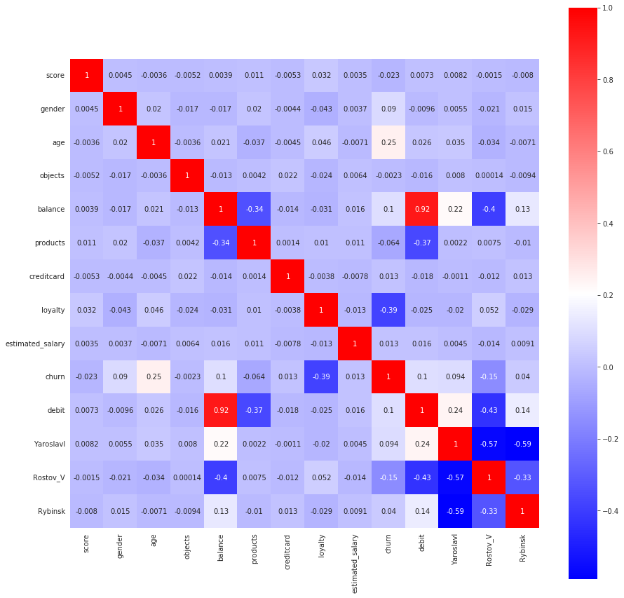
    


Выделить как коррелирующие признаки можем следующие данные:
- 'debit' и 'balance' что очевидно
- обратную зависимость 'products' и 'churn'
- обратную зависимость 'products' и 'debit'
- обратную зависимость 'products' и 'balance'
- обратную зависимость 'debit' и 'Rostov_V'
- обратную зависимость 'balance' и 'Rostov_V'
- 'churn' и 'age'

Указанные выше зависимости данных будут отражены в кластеризации. В целом они не противоречат нашим предыдущим выводам, но ктомуже в перспективе могут пролить свет на некоторые неочевидные закономерности.


```python
#bank_cr = bank_cr.drop('balance', axis = 1)
```


```python
scaler = StandardScaler()
x_sc = bank_cr.copy()
x_sc[['score', 'age', 'objects','balance', 'products','estimated_salary']] = \
scaler.fit_transform(bank_cr[['score', 'age', 'objects','balance', 'products','estimated_salary']])
```


```python
linked = linkage(x_sc, method = 'ward') 
```


```python
plt.figure(figsize=(15, 10))  
dendrogram(linked, orientation='top')
plt.show()
```


    
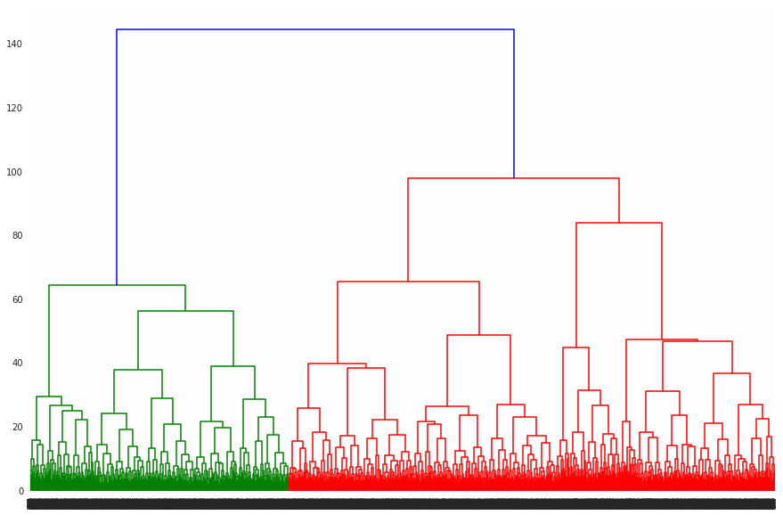
    


```python
km = KMeans(n_clusters = 3, random_state = 0)
labels = km.fit_predict(bank_cr.drop(['churn'], axis = 1))
bank_cr['cluster_km'] = labels
bank_cr.groupby('cluster_km').mean()
```


<div>
<style scoped>
    .dataframe tbody tr th:only-of-type {
        vertical-align: middle;
    }

    .dataframe tbody tr th {
        vertical-align: top;
    }

    .dataframe thead th {
        text-align: right;
    }
</style>
<table border="1" class="dataframe">
  <thead>
    <tr style="text-align: right;">
      <th></th>
      <th>score</th>
      <th>gender</th>
      <th>age</th>
      <th>objects</th>
      <th>balance</th>
      <th>products</th>
      <th>creditcard</th>
      <th>loyalty</th>
      <th>estimated_salary</th>
      <th>churn</th>
      <th>debit</th>
      <th>Yaroslavl</th>
      <th>Rostov_V</th>
      <th>Rybinsk</th>
    </tr>
    <tr>
      <th>cluster_km</th>
      <th></th>
      <th></th>
      <th></th>
      <th></th>
      <th></th>
      <th></th>
      <th></th>
      <th></th>
      <th></th>
      <th></th>
      <th></th>
      <th></th>
      <th></th>
      <th></th>
    </tr>
  </thead>
  <tbody>
    <tr>
      <td>0</td>
      <td>651.410815</td>
      <td>0.434340</td>
      <td>38.802317</td>
      <td>4.993329</td>
      <td>120981.396886</td>
      <td>1.359551</td>
      <td>0.702949</td>
      <td>0.468399</td>
      <td>50619.957051</td>
      <td>0.164677</td>
      <td>1.000000</td>
      <td>0.581110</td>
      <td>0.623596</td>
      <td>0.795295</td>
    </tr>
    <tr>
      <td>1</td>
      <td>649.903618</td>
      <td>0.451668</td>
      <td>38.179197</td>
      <td>5.077445</td>
      <td>1394.496108</td>
      <td>1.781232</td>
      <td>0.721594</td>
      <td>0.491803</td>
      <td>98748.376735</td>
      <td>0.097513</td>
      <td>0.028547</td>
      <td>0.338892</td>
      <td>0.991521</td>
      <td>0.669587</td>
    </tr>
    <tr>
      <td>2</td>
      <td>651.772838</td>
      <td>0.449462</td>
      <td>38.461271</td>
      <td>5.009726</td>
      <td>120961.958843</td>
      <td>1.389371</td>
      <td>0.700938</td>
      <td>0.466134</td>
      <td>150532.927336</td>
      <td>0.169503</td>
      <td>1.000000</td>
      <td>0.588746</td>
      <td>0.614102</td>
      <td>0.797152</td>
    </tr>
  </tbody>
</table>
</div>


```python
bank_cr.groupby('cluster_km').agg({'score':'count'}).rename(columns = {'score':'count'})
```


<div>
<style scoped>
    .dataframe tbody tr th:only-of-type {
        vertical-align: middle;
    }

    .dataframe tbody tr th {
        vertical-align: top;
    }

    .dataframe thead th {
        text-align: right;
    }
</style>
<table border="1" class="dataframe">
  <thead>
    <tr style="text-align: right;">
      <th></th>
      <th>count</th>
    </tr>
    <tr>
      <th>cluster_km</th>
      <th></th>
    </tr>
  </thead>
  <tbody>
    <tr>
      <td>0</td>
      <td>2848</td>
    </tr>
    <tr>
      <td>1</td>
      <td>3538</td>
    </tr>
    <tr>
      <td>2</td>
      <td>2879</td>
    </tr>
  </tbody>
</table>
</div>


```python
bank_df = bank_df.reset_index()
bank_cr = bank_cr.reset_index()
bank_df = bank_df.merge(bank_cr[['userid','cluster_km']], on='userid')
```


```python
cr_binary = bank_df[['gender', 'creditcard', 'loyalty', 'churn', 'debit', 'cluster_km']]
cr_hist = bank_df[['score','city', 'age', 'objects','balance', 'products','estimated_salary', 'churn', 'cluster_km']]
```


```python
sns.set_style('darkgrid')
for j in range(0,3,1):
    print('CLUSTER:', str(j))
    fig = plt.figure(figsize=(35,4))
    n = 0
    for i in cr_hist.drop(['churn','cluster_km'], axis = 1).columns:
        plt.subplot(1, 7, n+1)
        g = sns.histplot(data = cr_hist[cr_hist['cluster_km']==j],
                    x = i,
                    bins = 20, hue = 'churn', multiple="stack", kde=True)
        plt.title(i.upper())
        n+=1
    plt.show()
```

    CLUSTER: 0


    
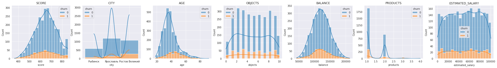
    


    CLUSTER: 1


    
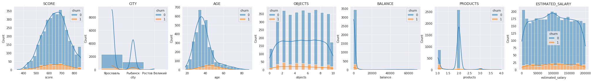
    


    CLUSTER: 2


    
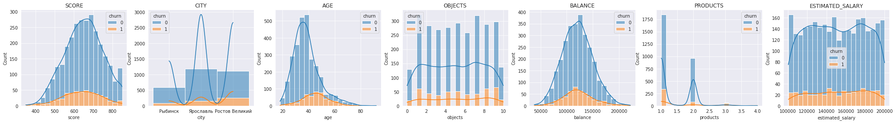
    


```python
len(bank_df.query('cluster_km == 0 and churn == 1'))/len(bank_df.query('cluster_km == 0'))
```


    0.16467696629213482


```python
len(bank_df.query('cluster_km == 1 and churn == 1'))/len(bank_df.query('cluster_km == 1'))
```


    0.0975127190503109


```python
len(bank_df.query('cluster_km == 2 and churn == 1'))/len(bank_df.query('cluster_km == 2'))
```


    0.16950329975686002


Подтверждаем наши предположения. При помощи кластеризации мы выделили целый сегмент клиентов (3538), который не имеет дебетовой карты, является преимущественно пользователем 2ух банковских продуктов и практически отсутствует в Рыбинске. При этом имея наименьший показатель по оттоку.


```python
for j in range(0,3,1):
    print('CLUSTER:', str(j))
    fig = plt.figure(figsize=(20,3))
    n = 0
    for i in cr_binary.drop(['churn','cluster_km'], axis = 1).columns:
        plt.subplot(1, 4, n+1)
        g = sns.countplot(data = cr_binary[cr_binary['cluster_km']==j], x = i, hue = 'churn')
        plt.title(i.upper())
        n+=1
    plt.show()
```

    CLUSTER: 0


    
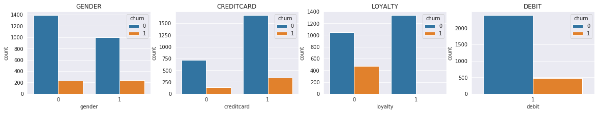
    


    CLUSTER: 1


    
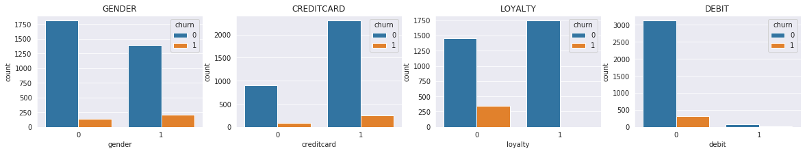
    


    CLUSTER: 2


    
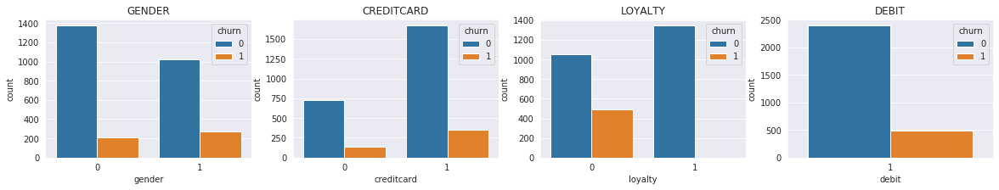
    


```python
len(bank_df.query('products == 2 and debit == 0'))/ len(bank_df.query('products == 2'))
```


    0.5767849124382577


Проанализируем данные по клиентам с 2мя продуктами и наличием дебетовой карты:


```python
good_df = bank_df.query('debit == 1')
len(good_df)
```


    5828


```python
good_df.head()
```


<div>
<style scoped>
    .dataframe tbody tr th:only-of-type {
        vertical-align: middle;
    }

    .dataframe tbody tr th {
        vertical-align: top;
    }

    .dataframe thead th {
        text-align: right;
    }
</style>
<table border="1" class="dataframe">
  <thead>
    <tr style="text-align: right;">
      <th></th>
      <th>userid</th>
      <th>score</th>
      <th>city</th>
      <th>gender</th>
      <th>age</th>
      <th>objects</th>
      <th>balance</th>
      <th>products</th>
      <th>creditcard</th>
      <th>loyalty</th>
      <th>estimated_salary</th>
      <th>churn</th>
      <th>debit</th>
      <th>cluster_km</th>
    </tr>
  </thead>
  <tbody>
    <tr>
      <td>0</td>
      <td>15690047</td>
      <td>608</td>
      <td>Рыбинск</td>
      <td>1</td>
      <td>41</td>
      <td>1</td>
      <td>83807.86</td>
      <td>1</td>
      <td>0</td>
      <td>1</td>
      <td>112542.58</td>
      <td>0</td>
      <td>1</td>
      <td>2</td>
    </tr>
    <tr>
      <td>1</td>
      <td>15662040</td>
      <td>502</td>
      <td>Ярославль</td>
      <td>1</td>
      <td>42</td>
      <td>8</td>
      <td>159660.80</td>
      <td>3</td>
      <td>1</td>
      <td>0</td>
      <td>113931.57</td>
      <td>1</td>
      <td>1</td>
      <td>2</td>
    </tr>
    <tr>
      <td>3</td>
      <td>15780624</td>
      <td>850</td>
      <td>Рыбинск</td>
      <td>1</td>
      <td>43</td>
      <td>2</td>
      <td>125510.82</td>
      <td>1</td>
      <td>1</td>
      <td>1</td>
      <td>79084.10</td>
      <td>0</td>
      <td>1</td>
      <td>0</td>
    </tr>
    <tr>
      <td>4</td>
      <td>15616748</td>
      <td>645</td>
      <td>Рыбинск</td>
      <td>0</td>
      <td>44</td>
      <td>8</td>
      <td>113755.78</td>
      <td>2</td>
      <td>1</td>
      <td>0</td>
      <td>149756.71</td>
      <td>1</td>
      <td>1</td>
      <td>2</td>
    </tr>
    <tr>
      <td>6</td>
      <td>15698884</td>
      <td>376</td>
      <td>Ростов Великий</td>
      <td>1</td>
      <td>29</td>
      <td>4</td>
      <td>115046.74</td>
      <td>4</td>
      <td>1</td>
      <td>0</td>
      <td>119346.88</td>
      <td>1</td>
      <td>1</td>
      <td>2</td>
    </tr>
  </tbody>
</table>
</div>


```python
good_binary = good_df[['gender', 'creditcard', 'loyalty', 'churn', 'products', 'debit']]
good_hist = good_df[['score','city', 'age', 'objects','balance', 'estimated_salary', 'churn']]
```


```python
sns.set_style('darkgrid')
fig = plt.figure(figsize=(25,12))
n = 0
for i in good_hist.drop('churn', axis = 1).columns:
    plt.subplot(2, 3, n+1)
    g = sns.histplot(data = good_hist,
                x = i,
                bins = 20, hue = 'churn', multiple="stack", kde=True)
    plt.title(i.upper())
    n+=1
```


    
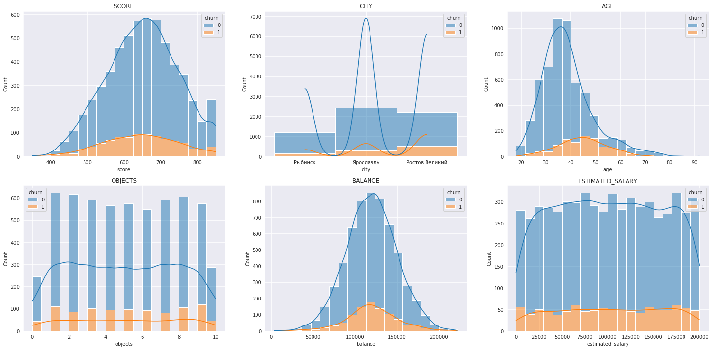
    


```python
sns.set_style('darkgrid')
fig = plt.figure(figsize=(25,6))
n = 0
for i in good_binary.drop(['churn', 'products'], axis = 1).columns:
    plt.subplot(1, 4, n+1)
    g = sns.countplot(data = good_binary, x = i, hue = 'churn')
    plt.title(i.upper())
    n+=1
```


    
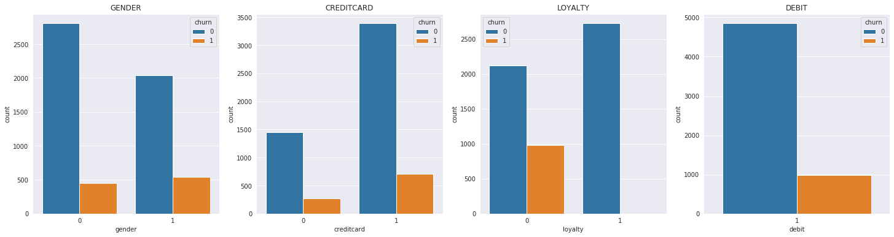
    


```python
len(good_df.query('churn == 1'))/ len(good_df)
```


    0.16849691146190804


Получаем что большинство пользователей 2ух продуктов и дебетовой карты из Рыбинска. При относительно низком значении оттока (8.3%) это больше трети всех пользователей группы с двумя продуктами.

Совмещая полученные результаты видим, что для банка самыми перспективными и надежными клиентами являются пользовтели 2ух банковских продуктов. Однако больше половины пользователей 2ух продуктов не имеют дебетовой карты, хотя большая часть группы клиентов с 1 продуктом банка имеет дебетовую карту.

После анализа предоставленных данных мы можем вынести следующие рекомендации по взаимодействию с пользователями:
- Клиентам с одним банковским проуктом предлагать второй с целью повышения удержания. Возможно на льготных условиях.
- Клиенты риск группы (ожидаемый отток) - это возрастные пользователи с одним банковским продуктом.
- Пользователям из Ростова с 2мя банковскими продуктами следует предложить завести дебетовую карту. Плюсы: возможное увеличение удержаия клиента, более полная информация о финансовом состоянии клинета.

# Статистический анализ данных

Проверим гипотезы относительно различия распределения предполагаемых заработных плат:
- пользователей 1ого и 2ух банковских продуктов
- клиентов из кластера 1 и кластера 2


Выдвинем следующие гипотезы:

- Н0 - нет статистически значимой разницы в зарплатах пользователей 1ого и 2ух продуктов
- Н1 - заработная плата отличается


```python
checkA = bank_df[bank_df['products']==1]['estimated_salary']
checkB = bank_df[bank_df['products']==2]['estimated_salary']
```


```python
alpha = 0.05

results = stats.mannwhitneyu(checkA, checkB, alternative='two-sided')

print('p-значение: ', results.pvalue.round(3))

if results.pvalue < alpha:
    print('Отвергаем нулевую гипотезу: разница статистически значима')
else:
    print(
        'Не получилось отвергнуть нулевую гипотезу, вывод о различии сделать нельзя'
    ) 
    
print("Разница между сегментами: {0:.1%}".format(checkB.mean() / checkA.mean() - 1))
```

    p-значение:  0.358
    Не получилось отвергнуть нулевую гипотезу, вывод о различии сделать нельзя
    Разница между сегментами: 1.1%


Выдвинем следующие гипотезы:

- Н0 - нет статистически значимой разницы в зарплатах пользователей 1ого и 2ого кластеров
- Н1 - заработная плата пользователей из 2ого кластера больше


```python
checkA = bank_cr[bank_cr['cluster_km']==1]['estimated_salary']
checkB = bank_cr[bank_cr['cluster_km']==2]['estimated_salary']
```


```python
alpha = 0.05

results = stats.mannwhitneyu(checkA, checkB, alternative='less')

print('p-значение: ', results.pvalue.round(3))

if results.pvalue < alpha:
    print('Отвергаем нулевую гипотезу: разница статистически значима')
else:
    print(
        'Не получилось отвергнуть нулевую гипотезу, вывод о различии сделать нельзя'
    ) 
    
print("Разница между сегментами: {0:.1%}".format(checkB.mean() / checkA.mean() - 1))
```

    p-значение:  0.0
    Отвергаем нулевую гипотезу: разница статистически значима
    Разница между сегментами: 52.4%


Видим еще одну пользу от применения кластеризации. Мы смогли выделить группу клиентов с более высокой заработной платой.
