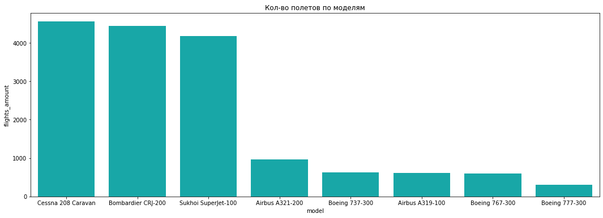
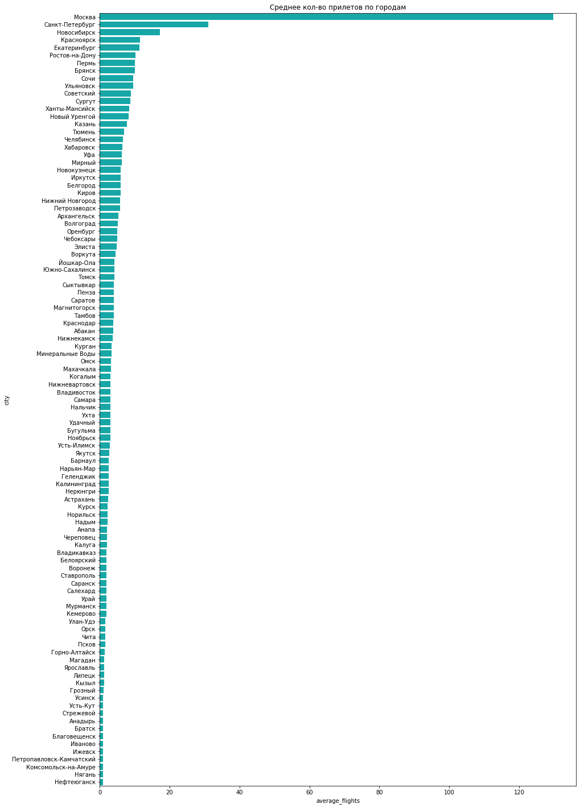
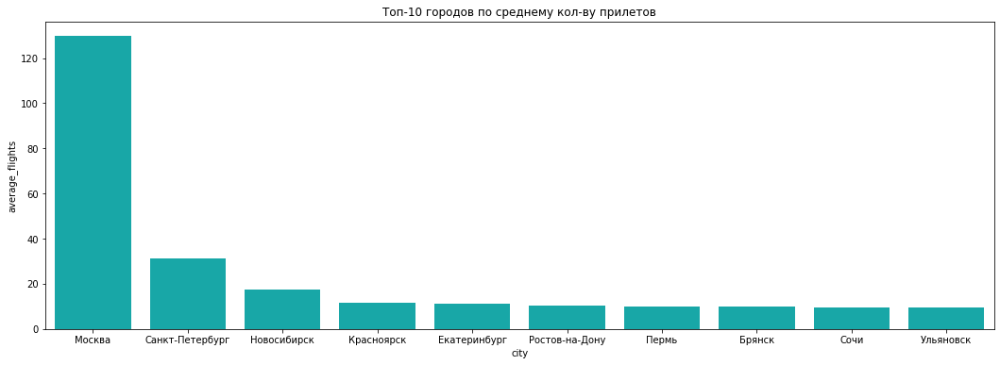

# Аналитика в авиакомпании

/datasets/query_1.csv — результат первого запроса. В нём содержится информация о:
    - model — модели самолета
    - flights_amount — количество рейсов для каждой модели самолетов model в сентябре 2018 года

/datasets/query_3.csv — результат третьего запроса. В нём содержится информация о:
    - city — городах
    - average_flights — среднем количестве рейсов, прибывающих в город city за день в августе 2018 года

Для этих двух наборов данных нужно:
    - импортировать файлы;
    - изучить данные в них;
    - проверить типы данных на корректность;
    - выбрать топ-10 городов по количеству рейсов;
    - построить графики: модели самолетов и количество рейсов, города и количество рейсов, топ-10 городов и количество рейсов;
    - сделать выводы по каждому из графиков, пояснить результат.

## Импортируем библиотеки и открываем данные 


```python
import pandas as pd
import numpy as np
from scipy import stats as st
import math
from matplotlib import pyplot as plt

import warnings
warnings.filterwarnings(action='ignore')
```


```python
!pip install --upgrade --quiet seaborn
```


```python
import seaborn as sns
```


```python
df1 = pd.read_csv('/datasets/query_1.csv')
```


```python
df1.info()
```

    <class 'pandas.core.frame.DataFrame'>
    RangeIndex: 8 entries, 0 to 7
    Data columns (total 2 columns):
    model             8 non-null object
    flights_amount    8 non-null int64
    dtypes: int64(1), object(1)
    memory usage: 256.0+ bytes


```python
df1 = df1.sort_values('flights_amount', ascending = False).reset_index(drop = True)
```


```python
df1
```


<div>
<style scoped>
    .dataframe tbody tr th:only-of-type {
        vertical-align: middle;
    }

    .dataframe tbody tr th {
        vertical-align: top;
    }

    .dataframe thead th {
        text-align: right;
    }
</style>
<table border="1" class="dataframe">
  <thead>
    <tr style="text-align: right;">
      <th></th>
      <th>model</th>
      <th>flights_amount</th>
    </tr>
  </thead>
  <tbody>
    <tr>
      <td>0</td>
      <td>Cessna 208 Caravan</td>
      <td>4557</td>
    </tr>
    <tr>
      <td>1</td>
      <td>Bombardier CRJ-200</td>
      <td>4446</td>
    </tr>
    <tr>
      <td>2</td>
      <td>Sukhoi SuperJet-100</td>
      <td>4185</td>
    </tr>
    <tr>
      <td>3</td>
      <td>Airbus A321-200</td>
      <td>960</td>
    </tr>
    <tr>
      <td>4</td>
      <td>Boeing 737-300</td>
      <td>630</td>
    </tr>
    <tr>
      <td>5</td>
      <td>Airbus A319-100</td>
      <td>607</td>
    </tr>
    <tr>
      <td>6</td>
      <td>Boeing 767-300</td>
      <td>600</td>
    </tr>
    <tr>
      <td>7</td>
      <td>Boeing 777-300</td>
      <td>300</td>
    </tr>
  </tbody>
</table>
</div>


В данных нет пропусков, названия столбцов и типы данных определены правильно.

Рассмотрим таблицу из третьего запроса:


```python
df3 = pd.read_csv('/datasets/query_3.csv')
```


```python
df3.info()
```

    <class 'pandas.core.frame.DataFrame'>
    RangeIndex: 101 entries, 0 to 100
    Data columns (total 2 columns):
    city               101 non-null object
    average_flights    101 non-null float64
    dtypes: float64(1), object(1)
    memory usage: 1.7+ KB


```python
df3 = df3.sort_values('average_flights', ascending = False).reset_index(drop = True)
```


```python
df3.head()
```


<div>
<style scoped>
    .dataframe tbody tr th:only-of-type {
        vertical-align: middle;
    }

    .dataframe tbody tr th {
        vertical-align: top;
    }

    .dataframe thead th {
        text-align: right;
    }
</style>
<table border="1" class="dataframe">
  <thead>
    <tr style="text-align: right;">
      <th></th>
      <th>city</th>
      <th>average_flights</th>
    </tr>
  </thead>
  <tbody>
    <tr>
      <td>0</td>
      <td>Москва</td>
      <td>129.774194</td>
    </tr>
    <tr>
      <td>1</td>
      <td>Санкт-Петербург</td>
      <td>31.161290</td>
    </tr>
    <tr>
      <td>2</td>
      <td>Новосибирск</td>
      <td>17.322581</td>
    </tr>
    <tr>
      <td>3</td>
      <td>Красноярск</td>
      <td>11.580645</td>
    </tr>
    <tr>
      <td>4</td>
      <td>Екатеринбург</td>
      <td>11.322581</td>
    </tr>
  </tbody>
</table>
</div>


В данных так же нет пропусков, названия столбцов и типы данных определены правильно.

## Определим топ-10 городов по кол-ву принимаемых рейсов


```python
top10 = df3.head(10)
```


```python
top10
```


<div>
<style scoped>
    .dataframe tbody tr th:only-of-type {
        vertical-align: middle;
    }

    .dataframe tbody tr th {
        vertical-align: top;
    }

    .dataframe thead th {
        text-align: right;
    }
</style>
<table border="1" class="dataframe">
  <thead>
    <tr style="text-align: right;">
      <th></th>
      <th>city</th>
      <th>average_flights</th>
    </tr>
  </thead>
  <tbody>
    <tr>
      <td>0</td>
      <td>Москва</td>
      <td>129.774194</td>
    </tr>
    <tr>
      <td>1</td>
      <td>Санкт-Петербург</td>
      <td>31.161290</td>
    </tr>
    <tr>
      <td>2</td>
      <td>Новосибирск</td>
      <td>17.322581</td>
    </tr>
    <tr>
      <td>3</td>
      <td>Красноярск</td>
      <td>11.580645</td>
    </tr>
    <tr>
      <td>4</td>
      <td>Екатеринбург</td>
      <td>11.322581</td>
    </tr>
    <tr>
      <td>5</td>
      <td>Ростов-на-Дону</td>
      <td>10.193548</td>
    </tr>
    <tr>
      <td>6</td>
      <td>Пермь</td>
      <td>10.129032</td>
    </tr>
    <tr>
      <td>7</td>
      <td>Брянск</td>
      <td>10.000000</td>
    </tr>
    <tr>
      <td>8</td>
      <td>Сочи</td>
      <td>9.612903</td>
    </tr>
    <tr>
      <td>9</td>
      <td>Ульяновск</td>
      <td>9.580645</td>
    </tr>
  </tbody>
</table>
</div>


## Построим графики для полученных данных 


```python
fig = plt.figure(figsize=(18,6))

plt.subplot()
plt.title('Кол-во полетов по моделям')
sns.barplot(x='model',y='flights_amount',data=df1, color="c")
```


    <matplotlib.axes._subplots.AxesSubplot at 0x7f0f51756490>


    

    


Первые 3 места занимают самолеты для авиалиний малой и средней протяженности, вместимостью до 14, 50 и 103 места соответственно(согласно википедии).


```python
fig = plt.figure(figsize=(15,25))

plt.subplot()
plt.title('Среднее кол-во прилетов по городам')
g = sns.barplot(x='average_flights',y='city',data=df3, color="c")
```


    

    


С большим отрывом по среднему кол-ву принимаемых рейсов лидирует Москва, как основной транспортный хаб. На втором месте Санкт-Петербург, как второй по величине город и основное туристическое направление. На третьем месте Новосибирск, как самый крупный город Сибири, удобен как хаб для дальних перелетов с точки зрения инфраструктуры и своего географического расположения.


```python
fig = plt.figure(figsize=(18,6))

plt.subplot()
plt.title('Топ-10 городов по среднему кол-ву прилетов')
sns.barplot(x='city',y='average_flights',data=top10, color="c")
```


    <matplotlib.axes._subplots.AxesSubplot at 0x7f0f50eb1e10>


    

    


Так же заключаем что топ-10 городов по кол-ву принимаемых рейсов занимают города, являющиеся региональными центрами.

## Общий вывод

Основной авиационный поток у нас сосредоточен на Москве с большим отрывом, затем идут другие региональные центры. Можем сделать вывод о том что все авиаперелеты так или иначе завязаны на Москве.
Основное же кол-во перелетов совершается самолетами предназначенными для малых и средних авиалиний.(Sukhoi SuperJet-100	имеет дальность 3000 или 4600км согласно данным Википедии)
