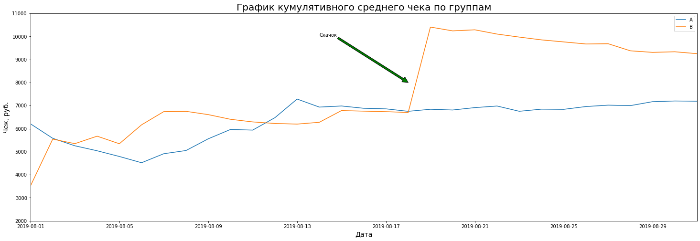

# Принятие решений в бизнесе на основе данных

**Описание проекта**

Приоритизируйте гипотезы, запустите A/B-тест и проанализируйте результаты.

Данные для первой части

Файл /datasets/hypothesis.csv.

- Hypothesis — краткое описание гипотезы;
- Reach — охват пользователей по 10-балльной шкале;
- Impact — влияние на пользователей по 10-балльной шкале;
- Confidence — уверенность в гипотезе по 10-балльной шкале;
- Efforts — затраты ресурсов на проверку гипотезы по 10-балльной шкале. Чем больше значение Efforts, тем дороже проверка гипотезы.

## Часть. Приоритизация гипотез.

Импортируем библиотеки и подгружаем данные:


```python
import pandas as pd
import datetime as dt
import numpy as np
import matplotlib.pyplot as plt
import scipy.stats as stats
import seaborn as sns
```


```python
hypothesis = pd.read_csv('/datasets/hypothesis.csv')
```


```python
pd.set_option('display.max_colwidth', -1)
```


```python
hypothesis
```


<div>
<style scoped>
    .dataframe tbody tr th:only-of-type {
        vertical-align: middle;
    }

    .dataframe tbody tr th {
        vertical-align: top;
    }

    .dataframe thead th {
        text-align: right;
    }
</style>
<table border="1" class="dataframe">
  <thead>
    <tr style="text-align: right;">
      <th></th>
      <th>Hypothesis</th>
      <th>Reach</th>
      <th>Impact</th>
      <th>Confidence</th>
      <th>Efforts</th>
    </tr>
  </thead>
  <tbody>
    <tr>
      <td>0</td>
      <td>Добавить два новых канала привлечения трафика, что позволит привлекать на 30% больше пользователей</td>
      <td>3</td>
      <td>10</td>
      <td>8</td>
      <td>6</td>
    </tr>
    <tr>
      <td>1</td>
      <td>Запустить собственную службу доставки, что сократит срок доставки заказов</td>
      <td>2</td>
      <td>5</td>
      <td>4</td>
      <td>10</td>
    </tr>
    <tr>
      <td>2</td>
      <td>Добавить блоки рекомендаций товаров на сайт интернет магазина, чтобы повысить конверсию и средний чек заказа</td>
      <td>8</td>
      <td>3</td>
      <td>7</td>
      <td>3</td>
    </tr>
    <tr>
      <td>3</td>
      <td>Изменить структура категорий, что увеличит конверсию, т.к. пользователи быстрее найдут нужный товар</td>
      <td>8</td>
      <td>3</td>
      <td>3</td>
      <td>8</td>
    </tr>
    <tr>
      <td>4</td>
      <td>Изменить цвет фона главной страницы, чтобы увеличить вовлеченность пользователей</td>
      <td>3</td>
      <td>1</td>
      <td>1</td>
      <td>1</td>
    </tr>
    <tr>
      <td>5</td>
      <td>Добавить страницу отзывов клиентов о магазине, что позволит увеличить количество заказов</td>
      <td>3</td>
      <td>2</td>
      <td>2</td>
      <td>3</td>
    </tr>
    <tr>
      <td>6</td>
      <td>Показать на главной странице баннеры с актуальными акциями и распродажами, чтобы увеличить конверсию</td>
      <td>5</td>
      <td>3</td>
      <td>8</td>
      <td>3</td>
    </tr>
    <tr>
      <td>7</td>
      <td>Добавить форму подписки на все основные страницы, чтобы собрать базу клиентов для email-рассылок</td>
      <td>10</td>
      <td>7</td>
      <td>8</td>
      <td>5</td>
    </tr>
    <tr>
      <td>8</td>
      <td>Запустить акцию, дающую скидку на товар в день рождения</td>
      <td>1</td>
      <td>9</td>
      <td>9</td>
      <td>5</td>
    </tr>
  </tbody>
</table>
</div>


Приводим имена столбцов к нижнему регистру:


```python
hypothesis.columns = [x.lower() for x in hypothesis.columns]
```


```python
hypothesis.info()
```

    <class 'pandas.core.frame.DataFrame'>
    RangeIndex: 9 entries, 0 to 8
    Data columns (total 5 columns):
    hypothesis    9 non-null object
    reach         9 non-null int64
    impact        9 non-null int64
    confidence    9 non-null int64
    efforts       9 non-null int64
    dtypes: int64(4), object(1)
    memory usage: 488.0+ bytes


```python
'''for i in hypothesis.columns:
    display(hypothesis[i].describe())'''
```


    'for i in hypothesis.columns:\n    display(hypothesis[i].describe())'


### Применим фреймворк ICE для приоритизации гипотез. Отсортируем их по убыванию приоритета.

- Impact — насколько сильно изменение повлияет на пользователей, их опыт и удовлетворение от продукта;
- Confidence — насколько вы уверены, что это изменение повлияет на пользователей именно так;
- Efforts — сколько стоит протестировать эту гипотезу.


```python
hypothesis['ICE'] = ((hypothesis['impact'] * hypothesis['confidence'])/hypothesis['efforts']).round(2)
```


```python
hypothesis[['hypothesis', 'ICE']].sort_values(by = 'ICE', ascending = False)
```


<div>
<style scoped>
    .dataframe tbody tr th:only-of-type {
        vertical-align: middle;
    }

    .dataframe tbody tr th {
        vertical-align: top;
    }

    .dataframe thead th {
        text-align: right;
    }
</style>
<table border="1" class="dataframe">
  <thead>
    <tr style="text-align: right;">
      <th></th>
      <th>hypothesis</th>
      <th>ICE</th>
    </tr>
  </thead>
  <tbody>
    <tr>
      <td>8</td>
      <td>Запустить акцию, дающую скидку на товар в день рождения</td>
      <td>16.20</td>
    </tr>
    <tr>
      <td>0</td>
      <td>Добавить два новых канала привлечения трафика, что позволит привлекать на 30% больше пользователей</td>
      <td>13.33</td>
    </tr>
    <tr>
      <td>7</td>
      <td>Добавить форму подписки на все основные страницы, чтобы собрать базу клиентов для email-рассылок</td>
      <td>11.20</td>
    </tr>
    <tr>
      <td>6</td>
      <td>Показать на главной странице баннеры с актуальными акциями и распродажами, чтобы увеличить конверсию</td>
      <td>8.00</td>
    </tr>
    <tr>
      <td>2</td>
      <td>Добавить блоки рекомендаций товаров на сайт интернет магазина, чтобы повысить конверсию и средний чек заказа</td>
      <td>7.00</td>
    </tr>
    <tr>
      <td>1</td>
      <td>Запустить собственную службу доставки, что сократит срок доставки заказов</td>
      <td>2.00</td>
    </tr>
    <tr>
      <td>5</td>
      <td>Добавить страницу отзывов клиентов о магазине, что позволит увеличить количество заказов</td>
      <td>1.33</td>
    </tr>
    <tr>
      <td>3</td>
      <td>Изменить структура категорий, что увеличит конверсию, т.к. пользователи быстрее найдут нужный товар</td>
      <td>1.12</td>
    </tr>
    <tr>
      <td>4</td>
      <td>Изменить цвет фона главной страницы, чтобы увеличить вовлеченность пользователей</td>
      <td>1.00</td>
    </tr>
  </tbody>
</table>
</div>


При даннм фреймворке(ICE) имеем следующую приоритезацию гипотез исходя из значений параметров Impact, Confidence, Efforts

### Применим фреймворк RICE для приоритизации гипотез. Отсортируем их по убыванию приоритета.

- Reach — скольких пользователей затронет изменение, которое вы хотите внести;
- Impact — насколько сильно изменение повлияет на пользователей, их опыт и удовлетворение от продукта;
- Confidence — насколько вы уверены, что это изменение повлияет на пользователей именно так;
- Efforts — сколько стоит протестировать эту гипотезу.


```python
hypothesis['RICE'] = (hypothesis['reach'] * hypothesis['impact']
                * hypothesis['confidence'])/hypothesis['efforts']
```


```python
#hypothesis[['hypothesis','ICE', 'RICE']].sort_values(by = 'RICE', ascending = False)
```


```python
df1 = hypothesis[['hypothesis','ICE', 'RICE']].sort_values(by = 'RICE', ascending = False)

cm = sns.light_palette("green", as_cmap=True)

s = df1.style.background_gradient(cmap=cm)
s
```


<style  type="text/css" >
    #T_b6b4d26a_0622_11ec_95f6_02420a393e32row0_col1 {
            background-color:  #4caa4c;
            color:  #000000;
        }    #T_b6b4d26a_0622_11ec_95f6_02420a393e32row0_col2 {
            background-color:  #008000;
            color:  #f1f1f1;
        }    #T_b6b4d26a_0622_11ec_95f6_02420a393e32row1_col1 {
            background-color:  #8bcd8b;
            color:  #000000;
        }    #T_b6b4d26a_0622_11ec_95f6_02420a393e32row1_col2 {
            background-color:  #76c176;
            color:  #000000;
        }    #T_b6b4d26a_0622_11ec_95f6_02420a393e32row2_col1 {
            background-color:  #2b982b;
            color:  #000000;
        }    #T_b6b4d26a_0622_11ec_95f6_02420a393e32row2_col2 {
            background-color:  #98d498;
            color:  #000000;
        }    #T_b6b4d26a_0622_11ec_95f6_02420a393e32row3_col1 {
            background-color:  #7cc57c;
            color:  #000000;
        }    #T_b6b4d26a_0622_11ec_95f6_02420a393e32row3_col2 {
            background-color:  #98d498;
            color:  #000000;
        }    #T_b6b4d26a_0622_11ec_95f6_02420a393e32row4_col1 {
            background-color:  #008000;
            color:  #f1f1f1;
        }    #T_b6b4d26a_0622_11ec_95f6_02420a393e32row4_col2 {
            background-color:  #caf0ca;
            color:  #000000;
        }    #T_b6b4d26a_0622_11ec_95f6_02420a393e32row5_col1 {
            background-color:  #e4fee4;
            color:  #000000;
        }    #T_b6b4d26a_0622_11ec_95f6_02420a393e32row5_col2 {
            background-color:  #d9f8d9;
            color:  #000000;
        }    #T_b6b4d26a_0622_11ec_95f6_02420a393e32row6_col1 {
            background-color:  #d7f7d7;
            color:  #000000;
        }    #T_b6b4d26a_0622_11ec_95f6_02420a393e32row6_col2 {
            background-color:  #e4fee4;
            color:  #000000;
        }    #T_b6b4d26a_0622_11ec_95f6_02420a393e32row7_col1 {
            background-color:  #e1fde1;
            color:  #000000;
        }    #T_b6b4d26a_0622_11ec_95f6_02420a393e32row7_col2 {
            background-color:  #e4fee4;
            color:  #000000;
        }    #T_b6b4d26a_0622_11ec_95f6_02420a393e32row8_col1 {
            background-color:  #e5ffe5;
            color:  #000000;
        }    #T_b6b4d26a_0622_11ec_95f6_02420a393e32row8_col2 {
            background-color:  #e5ffe5;
            color:  #000000;
        }</style><table id="T_b6b4d26a_0622_11ec_95f6_02420a393e32" ><thead>    <tr>        <th class="blank level0" ></th>        <th class="col_heading level0 col0" >hypothesis</th>        <th class="col_heading level0 col1" >ICE</th>        <th class="col_heading level0 col2" >RICE</th>    </tr></thead><tbody>
                <tr>
                        <th id="T_b6b4d26a_0622_11ec_95f6_02420a393e32level0_row0" class="row_heading level0 row0" >7</th>
                        <td id="T_b6b4d26a_0622_11ec_95f6_02420a393e32row0_col0" class="data row0 col0" >Добавить форму подписки на все основные страницы, чтобы собрать базу клиентов для email-рассылок</td>
                        <td id="T_b6b4d26a_0622_11ec_95f6_02420a393e32row0_col1" class="data row0 col1" >11.2</td>
                        <td id="T_b6b4d26a_0622_11ec_95f6_02420a393e32row0_col2" class="data row0 col2" >112</td>
            </tr>
            <tr>
                        <th id="T_b6b4d26a_0622_11ec_95f6_02420a393e32level0_row1" class="row_heading level0 row1" >2</th>
                        <td id="T_b6b4d26a_0622_11ec_95f6_02420a393e32row1_col0" class="data row1 col0" >Добавить блоки рекомендаций товаров на сайт интернет магазина, чтобы повысить конверсию и средний чек заказа</td>
                        <td id="T_b6b4d26a_0622_11ec_95f6_02420a393e32row1_col1" class="data row1 col1" >7</td>
                        <td id="T_b6b4d26a_0622_11ec_95f6_02420a393e32row1_col2" class="data row1 col2" >56</td>
            </tr>
            <tr>
                        <th id="T_b6b4d26a_0622_11ec_95f6_02420a393e32level0_row2" class="row_heading level0 row2" >0</th>
                        <td id="T_b6b4d26a_0622_11ec_95f6_02420a393e32row2_col0" class="data row2 col0" >Добавить два новых канала привлечения трафика, что позволит привлекать на 30% больше пользователей</td>
                        <td id="T_b6b4d26a_0622_11ec_95f6_02420a393e32row2_col1" class="data row2 col1" >13.33</td>
                        <td id="T_b6b4d26a_0622_11ec_95f6_02420a393e32row2_col2" class="data row2 col2" >40</td>
            </tr>
            <tr>
                        <th id="T_b6b4d26a_0622_11ec_95f6_02420a393e32level0_row3" class="row_heading level0 row3" >6</th>
                        <td id="T_b6b4d26a_0622_11ec_95f6_02420a393e32row3_col0" class="data row3 col0" >Показать на главной странице баннеры с актуальными акциями и распродажами, чтобы увеличить конверсию</td>
                        <td id="T_b6b4d26a_0622_11ec_95f6_02420a393e32row3_col1" class="data row3 col1" >8</td>
                        <td id="T_b6b4d26a_0622_11ec_95f6_02420a393e32row3_col2" class="data row3 col2" >40</td>
            </tr>
            <tr>
                        <th id="T_b6b4d26a_0622_11ec_95f6_02420a393e32level0_row4" class="row_heading level0 row4" >8</th>
                        <td id="T_b6b4d26a_0622_11ec_95f6_02420a393e32row4_col0" class="data row4 col0" >Запустить акцию, дающую скидку на товар в день рождения</td>
                        <td id="T_b6b4d26a_0622_11ec_95f6_02420a393e32row4_col1" class="data row4 col1" >16.2</td>
                        <td id="T_b6b4d26a_0622_11ec_95f6_02420a393e32row4_col2" class="data row4 col2" >16.2</td>
            </tr>
            <tr>
                        <th id="T_b6b4d26a_0622_11ec_95f6_02420a393e32level0_row5" class="row_heading level0 row5" >3</th>
                        <td id="T_b6b4d26a_0622_11ec_95f6_02420a393e32row5_col0" class="data row5 col0" >Изменить структура категорий, что увеличит конверсию, т.к. пользователи быстрее найдут нужный товар</td>
                        <td id="T_b6b4d26a_0622_11ec_95f6_02420a393e32row5_col1" class="data row5 col1" >1.12</td>
                        <td id="T_b6b4d26a_0622_11ec_95f6_02420a393e32row5_col2" class="data row5 col2" >9</td>
            </tr>
            <tr>
                        <th id="T_b6b4d26a_0622_11ec_95f6_02420a393e32level0_row6" class="row_heading level0 row6" >1</th>
                        <td id="T_b6b4d26a_0622_11ec_95f6_02420a393e32row6_col0" class="data row6 col0" >Запустить собственную службу доставки, что сократит срок доставки заказов</td>
                        <td id="T_b6b4d26a_0622_11ec_95f6_02420a393e32row6_col1" class="data row6 col1" >2</td>
                        <td id="T_b6b4d26a_0622_11ec_95f6_02420a393e32row6_col2" class="data row6 col2" >4</td>
            </tr>
            <tr>
                        <th id="T_b6b4d26a_0622_11ec_95f6_02420a393e32level0_row7" class="row_heading level0 row7" >5</th>
                        <td id="T_b6b4d26a_0622_11ec_95f6_02420a393e32row7_col0" class="data row7 col0" >Добавить страницу отзывов клиентов о магазине, что позволит увеличить количество заказов</td>
                        <td id="T_b6b4d26a_0622_11ec_95f6_02420a393e32row7_col1" class="data row7 col1" >1.33</td>
                        <td id="T_b6b4d26a_0622_11ec_95f6_02420a393e32row7_col2" class="data row7 col2" >4</td>
            </tr>
            <tr>
                        <th id="T_b6b4d26a_0622_11ec_95f6_02420a393e32level0_row8" class="row_heading level0 row8" >4</th>
                        <td id="T_b6b4d26a_0622_11ec_95f6_02420a393e32row8_col0" class="data row8 col0" >Изменить цвет фона главной страницы, чтобы увеличить вовлеченность пользователей</td>
                        <td id="T_b6b4d26a_0622_11ec_95f6_02420a393e32row8_col1" class="data row8 col1" >1</td>
                        <td id="T_b6b4d26a_0622_11ec_95f6_02420a393e32row8_col2" class="data row8 col2" >3</td>
            </tr>
    </tbody></table>


### Отличия в приоритизации гипотез при применении RICE вместо ICE

Фреймворк RICE является модификацией фреймворка ICE, и разница в полученных результатах определяется введением еще одного параметра - Reach, который позволяет оценить охват аудитории пользователей, которых коснутся вводимые изменения. Поэтому гипотеза о скидке в день рождения смещается с первого места, тк это будет касаться лишь части пользователей, в отличии от форм подписки или рекомендаций товаров которые коснуться всех пользователей.

## Часть. Анализ A/B-теста

Данные для второй части

Файл /datasets/orders.csv
- transactionId — идентификатор заказа;
- visitorId — идентификатор пользователя, совершившего заказ;
- date — дата, когда был совершён заказ;
- revenue — выручка заказа;
- group — группа A/B-теста, в которую попал заказ.

Файл /datasets/visitors.csv
- date — дата;
- group — группа A/B-теста;
- visitors — количество пользователей в указанную дату в указанной группе A/B-теста

Подгружаем данные:


```python
orders = pd.read_csv('/datasets/orders.csv')
```


```python
orders['date'] = orders['date'].map(
    lambda x: dt.datetime.strptime(x, '%Y-%m-%d')
)
```


```python
orders.head()
```


<div>
<style scoped>
    .dataframe tbody tr th:only-of-type {
        vertical-align: middle;
    }

    .dataframe tbody tr th {
        vertical-align: top;
    }

    .dataframe thead th {
        text-align: right;
    }
</style>
<table border="1" class="dataframe">
  <thead>
    <tr style="text-align: right;">
      <th></th>
      <th>transactionId</th>
      <th>visitorId</th>
      <th>date</th>
      <th>revenue</th>
      <th>group</th>
    </tr>
  </thead>
  <tbody>
    <tr>
      <td>0</td>
      <td>3667963787</td>
      <td>3312258926</td>
      <td>2019-08-15</td>
      <td>1650</td>
      <td>B</td>
    </tr>
    <tr>
      <td>1</td>
      <td>2804400009</td>
      <td>3642806036</td>
      <td>2019-08-15</td>
      <td>730</td>
      <td>B</td>
    </tr>
    <tr>
      <td>2</td>
      <td>2961555356</td>
      <td>4069496402</td>
      <td>2019-08-15</td>
      <td>400</td>
      <td>A</td>
    </tr>
    <tr>
      <td>3</td>
      <td>3797467345</td>
      <td>1196621759</td>
      <td>2019-08-15</td>
      <td>9759</td>
      <td>B</td>
    </tr>
    <tr>
      <td>4</td>
      <td>2282983706</td>
      <td>2322279887</td>
      <td>2019-08-15</td>
      <td>2308</td>
      <td>B</td>
    </tr>
  </tbody>
</table>
</div>


```python
orders.info()
```

    <class 'pandas.core.frame.DataFrame'>
    RangeIndex: 1197 entries, 0 to 1196
    Data columns (total 5 columns):
    transactionId    1197 non-null int64
    visitorId        1197 non-null int64
    date             1197 non-null datetime64[ns]
    revenue          1197 non-null int64
    group            1197 non-null object
    dtypes: datetime64[ns](1), int64(3), object(1)
    memory usage: 46.9+ KB


Пропусков нет, все типы данных соответствуют 


```python
orders['date'].describe()
```


    count     1197               
    unique    31                 
    top       2019-08-05 00:00:00
    freq      48                 
    first     2019-08-01 00:00:00
    last      2019-08-31 00:00:00
    Name: date, dtype: object


В нашем распоряжении данные за 1 месяц


```python
orders.duplicated().value_counts()
```


    False    1197
    dtype: int64


Дубликатов нет

Проверим попадание покупателей в обе группы:


```python
fail = orders.groupby('visitorId').agg({'group':'nunique'}).query('group > 1').reset_index()['visitorId']
```


```python
fail.count()
```


    58


58 пользователей попали в обе группы


```python
visitors = pd.read_csv('/datasets/visitors.csv')
```


```python
visitors['date'] = visitors['date'].map(
    lambda x: dt.datetime.strptime(x, '%Y-%m-%d')
)
```


```python
visitors.head()
```


<div>
<style scoped>
    .dataframe tbody tr th:only-of-type {
        vertical-align: middle;
    }

    .dataframe tbody tr th {
        vertical-align: top;
    }

    .dataframe thead th {
        text-align: right;
    }
</style>
<table border="1" class="dataframe">
  <thead>
    <tr style="text-align: right;">
      <th></th>
      <th>date</th>
      <th>group</th>
      <th>visitors</th>
    </tr>
  </thead>
  <tbody>
    <tr>
      <td>0</td>
      <td>2019-08-01</td>
      <td>A</td>
      <td>719</td>
    </tr>
    <tr>
      <td>1</td>
      <td>2019-08-02</td>
      <td>A</td>
      <td>619</td>
    </tr>
    <tr>
      <td>2</td>
      <td>2019-08-03</td>
      <td>A</td>
      <td>507</td>
    </tr>
    <tr>
      <td>3</td>
      <td>2019-08-04</td>
      <td>A</td>
      <td>717</td>
    </tr>
    <tr>
      <td>4</td>
      <td>2019-08-05</td>
      <td>A</td>
      <td>756</td>
    </tr>
  </tbody>
</table>
</div>


```python
visitors.info()
```

    <class 'pandas.core.frame.DataFrame'>
    RangeIndex: 62 entries, 0 to 61
    Data columns (total 3 columns):
    date        62 non-null datetime64[ns]
    group       62 non-null object
    visitors    62 non-null int64
    dtypes: datetime64[ns](1), int64(1), object(1)
    memory usage: 1.6+ KB


```python
visitors.duplicated().value_counts()
```


    False    62
    dtype: int64


Дубликатов нет, с данными по кол-ву пользователей в день все хорошо

### График кумулятивной выручки по группам. Выводы и предположения.


```python
orders.columns = ['orderId', 'userId', 'date', 'revenue', 'group']
```


```python
orders.head()
```


<div>
<style scoped>
    .dataframe tbody tr th:only-of-type {
        vertical-align: middle;
    }

    .dataframe tbody tr th {
        vertical-align: top;
    }

    .dataframe thead th {
        text-align: right;
    }
</style>
<table border="1" class="dataframe">
  <thead>
    <tr style="text-align: right;">
      <th></th>
      <th>orderId</th>
      <th>userId</th>
      <th>date</th>
      <th>revenue</th>
      <th>group</th>
    </tr>
  </thead>
  <tbody>
    <tr>
      <td>0</td>
      <td>3667963787</td>
      <td>3312258926</td>
      <td>2019-08-15</td>
      <td>1650</td>
      <td>B</td>
    </tr>
    <tr>
      <td>1</td>
      <td>2804400009</td>
      <td>3642806036</td>
      <td>2019-08-15</td>
      <td>730</td>
      <td>B</td>
    </tr>
    <tr>
      <td>2</td>
      <td>2961555356</td>
      <td>4069496402</td>
      <td>2019-08-15</td>
      <td>400</td>
      <td>A</td>
    </tr>
    <tr>
      <td>3</td>
      <td>3797467345</td>
      <td>1196621759</td>
      <td>2019-08-15</td>
      <td>9759</td>
      <td>B</td>
    </tr>
    <tr>
      <td>4</td>
      <td>2282983706</td>
      <td>2322279887</td>
      <td>2019-08-15</td>
      <td>2308</td>
      <td>B</td>
    </tr>
  </tbody>
</table>
</div>


Отчистим данные по заказам от пользователей которые попали в обе группы:


```python
fail = orders.groupby('userId').agg({'group':'nunique'}).query('group > 1').reset_index()['userId']
```


```python
orders = orders.query('userId not in @fail')
```


```python
visitors
```


<div>
<style scoped>
    .dataframe tbody tr th:only-of-type {
        vertical-align: middle;
    }

    .dataframe tbody tr th {
        vertical-align: top;
    }

    .dataframe thead th {
        text-align: right;
    }
</style>
<table border="1" class="dataframe">
  <thead>
    <tr style="text-align: right;">
      <th></th>
      <th>date</th>
      <th>group</th>
      <th>visitors</th>
    </tr>
  </thead>
  <tbody>
    <tr>
      <td>0</td>
      <td>2019-08-01</td>
      <td>A</td>
      <td>719</td>
    </tr>
    <tr>
      <td>1</td>
      <td>2019-08-02</td>
      <td>A</td>
      <td>619</td>
    </tr>
    <tr>
      <td>2</td>
      <td>2019-08-03</td>
      <td>A</td>
      <td>507</td>
    </tr>
    <tr>
      <td>3</td>
      <td>2019-08-04</td>
      <td>A</td>
      <td>717</td>
    </tr>
    <tr>
      <td>4</td>
      <td>2019-08-05</td>
      <td>A</td>
      <td>756</td>
    </tr>
    <tr>
      <td>...</td>
      <td>...</td>
      <td>...</td>
      <td>...</td>
    </tr>
    <tr>
      <td>57</td>
      <td>2019-08-27</td>
      <td>B</td>
      <td>720</td>
    </tr>
    <tr>
      <td>58</td>
      <td>2019-08-28</td>
      <td>B</td>
      <td>654</td>
    </tr>
    <tr>
      <td>59</td>
      <td>2019-08-29</td>
      <td>B</td>
      <td>531</td>
    </tr>
    <tr>
      <td>60</td>
      <td>2019-08-30</td>
      <td>B</td>
      <td>490</td>
    </tr>
    <tr>
      <td>61</td>
      <td>2019-08-31</td>
      <td>B</td>
      <td>718</td>
    </tr>
  </tbody>
</table>
<p>62 rows × 3 columns</p>
</div>


```python
visitors.info()
```

    <class 'pandas.core.frame.DataFrame'>
    RangeIndex: 62 entries, 0 to 61
    Data columns (total 3 columns):
    date        62 non-null datetime64[ns]
    group       62 non-null object
    visitors    62 non-null int64
    dtypes: datetime64[ns](1), int64(1), object(1)
    memory usage: 1.6+ KB


```python
# создаем массив уникальных пар значений дат и групп теста
datesGroups = orders[['date','group']].drop_duplicates() 
```


```python
datesGroups
```


<div>
<style scoped>
    .dataframe tbody tr th:only-of-type {
        vertical-align: middle;
    }

    .dataframe tbody tr th {
        vertical-align: top;
    }

    .dataframe thead th {
        text-align: right;
    }
</style>
<table border="1" class="dataframe">
  <thead>
    <tr style="text-align: right;">
      <th></th>
      <th>date</th>
      <th>group</th>
    </tr>
  </thead>
  <tbody>
    <tr>
      <td>0</td>
      <td>2019-08-15</td>
      <td>B</td>
    </tr>
    <tr>
      <td>7</td>
      <td>2019-08-15</td>
      <td>A</td>
    </tr>
    <tr>
      <td>45</td>
      <td>2019-08-16</td>
      <td>A</td>
    </tr>
    <tr>
      <td>47</td>
      <td>2019-08-16</td>
      <td>B</td>
    </tr>
    <tr>
      <td>55</td>
      <td>2019-08-01</td>
      <td>A</td>
    </tr>
    <tr>
      <td>...</td>
      <td>...</td>
      <td>...</td>
    </tr>
    <tr>
      <td>1068</td>
      <td>2019-08-12</td>
      <td>A</td>
    </tr>
    <tr>
      <td>1114</td>
      <td>2019-08-13</td>
      <td>B</td>
    </tr>
    <tr>
      <td>1116</td>
      <td>2019-08-13</td>
      <td>A</td>
    </tr>
    <tr>
      <td>1149</td>
      <td>2019-08-14</td>
      <td>B</td>
    </tr>
    <tr>
      <td>1150</td>
      <td>2019-08-14</td>
      <td>A</td>
    </tr>
  </tbody>
</table>
<p>62 rows × 2 columns</p>
</div>


```python
orders
```


<div>
<style scoped>
    .dataframe tbody tr th:only-of-type {
        vertical-align: middle;
    }

    .dataframe tbody tr th {
        vertical-align: top;
    }

    .dataframe thead th {
        text-align: right;
    }
</style>
<table border="1" class="dataframe">
  <thead>
    <tr style="text-align: right;">
      <th></th>
      <th>orderId</th>
      <th>userId</th>
      <th>date</th>
      <th>revenue</th>
      <th>group</th>
    </tr>
  </thead>
  <tbody>
    <tr>
      <td>0</td>
      <td>3667963787</td>
      <td>3312258926</td>
      <td>2019-08-15</td>
      <td>1650</td>
      <td>B</td>
    </tr>
    <tr>
      <td>1</td>
      <td>2804400009</td>
      <td>3642806036</td>
      <td>2019-08-15</td>
      <td>730</td>
      <td>B</td>
    </tr>
    <tr>
      <td>3</td>
      <td>3797467345</td>
      <td>1196621759</td>
      <td>2019-08-15</td>
      <td>9759</td>
      <td>B</td>
    </tr>
    <tr>
      <td>4</td>
      <td>2282983706</td>
      <td>2322279887</td>
      <td>2019-08-15</td>
      <td>2308</td>
      <td>B</td>
    </tr>
    <tr>
      <td>5</td>
      <td>182168103</td>
      <td>935554773</td>
      <td>2019-08-15</td>
      <td>2210</td>
      <td>B</td>
    </tr>
    <tr>
      <td>...</td>
      <td>...</td>
      <td>...</td>
      <td>...</td>
      <td>...</td>
      <td>...</td>
    </tr>
    <tr>
      <td>1191</td>
      <td>3592955527</td>
      <td>608641596</td>
      <td>2019-08-14</td>
      <td>16490</td>
      <td>B</td>
    </tr>
    <tr>
      <td>1192</td>
      <td>2662137336</td>
      <td>3733762160</td>
      <td>2019-08-14</td>
      <td>6490</td>
      <td>B</td>
    </tr>
    <tr>
      <td>1193</td>
      <td>2203539145</td>
      <td>370388673</td>
      <td>2019-08-14</td>
      <td>3190</td>
      <td>A</td>
    </tr>
    <tr>
      <td>1194</td>
      <td>1807773912</td>
      <td>573423106</td>
      <td>2019-08-14</td>
      <td>10550</td>
      <td>A</td>
    </tr>
    <tr>
      <td>1196</td>
      <td>3936777065</td>
      <td>2108080724</td>
      <td>2019-08-15</td>
      <td>202740</td>
      <td>B</td>
    </tr>
  </tbody>
</table>
<p>1016 rows × 5 columns</p>
</div>


```python
# получаем агрегированные кумулятивные по дням данные о заказах 
ordersAggregated = datesGroups.apply(lambda x: orders[np.logical_and(orders['date'] <= x['date'], orders['group'] == x['group'])]\
.agg({'date' : 'max', 'group' : 'max', 'orderId' : pd.Series.nunique, 'userId' : pd.Series.nunique, 'revenue' : 'sum'}), axis=1).sort_values(by=['date','group'])
```


```python
ordersAggregated
```


<div>
<style scoped>
    .dataframe tbody tr th:only-of-type {
        vertical-align: middle;
    }

    .dataframe tbody tr th {
        vertical-align: top;
    }

    .dataframe thead th {
        text-align: right;
    }
</style>
<table border="1" class="dataframe">
  <thead>
    <tr style="text-align: right;">
      <th></th>
      <th>date</th>
      <th>group</th>
      <th>orderId</th>
      <th>userId</th>
      <th>revenue</th>
    </tr>
  </thead>
  <tbody>
    <tr>
      <td>55</td>
      <td>2019-08-01</td>
      <td>A</td>
      <td>23</td>
      <td>19</td>
      <td>142779</td>
    </tr>
    <tr>
      <td>66</td>
      <td>2019-08-01</td>
      <td>B</td>
      <td>17</td>
      <td>17</td>
      <td>59758</td>
    </tr>
    <tr>
      <td>175</td>
      <td>2019-08-02</td>
      <td>A</td>
      <td>42</td>
      <td>36</td>
      <td>234381</td>
    </tr>
    <tr>
      <td>173</td>
      <td>2019-08-02</td>
      <td>B</td>
      <td>40</td>
      <td>39</td>
      <td>221801</td>
    </tr>
    <tr>
      <td>291</td>
      <td>2019-08-03</td>
      <td>A</td>
      <td>66</td>
      <td>60</td>
      <td>346854</td>
    </tr>
    <tr>
      <td>...</td>
      <td>...</td>
      <td>...</td>
      <td>...</td>
      <td>...</td>
      <td>...</td>
    </tr>
    <tr>
      <td>533</td>
      <td>2019-08-29</td>
      <td>B</td>
      <td>510</td>
      <td>490</td>
      <td>4746610</td>
    </tr>
    <tr>
      <td>757</td>
      <td>2019-08-30</td>
      <td>A</td>
      <td>460</td>
      <td>437</td>
      <td>3311413</td>
    </tr>
    <tr>
      <td>690</td>
      <td>2019-08-30</td>
      <td>B</td>
      <td>531</td>
      <td>511</td>
      <td>4955833</td>
    </tr>
    <tr>
      <td>958</td>
      <td>2019-08-31</td>
      <td>A</td>
      <td>468</td>
      <td>445</td>
      <td>3364656</td>
    </tr>
    <tr>
      <td>930</td>
      <td>2019-08-31</td>
      <td>B</td>
      <td>548</td>
      <td>528</td>
      <td>5068972</td>
    </tr>
  </tbody>
</table>
<p>62 rows × 5 columns</p>
</div>


```python
visitors
```


<div>
<style scoped>
    .dataframe tbody tr th:only-of-type {
        vertical-align: middle;
    }

    .dataframe tbody tr th {
        vertical-align: top;
    }

    .dataframe thead th {
        text-align: right;
    }
</style>
<table border="1" class="dataframe">
  <thead>
    <tr style="text-align: right;">
      <th></th>
      <th>date</th>
      <th>group</th>
      <th>visitors</th>
    </tr>
  </thead>
  <tbody>
    <tr>
      <td>0</td>
      <td>2019-08-01</td>
      <td>A</td>
      <td>719</td>
    </tr>
    <tr>
      <td>1</td>
      <td>2019-08-02</td>
      <td>A</td>
      <td>619</td>
    </tr>
    <tr>
      <td>2</td>
      <td>2019-08-03</td>
      <td>A</td>
      <td>507</td>
    </tr>
    <tr>
      <td>3</td>
      <td>2019-08-04</td>
      <td>A</td>
      <td>717</td>
    </tr>
    <tr>
      <td>4</td>
      <td>2019-08-05</td>
      <td>A</td>
      <td>756</td>
    </tr>
    <tr>
      <td>...</td>
      <td>...</td>
      <td>...</td>
      <td>...</td>
    </tr>
    <tr>
      <td>57</td>
      <td>2019-08-27</td>
      <td>B</td>
      <td>720</td>
    </tr>
    <tr>
      <td>58</td>
      <td>2019-08-28</td>
      <td>B</td>
      <td>654</td>
    </tr>
    <tr>
      <td>59</td>
      <td>2019-08-29</td>
      <td>B</td>
      <td>531</td>
    </tr>
    <tr>
      <td>60</td>
      <td>2019-08-30</td>
      <td>B</td>
      <td>490</td>
    </tr>
    <tr>
      <td>61</td>
      <td>2019-08-31</td>
      <td>B</td>
      <td>718</td>
    </tr>
  </tbody>
</table>
<p>62 rows × 3 columns</p>
</div>


```python
visitors
```


<div>
<style scoped>
    .dataframe tbody tr th:only-of-type {
        vertical-align: middle;
    }

    .dataframe tbody tr th {
        vertical-align: top;
    }

    .dataframe thead th {
        text-align: right;
    }
</style>
<table border="1" class="dataframe">
  <thead>
    <tr style="text-align: right;">
      <th></th>
      <th>date</th>
      <th>group</th>
      <th>visitors</th>
    </tr>
  </thead>
  <tbody>
    <tr>
      <td>0</td>
      <td>2019-08-01</td>
      <td>A</td>
      <td>719</td>
    </tr>
    <tr>
      <td>1</td>
      <td>2019-08-02</td>
      <td>A</td>
      <td>619</td>
    </tr>
    <tr>
      <td>2</td>
      <td>2019-08-03</td>
      <td>A</td>
      <td>507</td>
    </tr>
    <tr>
      <td>3</td>
      <td>2019-08-04</td>
      <td>A</td>
      <td>717</td>
    </tr>
    <tr>
      <td>4</td>
      <td>2019-08-05</td>
      <td>A</td>
      <td>756</td>
    </tr>
    <tr>
      <td>...</td>
      <td>...</td>
      <td>...</td>
      <td>...</td>
    </tr>
    <tr>
      <td>57</td>
      <td>2019-08-27</td>
      <td>B</td>
      <td>720</td>
    </tr>
    <tr>
      <td>58</td>
      <td>2019-08-28</td>
      <td>B</td>
      <td>654</td>
    </tr>
    <tr>
      <td>59</td>
      <td>2019-08-29</td>
      <td>B</td>
      <td>531</td>
    </tr>
    <tr>
      <td>60</td>
      <td>2019-08-30</td>
      <td>B</td>
      <td>490</td>
    </tr>
    <tr>
      <td>61</td>
      <td>2019-08-31</td>
      <td>B</td>
      <td>718</td>
    </tr>
  </tbody>
</table>
<p>62 rows × 3 columns</p>
</div>


```python
# получаем агрегированные кумулятивные по дням данные о посетителях интернет-магазина 
visitorsAggregated = datesGroups.apply(lambda x: visitors[np.logical_and(visitors['date'] <= x['date'], visitors['group'] == x['group'])].agg({'date' : 'max', 'group' : 'max', 'visitors' : 'sum'}), axis=1).sort_values(by=['date','group'])
```


```python
visitorsAggregated
```


<div>
<style scoped>
    .dataframe tbody tr th:only-of-type {
        vertical-align: middle;
    }

    .dataframe tbody tr th {
        vertical-align: top;
    }

    .dataframe thead th {
        text-align: right;
    }
</style>
<table border="1" class="dataframe">
  <thead>
    <tr style="text-align: right;">
      <th></th>
      <th>date</th>
      <th>group</th>
      <th>visitors</th>
    </tr>
  </thead>
  <tbody>
    <tr>
      <td>55</td>
      <td>2019-08-01</td>
      <td>A</td>
      <td>719</td>
    </tr>
    <tr>
      <td>66</td>
      <td>2019-08-01</td>
      <td>B</td>
      <td>713</td>
    </tr>
    <tr>
      <td>175</td>
      <td>2019-08-02</td>
      <td>A</td>
      <td>1338</td>
    </tr>
    <tr>
      <td>173</td>
      <td>2019-08-02</td>
      <td>B</td>
      <td>1294</td>
    </tr>
    <tr>
      <td>291</td>
      <td>2019-08-03</td>
      <td>A</td>
      <td>1845</td>
    </tr>
    <tr>
      <td>...</td>
      <td>...</td>
      <td>...</td>
      <td>...</td>
    </tr>
    <tr>
      <td>533</td>
      <td>2019-08-29</td>
      <td>B</td>
      <td>17708</td>
    </tr>
    <tr>
      <td>757</td>
      <td>2019-08-30</td>
      <td>A</td>
      <td>18037</td>
    </tr>
    <tr>
      <td>690</td>
      <td>2019-08-30</td>
      <td>B</td>
      <td>18198</td>
    </tr>
    <tr>
      <td>958</td>
      <td>2019-08-31</td>
      <td>A</td>
      <td>18736</td>
    </tr>
    <tr>
      <td>930</td>
      <td>2019-08-31</td>
      <td>B</td>
      <td>18916</td>
    </tr>
  </tbody>
</table>
<p>62 rows × 3 columns</p>
</div>


```python
# объединяем кумулятивные данные в одной таблице и присваиваем ее столбцам понятные названия
cumulativeData = ordersAggregated.merge(visitorsAggregated, left_on=['date', 'group'], right_on=['date', 'group'])
cumulativeData.columns = ['date', 'group', 'orders', 'buyers', 'revenue', 'visitors']
```


```python
cumulativeData
```


<div>
<style scoped>
    .dataframe tbody tr th:only-of-type {
        vertical-align: middle;
    }

    .dataframe tbody tr th {
        vertical-align: top;
    }

    .dataframe thead th {
        text-align: right;
    }
</style>
<table border="1" class="dataframe">
  <thead>
    <tr style="text-align: right;">
      <th></th>
      <th>date</th>
      <th>group</th>
      <th>orders</th>
      <th>buyers</th>
      <th>revenue</th>
      <th>visitors</th>
    </tr>
  </thead>
  <tbody>
    <tr>
      <td>0</td>
      <td>2019-08-01</td>
      <td>A</td>
      <td>23</td>
      <td>19</td>
      <td>142779</td>
      <td>719</td>
    </tr>
    <tr>
      <td>1</td>
      <td>2019-08-01</td>
      <td>B</td>
      <td>17</td>
      <td>17</td>
      <td>59758</td>
      <td>713</td>
    </tr>
    <tr>
      <td>2</td>
      <td>2019-08-02</td>
      <td>A</td>
      <td>42</td>
      <td>36</td>
      <td>234381</td>
      <td>1338</td>
    </tr>
    <tr>
      <td>3</td>
      <td>2019-08-02</td>
      <td>B</td>
      <td>40</td>
      <td>39</td>
      <td>221801</td>
      <td>1294</td>
    </tr>
    <tr>
      <td>4</td>
      <td>2019-08-03</td>
      <td>A</td>
      <td>66</td>
      <td>60</td>
      <td>346854</td>
      <td>1845</td>
    </tr>
    <tr>
      <td>...</td>
      <td>...</td>
      <td>...</td>
      <td>...</td>
      <td>...</td>
      <td>...</td>
      <td>...</td>
    </tr>
    <tr>
      <td>57</td>
      <td>2019-08-29</td>
      <td>B</td>
      <td>510</td>
      <td>490</td>
      <td>4746610</td>
      <td>17708</td>
    </tr>
    <tr>
      <td>58</td>
      <td>2019-08-30</td>
      <td>A</td>
      <td>460</td>
      <td>437</td>
      <td>3311413</td>
      <td>18037</td>
    </tr>
    <tr>
      <td>59</td>
      <td>2019-08-30</td>
      <td>B</td>
      <td>531</td>
      <td>511</td>
      <td>4955833</td>
      <td>18198</td>
    </tr>
    <tr>
      <td>60</td>
      <td>2019-08-31</td>
      <td>A</td>
      <td>468</td>
      <td>445</td>
      <td>3364656</td>
      <td>18736</td>
    </tr>
    <tr>
      <td>61</td>
      <td>2019-08-31</td>
      <td>B</td>
      <td>548</td>
      <td>528</td>
      <td>5068972</td>
      <td>18916</td>
    </tr>
  </tbody>
</table>
<p>62 rows × 6 columns</p>
</div>


```python
# датафрейм с кумулятивным количеством заказов и кумулятивной выручкой по дням в группе А
cumulativeRevenueA = cumulativeData[cumulativeData['group']=='A'][['date','revenue', 'orders']]
```


```python
# датафрейм с кумулятивным количеством заказов и кумулятивной выручкой по дням в группе B
cumulativeRevenueB = cumulativeData[cumulativeData['group']=='B'][['date','revenue', 'orders']]
```


```python
from pandas.plotting import register_matplotlib_converters
register_matplotlib_converters()

plt.figure(figsize=(25, 8))
# Строим график выручки группы А
plt.plot(cumulativeRevenueA['date'], cumulativeRevenueA['revenue'], label='A')
# Строим график выручки группы B
plt.plot(cumulativeRevenueB['date'], cumulativeRevenueB['revenue'], label='B')

plt.annotate('скачок', xy=('2019-08-17', 2800000), xytext=('2019-08-10', 3500000),
            arrowprops=dict(facecolor='g'))
plt.annotate('отрыв', xy=('2019-08-05', 800000), xytext=('2019-08-05', 2000000),
            arrowprops=dict(facecolor='g')) 

plt.title('График кумулятивной выручки по группам', fontsize=20)
plt.xlabel('Дата', fontsize=14)
plt.ylabel('Выручка, руб.', fontsize=14)
plt.legend() 
plt.show()
```


    

    


Вывод:

Выручка почти равномерно увеличивается в течение всего теста.

Однако график выручки группы В в определенной точке резко возрастает и продолжает расти тем же темпом что и до всплеска. Это может сигнализировать о всплесках числа заказов, либо о появлении очень дорогих заказов в выборке. 

### График кумулятивного среднего чека по группам. Выводы и предположения.


```python
plt.figure(figsize=(25, 8))
plt.plot(cumulativeRevenueA['date'], cumulativeRevenueA['revenue']/cumulativeRevenueA['orders'], label='A')
plt.plot(cumulativeRevenueB['date'], cumulativeRevenueB['revenue']/cumulativeRevenueB['orders'], label='B')
plt.axis(["2019-08-01", '2019-08-31', 2000, 11000])
plt.title('График кумулятивного среднего чека по группам', fontsize=20)
plt.xlabel('Дата', fontsize=14)
plt.ylabel('Чек, руб.', fontsize=14)

plt.annotate('Скачок', xy=('2019-08-18', 8000), xytext=('2019-08-14', 10000),
            arrowprops=dict(facecolor='g'))

plt.legend()
plt.show()
```


    

    


Вывод:

Наблюдаем схожую картину что и на графике с кумулятивной выручкой. Получаем что в период 17 по 21 августа 19 года была совершена аномально большая покупка

### График относительного изменения кумулятивного среднего чека группы B к группе A. Выводы и предположения.


```python
# собираем данные в одном датафрейме
mergedCumulativeRevenue = cumulativeRevenueA.merge(cumulativeRevenueB, left_on='date', right_on='date', how='left', suffixes=['A', 'B'])

# cтроим отношение средних чеков
plt.figure(figsize=(25, 8))
plt.plot(mergedCumulativeRevenue['date'], (mergedCumulativeRevenue['revenueB']/mergedCumulativeRevenue['ordersB'])/(mergedCumulativeRevenue['revenueA']/mergedCumulativeRevenue['ordersA'])-1)
plt.axis(["2019-08-01", '2019-08-31', -1, 1])
plt.title('График относительного изменения кумулятивного среднего чека группы B к группе A', fontsize=22)
plt.xlabel('Дата', fontsize=18)
# добавляем ось X
plt.axhline(y=0, color='black', linestyle='--')
plt.show()
```


    

    


Вывод:

До совершения аномальной покупки график кумулятивного среднего чека колебался, после же стабилизировался.

### График кумулятивной конверсии по группам. Выводы и предположения.


```python
# считаем кумулятивную конверсию
cumulativeData['conversion'] = cumulativeData['orders']/cumulativeData['visitors']

# отделяем данные по группе A
cumulativeDataA = cumulativeData[cumulativeData['group']=='A']

# отделяем данные по группе B
cumulativeDataB = cumulativeData[cumulativeData['group']=='B']

# строим графики
plt.figure(figsize=(25, 8))
plt.plot(cumulativeDataA['date'], cumulativeDataA['conversion'], label='A')
plt.plot(cumulativeDataB['date'], cumulativeDataB['conversion'], label='B')
plt.title('График кумулятивной конверсии по группам', fontsize=22)
plt.xlabel('Дата', fontsize=18)
plt.axis(["2019-08-01", '2019-08-31', 0, 0.04])
plt.legend()
plt.show()

# задаем масштаб осей
#plt.axis(["2019-04-01", '2019-04-23', 0, 0.015])
```


    

    


Вывод:

Однако по графику кумулятивной конферсии видим что группа В имеет большую конверсию практически на протяжении всего эксперимента.

### График относительного изменения кумулятивной конверсии группы B к группе A. Выводы и предположения.


```python
mergedCumulativeConversions = cumulativeDataA[['date','conversion']].merge(cumulativeDataB[['date','conversion']], left_on='date', right_on='date', how='left', suffixes=['A', 'B'])

plt.figure(figsize=(25, 8))
plt.plot(mergedCumulativeConversions['date'], mergedCumulativeConversions['conversionB']/mergedCumulativeConversions['conversionA']-1, label="Относительный прирост конверсии группы B относительно группы A")
plt.title('График относительного изменения кумулятивной конверсии группы B к группе A', fontsize=22)
plt.xlabel('Дата', fontsize=18)
plt.axhline(y=0, color='black', linestyle='--')
plt.axhline(y=0.1, color='grey', linestyle='--')
#plt.axis(["2019-04-01", '2019-04-23', -0.6, 0.6])
plt.show()
```


    

    


В начале теста группа B значительно проигрывала группе A, затем вырвалась вперёд. Стабилизировался график или нет судить сложно, но то что на протяжении большей части эксперимента кумулятивная конверсия группы В выше относительно А - факт

### Точечный график количества заказов по пользователям. Выводы и предположения.


```python
ordersByUsers = (
    orders.drop(['group', 'revenue', 'date'], axis=1)
    .groupby('userId', as_index=False)
    .agg({'orderId': pd.Series.nunique})
)

ordersByUsers.columns = ['userId', 'orders']

display(ordersByUsers.sort_values(by='orders', ascending=False).head(10))
```


<div>
<style scoped>
    .dataframe tbody tr th:only-of-type {
        vertical-align: middle;
    }

    .dataframe tbody tr th {
        vertical-align: top;
    }

    .dataframe thead th {
        text-align: right;
    }
</style>
<table border="1" class="dataframe">
  <thead>
    <tr style="text-align: right;">
      <th></th>
      <th>userId</th>
      <th>orders</th>
    </tr>
  </thead>
  <tbody>
    <tr>
      <td>908</td>
      <td>3967698036</td>
      <td>3</td>
    </tr>
    <tr>
      <td>55</td>
      <td>249864742</td>
      <td>3</td>
    </tr>
    <tr>
      <td>478</td>
      <td>2108163459</td>
      <td>3</td>
    </tr>
    <tr>
      <td>687</td>
      <td>2988190573</td>
      <td>3</td>
    </tr>
    <tr>
      <td>890</td>
      <td>3908431265</td>
      <td>3</td>
    </tr>
    <tr>
      <td>138</td>
      <td>611059232</td>
      <td>3</td>
    </tr>
    <tr>
      <td>632</td>
      <td>2742574263</td>
      <td>3</td>
    </tr>
    <tr>
      <td>157</td>
      <td>678354126</td>
      <td>2</td>
    </tr>
    <tr>
      <td>323</td>
      <td>1404560065</td>
      <td>2</td>
    </tr>
    <tr>
      <td>452</td>
      <td>1985475298</td>
      <td>2</td>
    </tr>
  </tbody>
</table>
</div>


```python
plt.figure(figsize=(10, 5))
plt.hist(ordersByUsers['orders'], bins = 50) 
plt.title('Гистограмма количества заказов по пользователям', fontsize=15)
plt.xlabel('Кол-во заказов, шт', fontsize=10)
plt.ylabel('Кол-во пользователей, шт.', fontsize=10)
plt.show()
```


    

    


```python
x_values = pd.Series(range(0,len(ordersByUsers)))

plt.figure(figsize=(10, 5))
plt.scatter(x_values, ordersByUsers['orders'])
plt.title('График количества заказов по пользователям', fontsize=15)
plt.ylabel('Кол-во заказов, шт', fontsize=10)
#plt.ylabel('Кол-во пользователей, шт.', fontsize=10)
plt.show()
```


    

    


```python
np.percentile(ordersByUsers['orders'], [90, 95, 99])
```


    array([1., 1., 2.])


Не более 5% пользователей делает 1 заказ и не более 1% пользователей - 2 и более

### Точечный график стоимостей заказов. Выводы и предположения.


```python
plt.figure(figsize=(10, 5))
plt.hist(orders['revenue'], range = (0, 50000)) 
plt.title('Гистограмма стоимостей заказов по пользователям', fontsize=15)
plt.xlabel('Стоимость заказов, шт', fontsize=10)
plt.ylabel('Кол-во пользователей, шт.', fontsize=10)
plt.show()
```


    

    


```python
x_values = pd.Series(range(0,len(orders['revenue'])))

plt.figure(figsize=(10, 5))
plt.scatter(x_values, orders['revenue']) 
plt.title('График количества заказов по пользователям', fontsize=15)
plt.ylabel('Сумма заказов, шт', fontsize=10)
plt.show()
```


    

    


```python
np.percentile(orders['revenue'], [90, 95, 99])
```


    array([17990., 26785., 53904.])


Не более 5% заказов дороже 26 785 рублей и не более 1% дороже 53 904 рублей.

### Посчитаем статистическую значимость различий в конверсии между группами по «сырым» данным.


```python
visitorsADaily = visitors[visitors['group'] == 'A'][['date', 'visitors']]
visitorsADaily.columns = ['date', 'visitorsPerDateA']

visitorsACummulative = visitorsADaily.apply(
    lambda x: visitorsADaily[visitorsADaily['date'] <= x['date']].agg(
        {'date': 'max', 'visitorsPerDateA': 'sum'}
    ),
    axis=1,
)
visitorsACummulative.columns = ['date', 'visitorsCummulativeA']

visitorsBDaily = visitors[visitors['group'] == 'B'][['date', 'visitors']]
visitorsBDaily.columns = ['date', 'visitorsPerDateB']

visitorsBCummulative = visitorsBDaily.apply(
    lambda x: visitorsBDaily[visitorsBDaily['date'] <= x['date']].agg(
        {'date': 'max', 'visitorsPerDateB': 'sum'}
    ),
    axis=1,
)
visitorsBCummulative.columns = ['date', 'visitorsCummulativeB']

ordersADaily = (
    orders[orders['group'] == 'A'][['date', 'orderId', 'userId', 'revenue']]
    .groupby('date', as_index=False)
    .agg({'orderId': pd.Series.nunique, 'revenue': 'sum'})
)
ordersADaily.columns = ['date', 'ordersPerDateA', 'revenuePerDateA']

ordersACummulative = ordersADaily.apply(
    lambda x: ordersADaily[ordersADaily['date'] <= x['date']].agg(
        {'date': 'max', 'ordersPerDateA': 'sum', 'revenuePerDateA': 'sum'}
    ),
    axis=1,
).sort_values(by=['date'])
ordersACummulative.columns = [
    'date',
    'ordersCummulativeA',
    'revenueCummulativeA',
]

ordersBDaily = (
    orders[orders['group'] == 'B'][['date', 'orderId', 'userId', 'revenue']]
    .groupby('date', as_index=False)
    .agg({'orderId': pd.Series.nunique, 'revenue': 'sum'})
)
ordersBDaily.columns = ['date', 'ordersPerDateB', 'revenuePerDateB']

ordersBCummulative = ordersBDaily.apply(
    lambda x: ordersBDaily[ordersBDaily['date'] <= x['date']].agg(
        {'date': 'max', 'ordersPerDateB': 'sum', 'revenuePerDateB': 'sum'}
    ),
    axis=1,
).sort_values(by=['date'])
ordersBCummulative.columns = [
    'date',
    'ordersCummulativeB',
    'revenueCummulativeB',
]

data = (
    ordersADaily.merge(
        ordersBDaily, left_on='date', right_on='date', how='left'
    )
    .merge(ordersACummulative, left_on='date', right_on='date', how='left')
    .merge(ordersBCummulative, left_on='date', right_on='date', how='left')
    .merge(visitorsADaily, left_on='date', right_on='date', how='left')
    .merge(visitorsBDaily, left_on='date', right_on='date', how='left')
    .merge(visitorsACummulative, left_on='date', right_on='date', how='left')
    .merge(visitorsBCummulative, left_on='date', right_on='date', how='left')
)

print(data.head(5))
```

            date  ordersPerDateA  revenuePerDateA  ordersPerDateB  \
    0 2019-08-01  23              142779           17               
    1 2019-08-02  19              91602            23               
    2 2019-08-03  24              112473           14               
    3 2019-08-04  11              41176            14               
    4 2019-08-05  22              86383            21               
    
       revenuePerDateB  ordersCummulativeA  revenueCummulativeA  \
    0  59758            23                  142779                
    1  162043           42                  234381                
    2  67049            66                  346854                
    3  96890            77                  388030                
    4  89908            99                  474413                
    
       ordersCummulativeB  revenueCummulativeB  visitorsPerDateA  \
    0  17                  59758                719                
    1  40                  221801               619                
    2  54                  288850               507                
    3  68                  385740               717                
    4  89                  475648               756                
    
       visitorsPerDateB  visitorsCummulativeA  visitorsCummulativeB  
    0  713               719                   713                   
    1  581               1338                  1294                  
    2  509               1845                  1803                  
    3  770               2562                  2573                  
    4  707               3318                  3280                  


```python
ordersByUsersA = (
    orders[orders['group'] == 'A']
    .groupby('userId', as_index=False)
    .agg({'orderId': pd.Series.nunique})
)
ordersByUsersA.columns = ['userId', 'orders']

ordersByUsersB = (
    orders[orders['group'] == 'B']
    .groupby('userId', as_index=False)
    .agg({'orderId': pd.Series.nunique})
)
ordersByUsersB.columns = ['userId', 'orders']
```


```python
sampleA = pd.concat([ordersByUsersA['orders'],pd.Series(0, index=np.arange(data['visitorsPerDateA'].sum() - len(ordersByUsersA['orders'])), name='orders')],axis=0)

sampleB = pd.concat([ordersByUsersB['orders'],pd.Series(0, index=np.arange(data['visitorsPerDateB'].sum() - len(ordersByUsersB['orders'])), name='orders')],axis=0)
```

Применяем непараметрический тест Манна-Уитни. Проведем одностороннюю проверку. 

<div>
Выдвинем следующие гипотезы:
<ul>
<li>Н0 - нет статистической значимости в различиях конверсий групп А и В</li>
<li>Н1 - конверсия группы В больше конверсии группы А"</li>
</ul>
</div>


```python
alpha = 0.05

results = stats.mannwhitneyu(sampleA, sampleB, alternative='less')

print('p-значение: ', results.pvalue.round(3))

if results.pvalue < alpha:
    print('Отвергаем нулевую гипотезу: разница статистически значима')
else:
    print(
        'Не получилось отвергнуть нулевую гипотезу, вывод о различии сделать нельзя'
    ) 
    
print("Разница между сегментами: {0:.1%}".format(sampleB.mean() / sampleA.mean() - 1))
```

    p-значение:  0.006
    Отвергаем нулевую гипотезу: разница статистически значима
    Разница между сегментами: 16.0%


По сырым данным P-value < 0.05, а следовательно отвергаем нулевую гипотезу, между конверсиями двух групп существует статистически значимая разница.

Выйгрыш группы В составляет 16%

### Посчитаем статистическую значимость различий в среднем чеке заказа между группами по «сырым» данным. 

Применяем непараметрический тест Манна-Уитни. Проведем двустороннюю проверку.

<div>
Выдвинем следующие гипотезы:
<ul>
<li>Н0 - нет статистической значимости в различиях среднего чека групп А и В</li>
<li>Н1 - Средний чек групп А и В отличается</li>
</ul>
</div>


```python
checkA = orders[orders['group']=='A']['revenue']
checkB = orders[orders['group']=='B']['revenue']
```


```python
alpha = 0.05

results = stats.mannwhitneyu(checkA, checkB, alternative='two-sided')

print('p-значение: ', results.pvalue.round(3))

if results.pvalue < alpha:
    print('Отвергаем нулевую гипотезу: разница статистически значима')
else:
    print(
        'Не получилось отвергнуть нулевую гипотезу, вывод о различии сделать нельзя'
    ) 
    
print("Разница между сегментами: {0:.1%}".format(checkB.mean() / checkA.mean() - 1))
```

    p-значение:  0.829
    Не получилось отвергнуть нулевую гипотезу, вывод о различии сделать нельзя
    Разница между сегментами: 28.7%


По сырым данным P-value > 0.05, а следовательно причин отвергать нулевую гипотезу и считать, что в среднем чеке есть различия, нет. Впрочем, средний чек группы B значительно выше среднего чека группы A (на 28,7%).

### Посчитаем статистическую значимость различий в конверсии между группами по «очищенным» данным.


```python
usersWithManyOrders = pd.concat(
    [
        ordersByUsersA[ordersByUsersA['orders'] > 1]['userId'],
        ordersByUsersB[ordersByUsersB['orders'] > 1]['userId'],
    ],
    axis=0,
)
usersWithExpensiveOrders = orders[orders['revenue'] > 30000]['userId']
abnormalUsers = (
    pd.concat([usersWithManyOrders, usersWithExpensiveOrders], axis=0)
    .drop_duplicates()
    .sort_values()
)
print(abnormalUsers.head(5))
print(abnormalUsers.shape)
```

    1099    148427295
    928     204675465
    33      249864742
    684     358944393
    36      366673373
    Name: userId, dtype: int64
    (77,)


Всего 77 аномальных пользователей.

Узнаем, как их действия повлияли на результаты теста. Посчитаем статистическую значимость различий в конверсии между группами теста по очищенным данным.

Применяем непараметрический тест Манна-Уитни. Проведем одностороннюю проверку. 

<div>
Выдвинем следующие гипотезы:
<ul>
<li>Н0 - нет статистической значимости в различиях конверсий групп А и В</li>
<li>Н1 - конверсия группы В больше конверсии группы А"</li>
</ul>
</div>


```python
sampleAFiltered = pd.concat(
    [
        ordersByUsersA[
            np.logical_not(ordersByUsersA['userId'].isin(abnormalUsers))
        ]['orders'],
        pd.Series(
            0,
            index=np.arange(
                data['visitorsPerDateA'].sum() - len(ordersByUsersA['orders'])
            ),
            name='orders',
        ),
    ],
    axis=0,
)

sampleBFiltered = pd.concat(
    [
        ordersByUsersB[
            np.logical_not(ordersByUsersB['userId'].isin(abnormalUsers))
        ]['orders'],
        pd.Series(
            0,
            index=np.arange(
                data['visitorsPerDateB'].sum() - len(ordersByUsersB['orders'])
            ),
            name='orders',
        ),
    ],
    axis=0,
)
```


```python
alpha = 0.05

results = stats.mannwhitneyu(sampleAFiltered, sampleBFiltered, alternative='less')

print('p-значение: ', results.pvalue.round(3))

if results.pvalue < alpha:
    print('Отвергаем нулевую гипотезу: разница статистически значима')
else:
    print(
        'Не получилось отвергнуть нулевую гипотезу, вывод о различии сделать нельзя'
    ) 
    
print("Разница между сегментами: {0:.1%}".format(sampleBFiltered.mean() / sampleAFiltered.mean() - 1))
```

    p-значение:  0.006
    Отвергаем нулевую гипотезу: разница статистически значима
    Разница между сегментами: 18.0%


Результаты по конверсии практически не изменились.

### Посчитаем статистическую значимость различий в среднем чеке заказа между группами по «очищенным» данным.

Применяем непараметрический тест Манна-Уитни. Проведем двустороннюю проверку.

<div>
Выдвинем следующие гипотезы:
<ul>
<li>Н0 - нет статистической значимости в различиях среднего чека групп А и В</li>
<li>Н1 - Средний чек групп А и В отличается</li>
</ul>
</div>


```python
check_A_Filtered = orders[
                np.logical_and(
                    orders['group'] == 'A',
                    np.logical_not(orders['userId'].isin(abnormalUsers)),
                )
            ]['revenue']
check_B_Filtered = orders[
                np.logical_and(
                    orders['group'] == 'B',
                    np.logical_not(orders['userId'].isin(abnormalUsers)),
                )
            ]['revenue']
```


```python
alpha = 0.05

results = stats.mannwhitneyu(check_A_Filtered, check_B_Filtered, alternative='two-sided')

print('p-значение: ', results.pvalue.round(3))

if results.pvalue < alpha:
    print('Отвергаем нулевую гипотезу: разница статистически значима')
else:
    print(
        'Не получилось отвергнуть нулевую гипотезу, вывод о различии сделать нельзя'
    ) 
    
print("Разница между сегментами: {0:.1%}".format(check_B_Filtered.mean() / check_A_Filtered.mean() - 1))
```

    p-значение:  0.829
    Не получилось отвергнуть нулевую гипотезу, вывод о различии сделать нельзя
    Разница между сегментами: -1.1%


P-value практически не изменился, однако разница между сегментами сократилась с 28,7% до -1.1%.

Есть статистически значимое различие по конверсии между группами по «сырым», и по данным после фильтрации аномалий;

Нет статистически значимого различия по среднему чеку между группами ни по «сырым», но есть по данным после фильтрации аномалий;

График различия конверсии между группами сообщает, что результаты группы B лучше группы A и нет значительной тенденции к ухудшению:

График различия среднего чека колеблется: он-то и позволил нам найти аномалии. Сделать из этого графика определённые выводы нельзя.


## Результаты теста

Варианты решений: 
1. Остановить тест, зафиксировать победу одной из групп. 
2. Остановить тест, зафиксировать отсутствие различий между группами. 
3. Продолжить тест.

Мы произвели приоритезацию гипотез при помощи 2ух фремворков: ICE и RICE. Результаты различаются в следствии того, что второй фреймворк учитывает такой параметр как охват изменения.

   Следующим шагом мы построили график кумулятивной выручки по группам. На нем видно что кумулятивная выручка группы В была больше, но имела схожую динамику роста до момента резкого скачка. Мы сделали предположение что это следствие аномально большого заказа, что нам подтвердил график кумулятивного среднего чека.
    
   Построив график кумулятивной конверсии по группам и относительного изменения кумулятивной конверссии группы В к группе А получили результат что несмотря на аномально большие покупки в группе В кумулятивная конверсия группы В была стабильно выше на протяжении большей части эксперимента.

   Так же мы определили перцентили количества заказов и его стоимости и получили результат: большинство пользователей совершают 1 заказ а его цена крайне редко превышает 27к.
    
   Посчитав статистическую значимость различий в конверсии между группами по сырым и отчищенным данным получили что разница между группами статистически значима и конверся группы В больше конверсии группы А на 18% по сырым данным и на 16% по очищенным.
    
   Статистической значимости различий в конверсии между группами по среднему чеку не обнаруженна, хотя по сырым данным средний чек группы В был больше на 28,7% а по очищенным меньше на 1,1%

   Заключаем что по среднему чеку различий между группами нет, но наблюдается разница в конверсии.
   Исходя из обнаруженных фактов, тест следует остановить, зафиксировать победу одной из групп(В) и признать его успешным.
