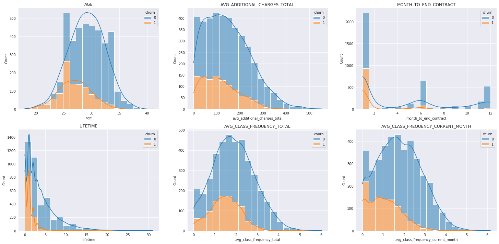
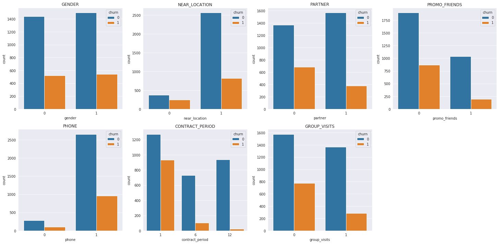
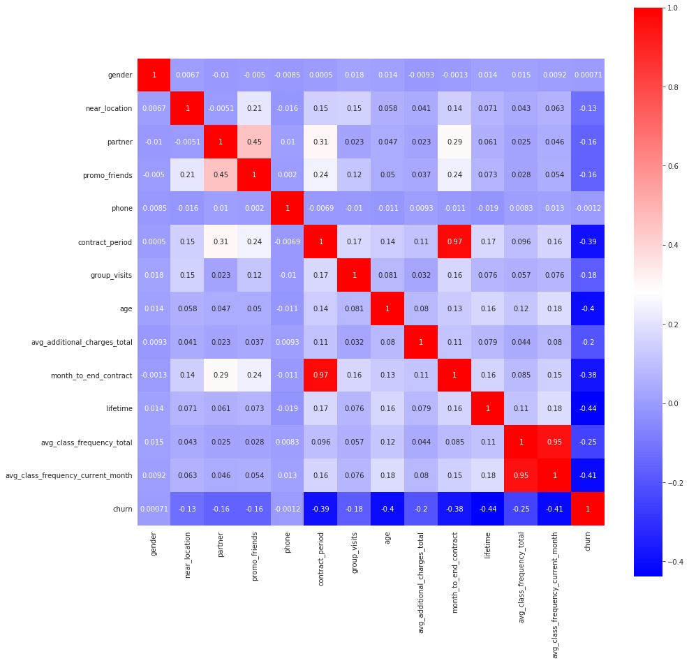
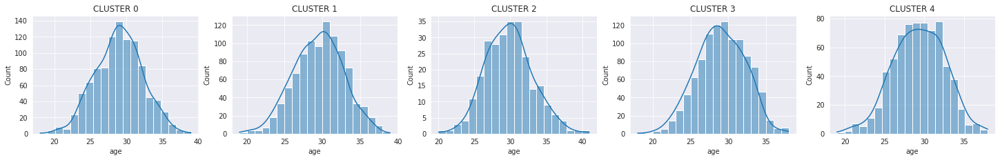
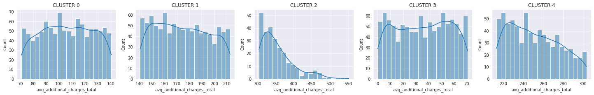
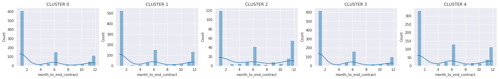
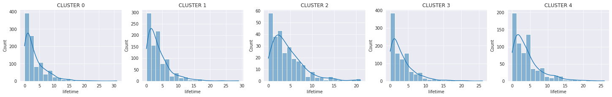
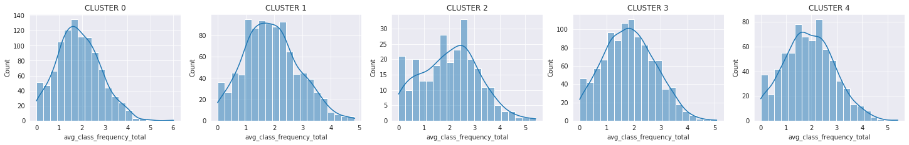
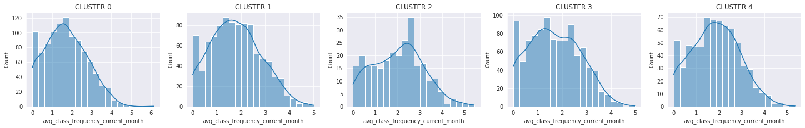
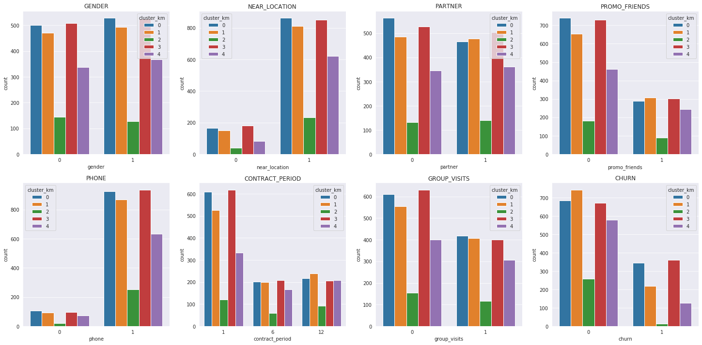

# Прогнозы и предсказания

**Описание проекта**

Сеть фитнес-центров разрабатывает стратегию взаимодействия с клиентами на основе аналитических данных.

Распространённая проблема фитнес-клубов и других сервисов — отток клиентов. Индикаторы оттока зависят от специфики отрасли. Для фитнес-центра можно считать, что клиент попал в отток, если за последний месяц ни разу не посетил спортзал. 

Чтобы бороться с оттоком, отдел по работе с клиентами «Культуриста-датасаентиста» перевёл в электронный вид множество клиентских анкет. Наша задача — провести анализ и подготовить план действий по удержанию клиентов.

'Churn' — факт оттока в текущем месяце;

Текущие поля в датасете:

Данные клиента за предыдущий до проверки факта оттока месяц:
- 'gender' — пол;
- 'Near_Location' — проживание или работа в районе, где находится фитнес-центр;
- 'Partner' — сотрудник компании-партнёра клуба (сотрудничество с компаниями, чьи сотрудники могут получать скидки на абонемент — в таком случае фитнес-центр хранит информацию о работодателе клиента);
- Promo_friends — факт первоначальной записи в рамках акции «приведи друга» (использовал промо-код от знакомого при оплате первого абонемента);
- 'Phone' — наличие контактного телефона;
- 'Age' — возраст;
- 'Lifetime' — время с момента первого обращения в фитнес-центр (в месяцах).

Информация на основе журнала посещений, покупок и информация о текущем статусе абонемента клиента:
- 'Contract_period' — длительность текущего действующего абонемента (месяц, 3 месяца, 6 месяцев, год);
- 'Month_to_end_contract' — срок до окончания текущего действующего абонемента (в месяцах);
- 'Group_visits' — факт посещения групповых занятий;
- 'Avg_class_frequency_total' — средняя частота посещений в неделю за все время с начала действия абонемента;
- 'Avg_class_frequency_current_month' — средняя частота посещений в неделю за предыдущий месяц;
- 'Avg_additional_charges_total' — суммарная выручка от других услуг фитнес-центра: кафе, спорт-товары, косметический и массажный салон.

## Импортируем библиотеки и загружаем данные


```python
import pandas as pd
import os
import seaborn as sns
from matplotlib import pyplot as plt
from sklearn.model_selection import train_test_split
from sklearn.preprocessing import StandardScaler
from sklearn.linear_model import LogisticRegression
from sklearn.metrics import recall_score, accuracy_score, precision_score, f1_score
from sklearn.ensemble import RandomForestClassifier
from sklearn.preprocessing import StandardScaler
from scipy.cluster.hierarchy import dendrogram, linkage
from sklearn.cluster import KMeans
from sklearn.metrics import r2_score
```


```python
pip install -U seaborn
```

    Defaulting to user installation because normal site-packages is not writeable
    Requirement already up-to-date: seaborn in /home/jovyan/.local/lib/python3.7/site-packages (0.11.2)
    Requirement already satisfied, skipping upgrade: pandas>=0.23 in /opt/conda/lib/python3.7/site-packages (from seaborn) (0.25.1)
    Requirement already satisfied, skipping upgrade: scipy>=1.0 in /opt/conda/lib/python3.7/site-packages (from seaborn) (1.4.1)
    Requirement already satisfied, skipping upgrade: matplotlib>=2.2 in /opt/conda/lib/python3.7/site-packages (from seaborn) (3.1.0)
    Requirement already satisfied, skipping upgrade: numpy>=1.15 in /opt/conda/lib/python3.7/site-packages (from seaborn) (1.19.5)
    Requirement already satisfied, skipping upgrade: python-dateutil>=2.6.1 in /opt/conda/lib/python3.7/site-packages (from pandas>=0.23->seaborn) (2.8.1)
    Requirement already satisfied, skipping upgrade: pytz>=2017.2 in /opt/conda/lib/python3.7/site-packages (from pandas>=0.23->seaborn) (2021.1)
    Requirement already satisfied, skipping upgrade: pyparsing!=2.0.4,!=2.1.2,!=2.1.6,>=2.0.1 in /opt/conda/lib/python3.7/site-packages (from matplotlib>=2.2->seaborn) (2.4.7)
    Requirement already satisfied, skipping upgrade: kiwisolver>=1.0.1 in /opt/conda/lib/python3.7/site-packages (from matplotlib>=2.2->seaborn) (1.3.1)
    Requirement already satisfied, skipping upgrade: cycler>=0.10 in /opt/conda/lib/python3.7/site-packages (from matplotlib>=2.2->seaborn) (0.10.0)
    Requirement already satisfied, skipping upgrade: six>=1.5 in /opt/conda/lib/python3.7/site-packages (from python-dateutil>=2.6.1->pandas>=0.23->seaborn) (1.15.0)
    Note: you may need to restart the kernel to use updated packages.


```python
if os.path.exists('gym_churn.csv'):
    df = pd.read_csv('gym_churn.csv')
else:
    df = pd.read_csv('/datasets/gym_churn.csv')
```


```python
df.head()
```


<div>
<style scoped>
    .dataframe tbody tr th:only-of-type {
        vertical-align: middle;
    }

    .dataframe tbody tr th {
        vertical-align: top;
    }

    .dataframe thead th {
        text-align: right;
    }
</style>
<table border="1" class="dataframe">
  <thead>
    <tr style="text-align: right;">
      <th></th>
      <th>gender</th>
      <th>Near_Location</th>
      <th>Partner</th>
      <th>Promo_friends</th>
      <th>Phone</th>
      <th>Contract_period</th>
      <th>Group_visits</th>
      <th>Age</th>
      <th>Avg_additional_charges_total</th>
      <th>Month_to_end_contract</th>
      <th>Lifetime</th>
      <th>Avg_class_frequency_total</th>
      <th>Avg_class_frequency_current_month</th>
      <th>Churn</th>
    </tr>
  </thead>
  <tbody>
    <tr>
      <td>0</td>
      <td>1</td>
      <td>1</td>
      <td>1</td>
      <td>1</td>
      <td>0</td>
      <td>6</td>
      <td>1</td>
      <td>29</td>
      <td>14.227470</td>
      <td>5.0</td>
      <td>3</td>
      <td>0.020398</td>
      <td>0.000000</td>
      <td>0</td>
    </tr>
    <tr>
      <td>1</td>
      <td>0</td>
      <td>1</td>
      <td>0</td>
      <td>0</td>
      <td>1</td>
      <td>12</td>
      <td>1</td>
      <td>31</td>
      <td>113.202938</td>
      <td>12.0</td>
      <td>7</td>
      <td>1.922936</td>
      <td>1.910244</td>
      <td>0</td>
    </tr>
    <tr>
      <td>2</td>
      <td>0</td>
      <td>1</td>
      <td>1</td>
      <td>0</td>
      <td>1</td>
      <td>1</td>
      <td>0</td>
      <td>28</td>
      <td>129.448479</td>
      <td>1.0</td>
      <td>2</td>
      <td>1.859098</td>
      <td>1.736502</td>
      <td>0</td>
    </tr>
    <tr>
      <td>3</td>
      <td>0</td>
      <td>1</td>
      <td>1</td>
      <td>1</td>
      <td>1</td>
      <td>12</td>
      <td>1</td>
      <td>33</td>
      <td>62.669863</td>
      <td>12.0</td>
      <td>2</td>
      <td>3.205633</td>
      <td>3.357215</td>
      <td>0</td>
    </tr>
    <tr>
      <td>4</td>
      <td>1</td>
      <td>1</td>
      <td>1</td>
      <td>1</td>
      <td>1</td>
      <td>1</td>
      <td>0</td>
      <td>26</td>
      <td>198.362265</td>
      <td>1.0</td>
      <td>3</td>
      <td>1.113884</td>
      <td>1.120078</td>
      <td>0</td>
    </tr>
  </tbody>
</table>
</div>


## Проведем исследовательский анализ данных (EDA)

### Посмотрим, есть ли в датасете отсутствующие признаки, изучим средние значения и стандартные отклонения


```python
df.info()
```

    <class 'pandas.core.frame.DataFrame'>
    RangeIndex: 4000 entries, 0 to 3999
    Data columns (total 14 columns):
    gender                               4000 non-null int64
    Near_Location                        4000 non-null int64
    Partner                              4000 non-null int64
    Promo_friends                        4000 non-null int64
    Phone                                4000 non-null int64
    Contract_period                      4000 non-null int64
    Group_visits                         4000 non-null int64
    Age                                  4000 non-null int64
    Avg_additional_charges_total         4000 non-null float64
    Month_to_end_contract                4000 non-null float64
    Lifetime                             4000 non-null int64
    Avg_class_frequency_total            4000 non-null float64
    Avg_class_frequency_current_month    4000 non-null float64
    Churn                                4000 non-null int64
    dtypes: float64(4), int64(10)
    memory usage: 437.6 KB


```python
df.describe()
```


<div>
<style scoped>
    .dataframe tbody tr th:only-of-type {
        vertical-align: middle;
    }

    .dataframe tbody tr th {
        vertical-align: top;
    }

    .dataframe thead th {
        text-align: right;
    }
</style>
<table border="1" class="dataframe">
  <thead>
    <tr style="text-align: right;">
      <th></th>
      <th>gender</th>
      <th>Near_Location</th>
      <th>Partner</th>
      <th>Promo_friends</th>
      <th>Phone</th>
      <th>Contract_period</th>
      <th>Group_visits</th>
      <th>Age</th>
      <th>Avg_additional_charges_total</th>
      <th>Month_to_end_contract</th>
      <th>Lifetime</th>
      <th>Avg_class_frequency_total</th>
      <th>Avg_class_frequency_current_month</th>
      <th>Churn</th>
    </tr>
  </thead>
  <tbody>
    <tr>
      <td>count</td>
      <td>4000.000000</td>
      <td>4000.000000</td>
      <td>4000.000000</td>
      <td>4000.000000</td>
      <td>4000.000000</td>
      <td>4000.000000</td>
      <td>4000.000000</td>
      <td>4000.000000</td>
      <td>4000.000000</td>
      <td>4000.000000</td>
      <td>4000.000000</td>
      <td>4000.000000</td>
      <td>4000.000000</td>
      <td>4000.000000</td>
    </tr>
    <tr>
      <td>mean</td>
      <td>0.510250</td>
      <td>0.845250</td>
      <td>0.486750</td>
      <td>0.308500</td>
      <td>0.903500</td>
      <td>4.681250</td>
      <td>0.412250</td>
      <td>29.184250</td>
      <td>146.943728</td>
      <td>4.322750</td>
      <td>3.724750</td>
      <td>1.879020</td>
      <td>1.767052</td>
      <td>0.265250</td>
    </tr>
    <tr>
      <td>std</td>
      <td>0.499957</td>
      <td>0.361711</td>
      <td>0.499887</td>
      <td>0.461932</td>
      <td>0.295313</td>
      <td>4.549706</td>
      <td>0.492301</td>
      <td>3.258367</td>
      <td>96.355602</td>
      <td>4.191297</td>
      <td>3.749267</td>
      <td>0.972245</td>
      <td>1.052906</td>
      <td>0.441521</td>
    </tr>
    <tr>
      <td>min</td>
      <td>0.000000</td>
      <td>0.000000</td>
      <td>0.000000</td>
      <td>0.000000</td>
      <td>0.000000</td>
      <td>1.000000</td>
      <td>0.000000</td>
      <td>18.000000</td>
      <td>0.148205</td>
      <td>1.000000</td>
      <td>0.000000</td>
      <td>0.000000</td>
      <td>0.000000</td>
      <td>0.000000</td>
    </tr>
    <tr>
      <td>25%</td>
      <td>0.000000</td>
      <td>1.000000</td>
      <td>0.000000</td>
      <td>0.000000</td>
      <td>1.000000</td>
      <td>1.000000</td>
      <td>0.000000</td>
      <td>27.000000</td>
      <td>68.868830</td>
      <td>1.000000</td>
      <td>1.000000</td>
      <td>1.180875</td>
      <td>0.963003</td>
      <td>0.000000</td>
    </tr>
    <tr>
      <td>50%</td>
      <td>1.000000</td>
      <td>1.000000</td>
      <td>0.000000</td>
      <td>0.000000</td>
      <td>1.000000</td>
      <td>1.000000</td>
      <td>0.000000</td>
      <td>29.000000</td>
      <td>136.220159</td>
      <td>1.000000</td>
      <td>3.000000</td>
      <td>1.832768</td>
      <td>1.719574</td>
      <td>0.000000</td>
    </tr>
    <tr>
      <td>75%</td>
      <td>1.000000</td>
      <td>1.000000</td>
      <td>1.000000</td>
      <td>1.000000</td>
      <td>1.000000</td>
      <td>6.000000</td>
      <td>1.000000</td>
      <td>31.000000</td>
      <td>210.949625</td>
      <td>6.000000</td>
      <td>5.000000</td>
      <td>2.536078</td>
      <td>2.510336</td>
      <td>1.000000</td>
    </tr>
    <tr>
      <td>max</td>
      <td>1.000000</td>
      <td>1.000000</td>
      <td>1.000000</td>
      <td>1.000000</td>
      <td>1.000000</td>
      <td>12.000000</td>
      <td>1.000000</td>
      <td>41.000000</td>
      <td>552.590740</td>
      <td>12.000000</td>
      <td>31.000000</td>
      <td>6.023668</td>
      <td>6.146783</td>
      <td>1.000000</td>
    </tr>
  </tbody>
</table>
</div>


```python
for i in df.columns:
    print(i.upper())
    print(df[i].value_counts())
    print('**********************************')
```

    GENDER
    1    2041
    0    1959
    Name: gender, dtype: int64
    **********************************
    NEAR_LOCATION
    1    3381
    0     619
    Name: Near_Location, dtype: int64
    **********************************
    PARTNER
    0    2053
    1    1947
    Name: Partner, dtype: int64
    **********************************
    PROMO_FRIENDS
    0    2766
    1    1234
    Name: Promo_friends, dtype: int64
    **********************************
    PHONE
    1    3614
    0     386
    Name: Phone, dtype: int64
    **********************************
    CONTRACT_PERIOD
    1     2207
    12     960
    6      833
    Name: Contract_period, dtype: int64
    **********************************
    GROUP_VISITS
    0    2351
    1    1649
    Name: Group_visits, dtype: int64
    **********************************
    AGE
    29    468
    30    457
    28    447
    31    434
    27    378
    32    364
    26    300
    33    253
    25    231
    34    174
    24    148
    35     98
    23     82
    36     48
    22     33
    37     29
    21     24
    20     14
    38     10
    39      3
    19      2
    18      2
    41      1
    Name: Age, dtype: int64
    **********************************
    AVG_ADDITIONAL_CHARGES_TOTAL
    135.756722    1
    97.623617     1
    82.487277     1
    17.911351     1
    74.882931     1
                 ..
    163.080276    1
    133.640108    1
    9.838696      1
    134.699410    1
    357.046942    1
    Name: Avg_additional_charges_total, Length: 4000, dtype: int64
    **********************************
    MONTH_TO_END_CONTRACT
    1.0     2207
    6.0      645
    12.0     524
    11.0     181
    5.0      130
    10.0      82
    9.0       73
    4.0       58
    8.0       38
    7.0       25
    3.0       23
    2.0       14
    Name: Month_to_end_contract, dtype: int64
    **********************************
    LIFETIME
    1     843
    2     610
    3     490
    0     487
    4     383
    5     273
    6     220
    7     167
    8     111
    9     100
    10     76
    12     53
    11     48
    13     28
    14     24
    15     24
    16     15
    17     11
    19      7
    20      7
    18      7
    21      5
    24      2
    22      2
    26      2
    23      2
    29      1
    27      1
    31      1
    Name: Lifetime, dtype: int64
    **********************************
    AVG_CLASS_FREQUENCY_TOTAL
    0.000000    88
    3.071431     1
    3.275314     1
    2.687575     1
    0.751450     1
                ..
    1.801802     1
    3.519139     1
    1.750208     1
    1.315297     1
    2.863927     1
    Name: Avg_class_frequency_total, Length: 3913, dtype: int64
    **********************************
    AVG_CLASS_FREQUENCY_CURRENT_MONTH
    0.000000    181
    2.038709      1
    1.202066      1
    2.981590      1
    2.618891      1
               ... 
    1.287944      1
    2.349070      1
    3.399411      1
    0.472735      1
    3.720636      1
    Name: Avg_class_frequency_current_month, Length: 3820, dtype: int64
    **********************************
    CHURN
    0    2939
    1    1061
    Name: Churn, dtype: int64
    **********************************


### Посмотрим на средние значения признаков в двух группах — тех, кто ушел в отток и тех, кто остался :


```python
df.columns = df.columns.str.lower()
```


```python
df.groupby('churn').mean()
```


<div>
<style scoped>
    .dataframe tbody tr th:only-of-type {
        vertical-align: middle;
    }

    .dataframe tbody tr th {
        vertical-align: top;
    }

    .dataframe thead th {
        text-align: right;
    }
</style>
<table border="1" class="dataframe">
  <thead>
    <tr style="text-align: right;">
      <th></th>
      <th>gender</th>
      <th>near_location</th>
      <th>partner</th>
      <th>promo_friends</th>
      <th>phone</th>
      <th>contract_period</th>
      <th>group_visits</th>
      <th>age</th>
      <th>avg_additional_charges_total</th>
      <th>month_to_end_contract</th>
      <th>lifetime</th>
      <th>avg_class_frequency_total</th>
      <th>avg_class_frequency_current_month</th>
    </tr>
    <tr>
      <th>churn</th>
      <th></th>
      <th></th>
      <th></th>
      <th></th>
      <th></th>
      <th></th>
      <th></th>
      <th></th>
      <th></th>
      <th></th>
      <th></th>
      <th></th>
      <th></th>
    </tr>
  </thead>
  <tbody>
    <tr>
      <td>0</td>
      <td>0.510037</td>
      <td>0.873086</td>
      <td>0.534195</td>
      <td>0.353522</td>
      <td>0.903709</td>
      <td>5.747193</td>
      <td>0.464103</td>
      <td>29.976523</td>
      <td>158.445715</td>
      <td>5.283089</td>
      <td>4.711807</td>
      <td>2.024876</td>
      <td>2.027882</td>
    </tr>
    <tr>
      <td>1</td>
      <td>0.510839</td>
      <td>0.768143</td>
      <td>0.355325</td>
      <td>0.183789</td>
      <td>0.902922</td>
      <td>1.728558</td>
      <td>0.268615</td>
      <td>26.989632</td>
      <td>115.082899</td>
      <td>1.662582</td>
      <td>0.990575</td>
      <td>1.474995</td>
      <td>1.044546</td>
    </tr>
  </tbody>
</table>
</div>


### Построим столбчатые гистограммы и распределения признаков для тех, кто ушёл (отток) и тех, кто остался (не попали в отток):


```python
df.columns
```


    Index(['gender', 'near_location', 'partner', 'promo_friends', 'phone',
           'contract_period', 'group_visits', 'age',
           'avg_additional_charges_total', 'month_to_end_contract', 'lifetime',
           'avg_class_frequency_total', 'avg_class_frequency_current_month',
           'churn'],
          dtype='object')


```python
df_binary = df[['gender', 'near_location', 'partner', 'promo_friends', 'phone','contract_period', 'group_visits',\
                'churn']]
df_hist = df[['age','avg_additional_charges_total', 'month_to_end_contract', 'lifetime','avg_class_frequency_total',\
              'avg_class_frequency_current_month','churn']]
```


```python
sns.set_style('darkgrid')
fig = plt.figure(figsize=(25,12))
n = 0
for i in df_hist.drop('churn', axis = 1).columns:
    plt.subplot(2, 3, n+1)
    g = sns.histplot(data = df_hist,
                x = i,
                bins = 20, hue = 'churn', multiple="stack", kde=True)
    plt.title(i.upper())
    n+=1
```


    

    


```python
sns.set_style('darkgrid')
fig = plt.figure(figsize=(25,12))
n = 0
for i in df_binary.drop('churn', axis = 1).columns:
    plt.subplot(2, 4, n+1)
    g = sns.countplot(data = df_binary, x = i, hue = 'churn')
    plt.title(i.upper())
    n+=1
```


    

    


В целом распределения имеют схожий характер, пропорционально кол-ву групп ушедших и оставшихся. Исключение - возраст(ушедшие всреднем младше) и срок абонемента (у ушедших он в подавляющем большинстве на 1 месяц).


```python
corr_m = df.corr()
plt.figure(figsize = (15,15))
ax = sns.heatmap(corr_m, square = True, annot = True, cmap = 'bwr')
```


    

    


Видим по тепловой карте, что у нас имеютсю 4 мультиколлинеарных признака. В качестве эксперимента при обучении модели попробуем удалить их. 

С целевой переменной выраженную обратную корреляцию имеют следующие параметры: 
- contract_period 
- age
- lifetime
- avg_class_frequency_current_month

## Постройка модели прогнозирования оттока пользователей


```python
X = df.drop(['churn'], axis = 1)
y = df['churn']
X_train, X_test, y_train, y_test = train_test_split(X, y, test_size=0.2, random_state=0)
```

### Логистическая регрессия


```python
scaler = StandardScaler()
scaler.fit(X_train)

# Преобразуйте обучающий и валидационные наборы данных
X_train_st = scaler.transform(X_train)
X_test_st = scaler.transform(X_test)
```


```python
# зададим алгоритм для нашей модели
model_logrec = LogisticRegression(solver='liblinear', random_state=0)

# обучим модель
model_logrec.fit(X_train, y_train)

# воспользуемся уже обученной моделью, чтобы сделать прогнозы
predictions = model_logrec.predict(X_test)
probabilities = model_logrec.predict_proba(X_test)[:, 1]
```


```python
from sklearn.metrics import roc_auc_score
print('ROC_AUC: {:.2f}'.format(roc_auc_score(y_test, probabilities)))
```

    ROC_AUC: 0.97


```python
print('Accuracy: {:.2f}'.format(accuracy_score(y_test, predictions)))
print('Precision: {:.2f}'.format(precision_score(y_test, predictions)))
print('Recall: {:.2f}'.format(recall_score(y_test, predictions)))
print('F1: {:.2f}'.format(f1_score(y_test, predictions)))
```

    Accuracy: 0.93
    Precision: 0.86
    Recall: 0.83
    F1: 0.85


#### Логистическая регрессия с удалением коллинеарных признаков

Удаляем 2 признака: month_to_end_contract и avg_class_frequency_total, тк они связаны с двумя другими (contract_period, avg_class_frequency_current_month).


```python
X = df.drop(['churn','month_to_end_contract', 'avg_class_frequency_total'], axis = 1)
y = df['churn']
X_train, X_test, y_train, y_test = train_test_split(X, y, test_size=0.2, random_state=0)
```


```python
scaler = StandardScaler()
scaler.fit(X_train)

# Преобразуйте обучающий и валидационные наборы данных
X_train_st = scaler.transform(X_train)
X_test_st = scaler.transform(X_test)
```


```python
# зададим алгоритм для нашей модели
model_logrec = LogisticRegression(solver='liblinear', random_state=0)

# обучим модель
model_logrec.fit(X_train, y_train)

# воспользуемся уже обученной моделью, чтобы сделать прогнозы
predictions = model_logrec.predict(X_test)
probabilities = model_logrec.predict_proba(X_test)[:, 1]
```


```python
from sklearn.metrics import roc_auc_score
print('ROC_AUC: {:.2f}'.format(roc_auc_score(y_test, probabilities)))
```

    ROC_AUC: 0.96


```python
print('Accuracy: {:.2f}'.format(accuracy_score(y_test, predictions)))
print('Precision: {:.2f}'.format(precision_score(y_test, predictions)))
print('Recall: {:.2f}'.format(recall_score(y_test, predictions)))
print('F1: {:.2f}'.format(f1_score(y_test, predictions)))
```

    Accuracy: 0.90
    Precision: 0.79
    Recall: 0.79
    F1: 0.79


### Случайный лес


```python
X = df.drop(['churn'], axis = 1)
y = df['churn']
X_train, X_test, y_train, y_test = train_test_split(X, y, test_size=0.2, random_state=0)
```


```python
# зададим алгоритм для новой модели на основе алгоритма случайного леса
rf_model = RandomForestClassifier(n_estimators = 100, random_state = 0)
# обучим модель случайного леса
rf_model.fit(X_train, y_train)
# воспользуемся уже обученной моделью, чтобы сделать прогнозы
rf_predictions = rf_model.predict(X_test)
```


```python
print('Accuracy: {:.2f}'.format(accuracy_score(y_test, rf_predictions)))
print('Precision: {:.2f}'.format(precision_score(y_test, rf_predictions)))
print('Recall: {:.2f}'.format(recall_score(y_test, rf_predictions)))
print('F1: {:.2f}'.format(f1_score(y_test, rf_predictions)))
```

    Accuracy: 0.92
    Precision: 0.84
    Recall: 0.82
    F1: 0.83


#### Случайный лес с удалением мультиколлинеарности


```python
X = df.drop(['churn','month_to_end_contract', 'avg_class_frequency_total'], axis = 1)
y = df['churn']
X_train, X_test, y_train, y_test = train_test_split(X, y, test_size=0.2, random_state=0)
```


```python
# зададим алгоритм для новой модели на основе алгоритма случайного леса
rf_model = RandomForestClassifier(n_estimators = 100, random_state = 0)
# обучим модель случайного леса
rf_model.fit(X_train, y_train)
# воспользуемся уже обученной моделью, чтобы сделать прогнозы
rf_predictions = rf_model.predict(X_test)
```


```python
print('Accuracy: {:.2f}'.format(accuracy_score(y_test, rf_predictions)))
print('Precision: {:.2f}'.format(precision_score(y_test, rf_predictions)))
print('Recall: {:.2f}'.format(recall_score(y_test, rf_predictions)))
print('F1: {:.2f}'.format(f1_score(y_test, rf_predictions)))
```

    Accuracy: 0.90
    Precision: 0.81
    Recall: 0.75
    F1: 0.78


Как видим, исходя из метрик, метод линейной регрессии имеет показатели лучше.

В результате получаем, что при удалении мультиколлинеарности метрики обучения ухудшаются.

## Кластеризация 


```python
scaler = StandardScaler() # создаём объект класса scaler (нормализатор)
#x_sc = scaler.fit_transform(df.drop(columns = ['churn','group_visits','phone','promo_friends','gender','near_location', 'partner']))
x_sc = scaler.fit_transform(df.drop(columns = ['churn']))# обучаем нормализатор и преобразуем набор данных 
```


```python
linked = linkage(x_sc, method = 'ward') 
```


```python
'''plt.figure(figsize=(15, 10))  
dendrogram(linked, orientation='top')
plt.show()'''
```


    "plt.figure(figsize=(15, 10))  \ndendrogram(linked, orientation='top')\nplt.show()"


На основании полученного графика выделим 5 (4) кластеров.


```python
km = KMeans(n_clusters = 5, random_state = 0)
labels = km.fit_predict(df.drop(['churn'], axis = 1))
df['cluster_km'] = labels
df.groupby('cluster_km').mean()
```


<div>
<style scoped>
    .dataframe tbody tr th:only-of-type {
        vertical-align: middle;
    }

    .dataframe tbody tr th {
        vertical-align: top;
    }

    .dataframe thead th {
        text-align: right;
    }
</style>
<table border="1" class="dataframe">
  <thead>
    <tr style="text-align: right;">
      <th></th>
      <th>gender</th>
      <th>near_location</th>
      <th>partner</th>
      <th>promo_friends</th>
      <th>phone</th>
      <th>contract_period</th>
      <th>group_visits</th>
      <th>age</th>
      <th>avg_additional_charges_total</th>
      <th>month_to_end_contract</th>
      <th>lifetime</th>
      <th>avg_class_frequency_total</th>
      <th>avg_class_frequency_current_month</th>
      <th>churn</th>
    </tr>
    <tr>
      <th>cluster_km</th>
      <th></th>
      <th></th>
      <th></th>
      <th></th>
      <th></th>
      <th></th>
      <th></th>
      <th></th>
      <th></th>
      <th></th>
      <th></th>
      <th></th>
      <th></th>
      <th></th>
    </tr>
  </thead>
  <tbody>
    <tr>
      <td>0</td>
      <td>0.514091</td>
      <td>0.839650</td>
      <td>0.451895</td>
      <td>0.279883</td>
      <td>0.897959</td>
      <td>4.301263</td>
      <td>0.407191</td>
      <td>28.973761</td>
      <td>105.932804</td>
      <td>3.996113</td>
      <td>3.544218</td>
      <td>1.852564</td>
      <td>1.708264</td>
      <td>0.334305</td>
    </tr>
    <tr>
      <td>1</td>
      <td>0.511435</td>
      <td>0.844075</td>
      <td>0.495842</td>
      <td>0.320166</td>
      <td>0.902287</td>
      <td>4.755717</td>
      <td>0.423077</td>
      <td>29.401247</td>
      <td>174.873445</td>
      <td>4.376299</td>
      <td>3.749480</td>
      <td>1.895200</td>
      <td>1.785569</td>
      <td>0.226611</td>
    </tr>
    <tr>
      <td>2</td>
      <td>0.468635</td>
      <td>0.856089</td>
      <td>0.516605</td>
      <td>0.332103</td>
      <td>0.926199</td>
      <td>5.822878</td>
      <td>0.431734</td>
      <td>29.845018</td>
      <td>356.481960</td>
      <td>5.383764</td>
      <td>4.420664</td>
      <td>2.019260</td>
      <td>2.009382</td>
      <td>0.044280</td>
    </tr>
    <tr>
      <td>3</td>
      <td>0.508721</td>
      <td>0.824612</td>
      <td>0.488372</td>
      <td>0.293605</td>
      <td>0.907946</td>
      <td>4.198643</td>
      <td>0.387597</td>
      <td>28.908915</td>
      <td>35.600722</td>
      <td>3.855620</td>
      <td>3.394380</td>
      <td>1.836755</td>
      <td>1.692641</td>
      <td>0.349806</td>
    </tr>
    <tr>
      <td>4</td>
      <td>0.521246</td>
      <td>0.881020</td>
      <td>0.511331</td>
      <td>0.347025</td>
      <td>0.898017</td>
      <td>5.400850</td>
      <td>0.433428</td>
      <td>29.344193</td>
      <td>250.984767</td>
      <td>5.001416</td>
      <td>4.169972</td>
      <td>1.903480</td>
      <td>1.843255</td>
      <td>0.178470</td>
    </tr>
  </tbody>
</table>
</div>


```python
df_binary = df[['gender', 'near_location', 'partner', 'promo_friends', 'phone','contract_period', 'group_visits',\
                'churn','cluster_km']]
df_hist = df[['age','avg_additional_charges_total', 'month_to_end_contract', 'lifetime','avg_class_frequency_total',\
              'avg_class_frequency_current_month','churn', 'cluster_km']]
```


```python
sns.set_style('darkgrid')
for j in df_hist.drop(['cluster_km', 'churn'], axis = 1).columns:
    print(j.upper())
    fig = plt.figure(figsize=(25,22))
    n = 0
    for i in range(5):
        plt.subplot(6, 5, n+1)
        g = sns.histplot(data = df_hist[df_hist['cluster_km']==i],
                x = j,
                bins = 20, multiple="stack", kde=True, palette='tab10')
        plt.title('CLUSTER '+ str(i).upper())
        n+=1
    plt.show()
```

    AGE


    

    


    AVG_ADDITIONAL_CHARGES_TOTAL


    

    


    MONTH_TO_END_CONTRACT


    

    


    LIFETIME


    

    


    AVG_CLASS_FREQUENCY_TOTAL


    

    


    AVG_CLASS_FREQUENCY_CURRENT_MONTH


    

    


```python
sns.set_style('darkgrid')
fig = plt.figure(figsize=(25,12))
n = 0
for i in df_binary.drop('cluster_km', axis = 1).columns:
    plt.subplot(2, 4, n+1)
    g = sns.countplot(data = df_binary, x = i, hue = 'cluster_km')
    plt.title(i.upper())
    n+=1
```


    

    


```python
df.groupby('cluster_km').agg({'age':'count'}).rename(columns = {'age':'count'})
```


<div>
<style scoped>
    .dataframe tbody tr th:only-of-type {
        vertical-align: middle;
    }

    .dataframe tbody tr th {
        vertical-align: top;
    }

    .dataframe thead th {
        text-align: right;
    }
</style>
<table border="1" class="dataframe">
  <thead>
    <tr style="text-align: right;">
      <th></th>
      <th>count</th>
    </tr>
    <tr>
      <th>cluster_km</th>
      <th></th>
    </tr>
  </thead>
  <tbody>
    <tr>
      <td>0</td>
      <td>1029</td>
    </tr>
    <tr>
      <td>1</td>
      <td>962</td>
    </tr>
    <tr>
      <td>2</td>
      <td>271</td>
    </tr>
    <tr>
      <td>3</td>
      <td>1032</td>
    </tr>
    <tr>
      <td>4</td>
      <td>706</td>
    </tr>
  </tbody>
</table>
</div>


```python
df.groupby('cluster_km').agg({'churn':'mean'})
```


<div>
<style scoped>
    .dataframe tbody tr th:only-of-type {
        vertical-align: middle;
    }

    .dataframe tbody tr th {
        vertical-align: top;
    }

    .dataframe thead th {
        text-align: right;
    }
</style>
<table border="1" class="dataframe">
  <thead>
    <tr style="text-align: right;">
      <th></th>
      <th>churn</th>
    </tr>
    <tr>
      <th>cluster_km</th>
      <th></th>
    </tr>
  </thead>
  <tbody>
    <tr>
      <td>0</td>
      <td>0.334305</td>
    </tr>
    <tr>
      <td>1</td>
      <td>0.226611</td>
    </tr>
    <tr>
      <td>2</td>
      <td>0.044280</td>
    </tr>
    <tr>
      <td>3</td>
      <td>0.349806</td>
    </tr>
    <tr>
      <td>4</td>
      <td>0.178470</td>
    </tr>
  </tbody>
</table>
</div>


Получаем что 2 кластер имеет наименьший отток, а 4 - наибольший.

При этом стоит обратить внимание на то что 2 кластер значительно меньше остальных и значительно выделяется по значению 'avg_additional_charges_total'. Поэтому в формировании гипотиз стоит учесть 4 кластер который имеет отток всего 18% но сопоставим по кол-ву с остальными.

## Выводы и  базовые рекомендации по работе с клиентами

Посмотрев на средние значения посетителей, тех кто ушел и остался можно сделать первые выводы:

Часть параметров почти совпадают, но главное что выделяется - срок абонимента. У тех кто уходит он в среднем составляет 1 месяц. Так же отмечу что частота посещений спорт зала у убывших в среднем 1 раз в неделю, против 2 раз у оставшихся. И в среднем они моложе и тратят меньше денег на прочие услуши спортзала.

Стоит обратить внимание на то что убывшие клиенты реже являются пользователем партнерской программы и реже приходят по промо от друга. Так же они гораздо реже посещают групповые тренировки. Все это может говорить об низкой вовлеченности в жизнь клуба и социализации среди других посетителей. Не имея свой круг общения в спортзале им сложнее сохранять дисциплину и морально проще сменить зал (Возможно на тот где занимаются их друзья или коллеги)

При построении ML модели лучше всего себя проявила логистическая регрессия, показав чуть большие показатели метрик.

При кластеризации и дальнейшем рассмотрении признаков, мы выделили что наиболее при всех прочих равных, самый надежный кластер имеет в среднем больший период абонимента и самую большую частоу посещений. А главное больше всех тратит на сторонние услуги фитнес центра.

Для удержания платежеспособных клиентов, повышения их лояльности можно рассмотреть введение системы поощрения : бонусы, акции, накопительные/скидочные карты.(тк кластерный аназиз показал что среди таких посетителей отток самый маленький).

Так же возможны акции, стимулирующие приобретать абонемент больше чем на месяц(подарки, сертификаты, более выгодные условия при покупке абонемента на более длительный срок).

Активное продвижение групповых занятий(если платные, сделать часть бесплатными или ввести пробные занятия(2 недели/ месяц)) с целью повышения вовлеченности посетителя, дать возможность завести круг общения в зале.
